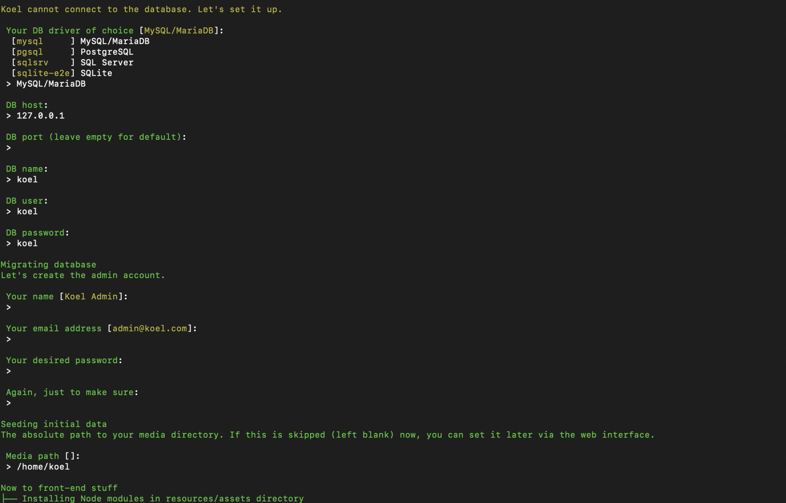
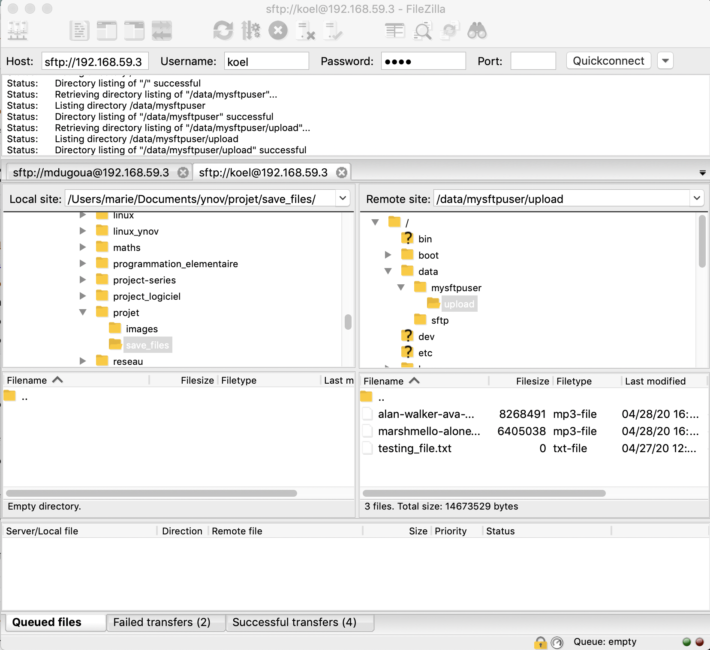

# Projet réseau - Stream music

## 1 - Prérequis

### Server 

- Tous les requirements de Laravel – PHP, OpenSSL, [composer](https://getcomposer.org/)... 
- MySQL, MariaDB, PostgresSQL, or SQLite. 
- NodeJS dernière version satble avec [`yarn`](https://yarnpkg.com/)

### Client

- Koel a été testé sur Chrome 47, Firefox 42, Safari 8, Opera 34, and Edge.

## 2 - Installation Koel

```shell
# Mettre à jour yum
sudo yum update -y 

# Créer le dossier dans lequel sera stocké
# notre outil et base de donnée
sudo mkdir -p /var/www/koel
# Musique à telecharger
sudo mkdir /data
```

```shell
# Instalation de php "https://linuxize.com/post/install-php-7-on-centos-7/"
sudo yum -y install epel-release yum-utils
sudo yum -y install http://rpms.remirepo.net/enterprise/remi-release-7.rpm
sudo yum -y update
sudo yum -y install php php-opcache
sudo yum -y install php-mysqlnd php-pdo php-gd php-odbc php-pear php-xml php-xmlrpc php-mbstring php-soap curl curl-devel
sudo yum-config-manager --enable remi-php70  
sudo yum-config-manager --disable remi-php70  
sudo yum-config-manager --enable remi-php73
sudo yum-config-manager --enable remi-php73
sudo yum install -y php php-mcrypt php-cli php-gd php-curl php-mysql php-ldap php-zip php-fileinfo
php --version
```

```shell
# Créer un utilisateur
sudo useradd koel
# Initialiser un mot de passe
sudo passwd koel
```

```shell
# Instalation de git
sudo yum -y install git 
```

```shell
# Se déplacer dans le fichier créé
cd /var/www/koel

# Cloner depuis le site koel le contenu nécessaire
sudo git clone --recurse-submodules https://github.com/phanan/koel.git .
ls
git branch -a
sudo git checkout v4.0.0
```

```shell
# Instalation de composer "https://getcomposer.org/download/"
sudo php -r "copy('https://getcomposer.org/installer', 'composer-setup.php');"
sudo php -r "if (hash_file('sha384', 'composer-setup.php') === 'e0012edf3e80b6978849f5eff0d4b4e4c79ff1609dd1e613307e16318854d24ae64f26d17af3ef0bf7cfb710ca74755a') { echo 'Installer verified'; } else { echo 'Installer corrupt'; unlink('composer-setup.php'); } echo PHP_EOL;"
sudo php composer-setup.php
sudo php -r "unlink('composer-setup.php');"
```

```shell
git status
sudo php composer.phar install
git branch -a
git tag
```

```shell
sudo chown -R koel:koel .
```

```shell
# Installation de mariadb
sudo yum install -y mariadb 
sudo yum install -y mariadb-server
sudo systemctl start mariadb
sudo systemctl enable mariadb
sudo systemctl status mariadb

# Créer notre base de données
sudo mysql 
```

```sql
Welcome to the MariaDB monitor.  Commands end with ; or \g.
Your MariaDB connection id is 13
Server version: 5.5.64-MariaDB MariaDB Server

Copyright (c) 2000, 2018, Oracle, MariaDB Corporation Ab and others.

Type 'help;' or '\h' for help. Type '\c' to clear the current input statement.
-- Regarder si une base est déjà existante
MariaDB [(none)]> show databases;
+--------------------+
| Database           |
+--------------------+
| information_schema |
| mysql              |
| performance_schema |
| test               |
+--------------------+
4 rows in set (0.02 sec)
-- Créer une base de données
MariaDB [(none)]> create database koel;
Query OK, 1 row affected (0.00 sec)
-- Regarder les utilisateurs existants
MariaDB [(none)]> select user, host from mysql.user;
+------+-----------------------+
| user | host                  |
+------+-----------------------+
| root | 127.0.0.1             |
| root | ::1                   |
|      | localhost             |
| root | localhost             |
|      | localhost.localdomain |
| root | localhost.localdomain |
+------+-----------------------+
6 rows in set (0.01 sec)
-- Créer un utilisateur 'nom'@'address'
MariaDB [(none)]> create user 'koel'@'127.0.0.1' identified by 'koel';
Query OK, 0 rows affected (0.02 sec)
-- Donner tous les droits à notre utilisateur
MariaDB [(none)]> grant all privileges on koel.* to 'koel'@'127.0.0.1';
Query OK, 0 rows affected (0.00 sec)
-- Actualiser nos droits
MariaDB [(none)]> flush privileges;
Query OK, 0 rows affected (0.00 sec)
```

```shell
sudo yum install -y libpng libpng12-devel

# Instalation de yarn "https://linuxize.com/post/how-to-install-yarn-on-centos-7/"
curl --silent --location https://rpm.nodesource.com/setup_10.x | sudo bash -
sudo yum -y install nodejs
curl --silent --location https://dl.yarnpkg.com/rpm/yarn.repo | sudo tee /etc/yum.repos.d/yarn.repo
sudo rpm --import https://dl.yarnpkg.com/rpm/pubkey.gpg
sudo yum -y install yarn
yarn --version 
```

```shell
# Installation d'un compilateur
sudo yum install -y g++
yum provides g++
sudo yum install -y gcc-c++ make
```

```shell
# Ouvrir le port choisi
sudo firewall-cmd --add-port=8000/tcp  --permanent

# Initialiser Koel
sudo php artisan koel:init
```



```shell
# Donner les droits
sudo chown -R koel:koel /data
sudo chown -R koel:koel /var/www/koel

# Changer d'utilisateur pour aller sur celui créé
sudo su - koel
cd /var/www/koel/

# Demarrer l'application
php artisan serve --host="l'ip de votre machine"
```

## 3 - Installation de la connexion SFTP

Installer l'application FileZilla qui va nous permettre de transferer de notre ordinateur a notre vm ou l'inverse des dossier/fichiers.

Pour ce la je vous conseille d'installer FileZilla: 

https://www.01net.com/telecharger/windows/Internet/ftp/fiches/17966.html

```shell
 # SUR VM
 # Vérification des packages ssh
 rpm -qa|grep ssh
 # Créer un dossier et lui donner les droits :
 mkdir -p /data/upload
 chown -R root:koel /data
 chown -R koel:koel /data/upload
```

```shell
ls -ld /data/
drwx-----x. 5 koel koel 54 Mar 22 14:29 /data/

ls -ld /data/upload
drwxr-xr-x. 2 koel koel 6 Mar 22 14:29 /data/upload
```

```shell
# Redémarrer le service ssh
	service sshd status
	service sshd restart
```

```shell
# Toujours sur le terminal de ma VM :
$ cd /data/upload
$ touch testing_file.txt
$ ls
testing_file.txt
```

Comme vous pouvez le voir ci-dessous vous avez les cases :

- Host -> adresse ip
- Username -> votre nom d'utilisateur
- Password -> le mot de passe que vous avez choisis

Vous devez remplir les champs comme pour une connexion SSH sur votre terminal.



## 4 - Installation du monitoring avec Netdata

```shell
# Installation de netdata 
bash <(curl -Ss https://my-netdata.io/kickstart.sh) --disable-telemetry

# Mettre en route
systemctl start netdata
==== AUTHENTICATING FOR org.freedesktop.systemd1.manage-units ===
Authentication is required to manage system services or units.
Authenticating as: leadu
Password: 
==== AUTHENTICATION COMPLETE ===

# Ajouter de la route
$ sudo firewall-cmd --add-port=19999/tcp --permanent
[sudo] password for XXXX: 
success
$ sudo firewall-cmd --reload
success
```

Pour se connecter :  **http://this.machine.ip:19999/**