# TP 1 - Infrastructure et réseau - Faisons joujou

## I- Exploration locale en solo

### Affichage d'informations sur la pile TCP/IP locale

#### En ligne de commande :

– Afficher les infos des cartes réseau de votre PC :
* nom, adresse mac et adresse IP de l'interface wifi : 
ifconfig

Fonction | Name | IP | Mac
--- | --- | --- | --- | ---
carte wifi | en0 | 10.33.2.89 | a4:83:e7:56:dd:32

* nom, adresse MAC et adresse IP de l'interface Ethernet :

Je n'ai pas de carte éthernet sur mon ordinateur.

* Affichez votre gateway
* utilisez une commande pour connaître l'adresse IP de la passerelle de votre carte WiFi : 
netstat -nr

```
Routing tables
Internet:
Destination        Gateway            Flags        Refs      Use   Netif Expire
default            10.33.3.253        UGSc          125       69     en0
10.33/22           link#9             UCS           154        0     en0      !
10.33.0.16         74:eb:80:e6:eb:aa  UHLWI           0        0     en0   1178
10.33.0.17         c8:3d:d4:7a:cd:ff  UHLWI           0      174     en0   1177
[...]
10.33.3.204        4:d6:aa:2b:f0:63   UHLWI           0        0     en0   1191
10.33.3.236        a0:cc:2b:1c:a1:3c  UHLWI           0        0     en0   1054
10.33.3.253/32     link#9             UCS             1        0     en0      !
10.33.3.253        0:12:0:40:4c:bf    UHLWIir        64       28     en0   1166
10.33.3.254        94:c:6d:84:50:c8   UHLWI           0        0     en0    269
```

L'adresse de la passerelle de ma carte wifi est donc 10.33.3.253

#### En graphique (GUI : Graphical User Interface) :
* Trouvez comment afficher les informations sur une carte IP (change selon l'OS) :

* trouvez l'IP, la MAC et la gateway pour l'interface WiFi de votre PC :


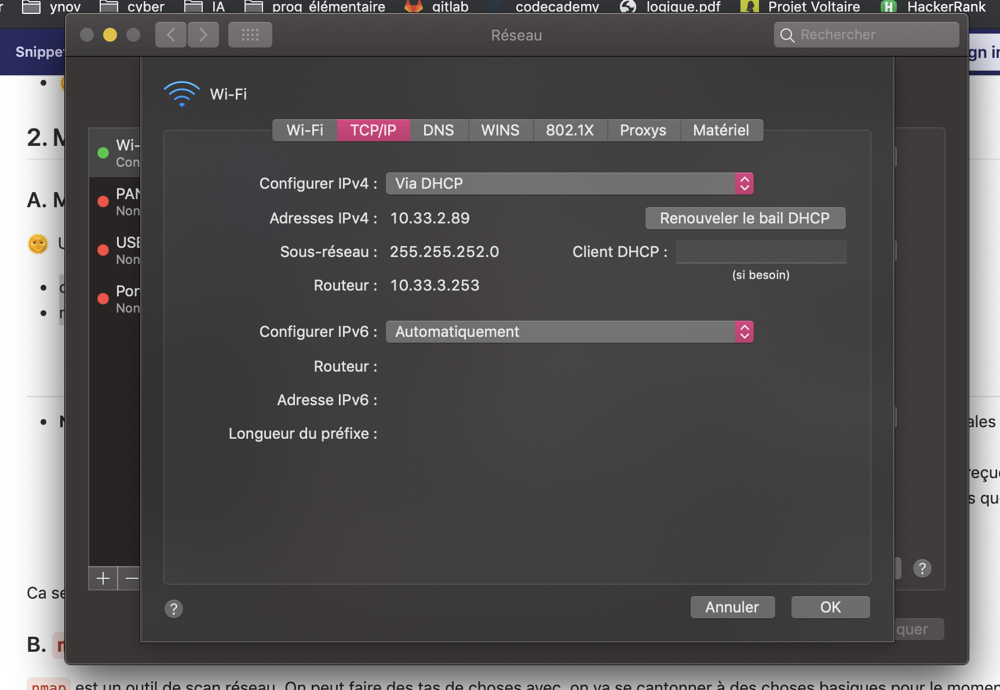
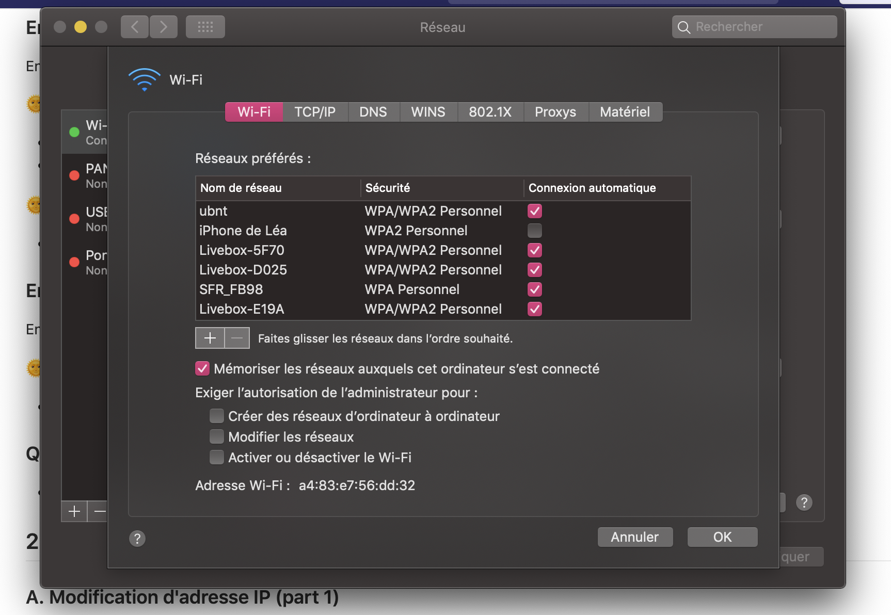


Adresse IP : 10.33.2.89
Adresse MAC : a4:83:e7:56:dd:32
Adresse gateway : 10.33.3.253

* à quoi sert la gateway dans le réseau d'YNOV ?

La gateway d'YNOV sert à connecter deux réseaux informatiques entre eux (exemple : réseau local et réseau internet). Ici, elle permet à toutes les machines connectées sur le réseau wifi d'YNOV, de pouvoir se connecter à internet. 

### Modifications des informations

#### Modification d'adresse IP (part 1)

* Utilisez l'interface graphique de votre OS pour changer d'adresse IP :

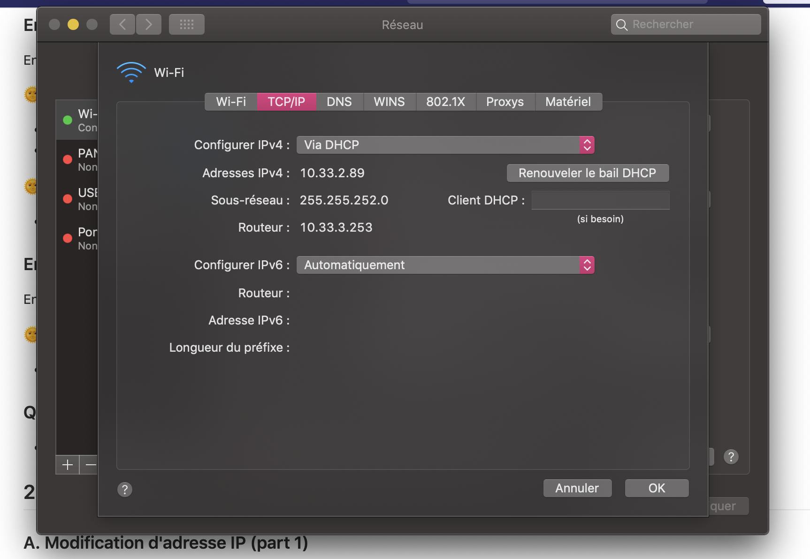
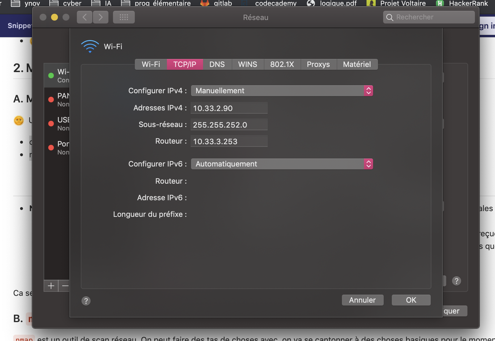

J'ai perdu l'accès internet car j'ai utilisé une adresse déja occupé par une autre machine sur le même réseau.

#### Modification d'adresse IP (part 2)

* Modifiez de nouveau votre adresse IP vers une adresse IP que vous savez libre grâce à nmap 
* Utiliser un ping scan sur le reseau Ynov :
```
leaduvigneau@MacBook-Pro-de-lea  ~   master ?  nmap -sP 10.33.0.0/22  
Starting Nmap 7.80 ( https://nmap.org ) at 2020-01-23 12:19 CET
Nmap scan report for 10.33.0.16
Host is up (0.0050s latency).
Nmap scan report for 10.33.0.25
Host is up (0.12s latency).
Nmap scan report for 10.33.0.35
Host is up (0.096s latency).
Nmap scan report for 10.33.0.37
Host is up (0.11s latency).
Nmap scan report for 10.33.0.48
Host is up (0.034s latency).
Nmap scan report for 10.33.0.49
Host is up (0.0063s latency).
Nmap scan report for 10.33.0.51
Host is up (0.092s latency).
Nmap scan report for 10.33.0.55
Host is up (0.084s latency).
Nmap scan report for 10.33.0.56
Host is up (0.0058s latency).
Nmap scan report for 10.33.0.58
Host is up (0.25s latency).
Nmap scan report for 10.33.0.66
Host is up (0.092s latency).
Nmap scan report for 10.33.0.71
Host is up (0.20s latency).
[...]
Nmap scan report for 10.33.3.232
Host is up (0.22s latency).
Nmap scan report for 10.33.3.239
Host is up (0.028s latency).
Nmap scan report for 10.33.3.240
Host is up (0.095s latency).
Nmap scan report for 10.33.3.242
Host is up (0.050s latency).
Nmap scan report for 10.33.3.243
Host is up (0.090s latency).
Nmap scan report for 10.33.3.246
Host is up (0.19s latency).
Nmap scan report for 10.33.3.253
Host is up (0.0070s latency).
Nmap done: 1024 IP addresses (150 hosts up) scanned in 78.70 seconds
```
* J'utlise le ping scan et voici le résultat de ma commande nmap :
```
leaduvigneau@MacBook-Pro-de-lea  ~   master ?  nmap -sn -PE 10.33.0.0/22
Warning:  You are not root -- using TCP pingscan rather than ICMP
Starting Nmap 7.80 ( https://nmap.org ) at 2020-01-23 12:24 CET
Nmap scan report for 10.33.0.16
Host is up (0.56s latency).
Nmap scan report for 10.33.0.25
Host is up (0.086s latency).
Nmap scan report for 10.33.0.35
Host is up (0.11s latency).
Nmap scan report for 10.33.0.37
Host is up (0.15s latency).
Nmap scan report for 10.33.0.48
[...]
Host is up (0.0064s latency).
Nmap scan report for 10.33.3.85
Host is up (0.0095s latency).
Nmap scan report for 10.33.3.100
Host is up (0.053s latency).
Nmap scan report for 10.33.3.102
Host is up (0.061s latency).
Nmap scan report for 10.33.3.106
Host is up (0.043s latency).
Nmap scan report for 10.33.3.129
Host is up (0.042s latency).
Nmap scan report for 10.33.3.140
Host is up (0.059s latency).
Nmap scan report for 10.33.3.146
Host is up (0.082s latency).
Nmap scan report for 10.33.3.149
Host is up (0.43s latency).
Nmap scan report for 10.33.3.151
Host is up (0.060s latency).
Nmap scan report for 10.33.3.155
Host is up (0.033s latency).
Nmap scan report for 10.33.3.178
Host is up (0.016s latency).
Nmap scan report for 10.33.3.189
Host is up (0.010s latency).
Nmap scan report for 10.33.3.191
Host is up (0.070s latency).
Nmap scan report for 10.33.3.192
Host is up (0.064s latency).
Nmap scan report for 10.33.3.197
Host is up (0.24s latency).
Nmap scan report for 10.33.3.204
Host is up (0.051s latency).
Nmap scan report for 10.33.3.205
Host is up (0.023s latency).
Nmap scan report for 10.33.3.211
Host is up (0.065s latency).
Nmap scan report for 10.33.3.212
Host is up (0.14s latency).
Nmap scan report for 10.33.3.214
Host is up (0.32s latency).
Nmap scan report for 10.33.3.218
Host is up (0.093s latency).
Nmap scan report for 10.33.3.232
Host is up (0.093s latency).
Nmap scan report for 10.33.3.236
Host is up (0.011s latency).
Nmap scan report for 10.33.3.239
Host is up (0.079s latency).
Nmap scan report for 10.33.3.240
Host is up (0.082s latency).
Nmap scan report for 10.33.3.242
Host is up (0.15s latency).
Nmap scan report for 10.33.3.246
Host is up (0.14s latency).
Nmap scan report for 10.33.3.253
Host is up (0.0050s latency).
Nmap done: 1024 IP addresses (136 hosts up) scanned in 24.79 seconds
```

L'adresse 10.33.3.250 est libre et la gateway est correctement configurée.

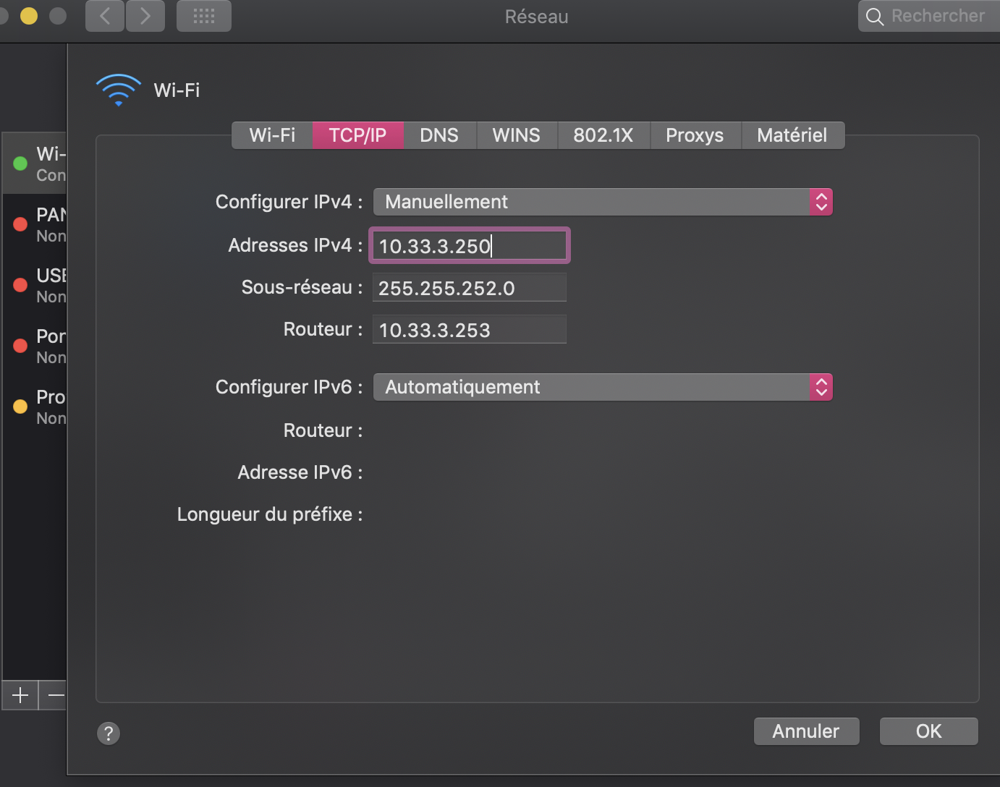


### II- Exploration locale en duo (Marie Dugoua(os), Léa Duvigneau(os), Joseph(windows/linux) Monnet et Quentin Guiheneuc(windows)) 

#### Modification d'adresse IP :

* Modifier l'IP des deux machines pour qu'elles soient dans le même réseau

-> Comme je ne suis pas à l'ecole ma gateway est différente

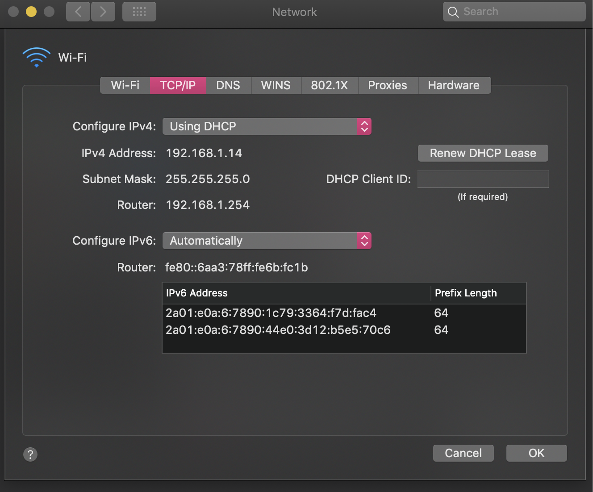

-> Modifier l'IP  
1er ordinateur
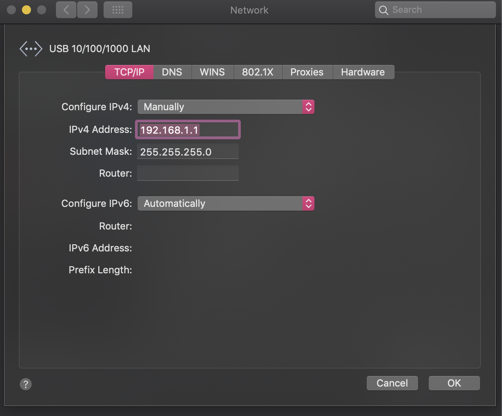

2e ordinateur
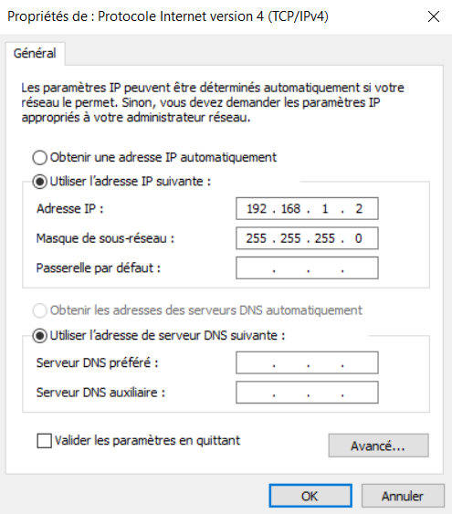

-> Vérifiez à l'aide de commandes que vos changements ont pris effet  

commande saisie : ```ifconfig ```

```[...]
en7: flags=8863<UP,BROADCAST,SMART,RUNNING,SIMPLEX,MULTICAST> mtu 1500
options=4<VLAN_MTU>
ether 48:65:ee:18:e3:62
inet6 fe80::b2:674f:13d8:77bf%en7 prefixlen 64 secured scopeid 0x13
inet 192.168.1.1 netmask 0xffffff00 broadcast 192.168.1.255
nd6 options=201<PERFORMNUD,DAD>
media: autoselect (1000baseT <full-duplex>)
status: active
```

Changement du 2e ordinateur

```
PS C:\Users\josep> ipconfig

Configuration IP de Windows

Carte Ethernet Ethernet :

Suffixe DNS propre à la connexion. . . :
Adresse IPv6 de liaison locale. . . . .: fe80::b0d7:71c7:4b99:d014%3
Adresse IPv4. . . . . . . . . . . . . .: 192.168.1.2
Masque de sous-réseau. . . . . . . . . : 255.255.255.0
Passerelle par défaut. . . . . . . . . :
[...]
```


-> utilisez ping pour tester la connectivité entre les deux machines  

Commande saisie : ```ping 192.168.1.2 ```

```
PING 192.168.1.2 (192.168.1.2): 56 data bytes
64 bytes from 192.168.1.2: icmp_seq=0 ttl=128 time=0.652 ms
64 bytes from 192.168.1.2: icmp_seq=1 ttl=128 time=0.449 ms
64 bytes from 192.168.1.2: icmp_seq=2 ttl=128 time=0.440 ms
64 bytes from 192.168.1.2: icmp_seq=3 ttl=128 time=0.738 ms
^C
--- 192.168.1.2 ping statistics ---
4 packets transmitted, 4 packets received, 0.0% packet loss
round-trip min/avg/max/stddev = 0.440/0.570/0.738/0.129 ms
```

Ping du 2e ordinateur 
```
PS C:\Users\josep> ping 192.168.1.1

Envoi d’une requête 'Ping'  192.168.1.1 avec 32 octets de données :
Réponse de 192.168.1.1 : octets=32 temps=2 ms TTL=64
Réponse de 192.168.1.1 : octets=32 temps=1 ms TTL=64
Réponse de 192.168.1.1 : octets=32 temps=1 ms TTL=64
Réponse de 192.168.1.1 : octets=32 temps=2 ms TTL=64

Statistiques Ping pour 192.168.1.1:
Paquets : envoyés = 4, reçus = 4, perdus = 0 (perte 0%),
Durée approximative des boucles en millisecondes :
Minimum = 1ms, Maximum = 2ms, Moyenne = 1ms
```
#### Utilisation d'un des deux comme gateway

-> Utiliser un ordinateur en gateway

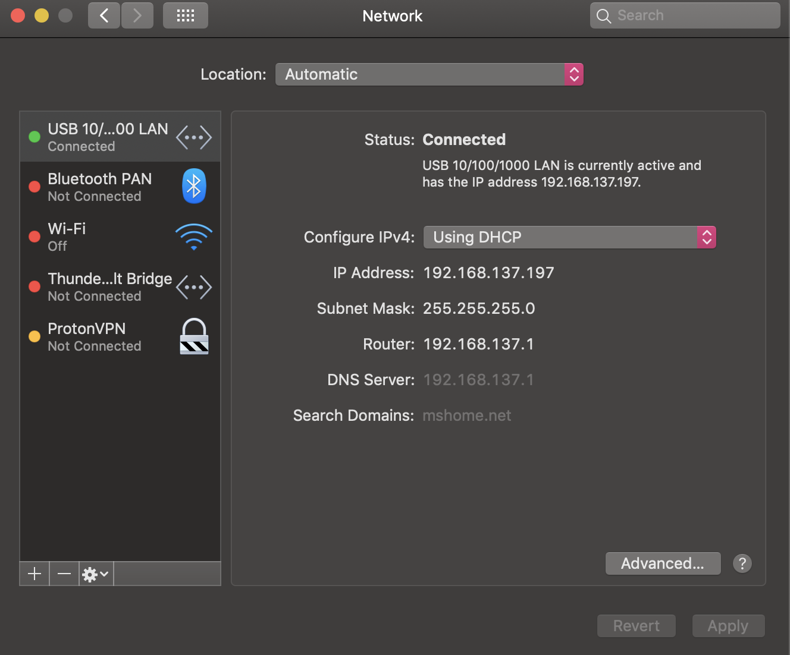

Ordinateur gateway:

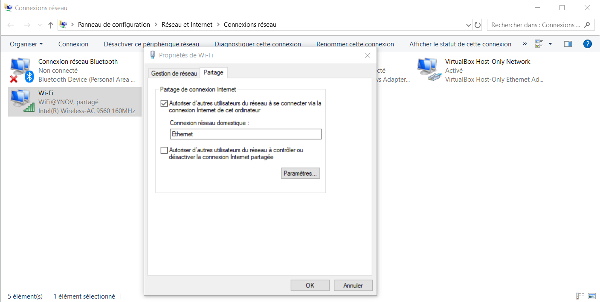

-> utilisez curl ou une requête DNS (dig, nslookup) pour prouver que vous avez un accès à internet, avec la carte WiFi désactivée

Commande saisie : ```curl --url rootme.com``` 

```
<!DOCTYPE html PUBLIC "-//W3C//DTD HTML 4.01//EN" "http://www.w3.org/TR/html4/strict.dtd">
<html xmlns="http://www.w3.org/1999/xhtml" data-adblockkey="MFwwDQYJKoZIhvcNAQEBBQADSwAwSAJBAKX74ixpzVyXbJprcLfbH4psP4+L2entqri0lzh6pkAaXLPIcclv6DQBeJJjGFWrBIF6QMyFwXT5CCRyjS2penECAwEAAQ==_cmvrZhRZrUz94DGvPh3Vz6mwVVhU2hLPV3GaEZqQj2CI/c9bJa9a/Hxfe04QYMOjF04DIzo9SU6gtw3knHwv7Q==">
<head><script type="text/javascript">var abp;</script><script type="text/javascript" src="http://rootme.com/px.js?ch=1"></script><script type="text/javascript" src="http://rootme.com/px.js?ch=2"></script><script type="text/javascript">function handleABPDetect(){try{var imglog = document.createElement("img");imglog.style.height="0px";imglog.style.width="0px";imglog.src="http://rootme.com/sk-logabpstatus.php?a=Z2Vua3U2VmVubEpBayszeGpOMkZsWFJCNi91VndleXhPT0tLazNIOEV6eDNCNWIwK1dkMng0a2Z2bkxsTVNRc3NmaW5xTFkwM3lrWHRMM21kNlhvWHE3ZGxMTE9UeXcwRFRSVm1hUXpWVHM9&b="+abp;document.body.appendChild(imglog);}catch(err){}}</script><meta name="tids" content="a='10861' b='13175' c='rootme.com' d='entity_mapped'" /><title>Rootme.com</title>
<meta http-equiv="Content-Type" content="text/html; charset=UTF-8">
```

->  utiliser un traceroute ou tracert pour bien voir que les requêtes passent par la passerelle choisie (l'autre le PC)

Commande saisie : ```traceroute google.com```

```
traceroute to google.com (216.58.215.46), 64 hops max, 52 byte packets
1  laptop-0j98s4ti (192.168.137.1)  0.828 ms *  0.863 ms
2  * * *
3  192.168.1.254 (192.168.1.254)  30.398 ms  26.897 ms  20.897 ms
4  194.149.164.72 (194.149.164.72)  60.251 ms  32.352 ms  23.115 ms
5  194.149.166.58 (194.149.166.58)  42.456 ms  61.081 ms  56.260 ms
6  72.14.221.62 (72.14.221.62)  50.066 ms  29.476 ms  37.432 ms
7  108.170.244.193 (108.170.244.193)  43.657 ms
    108.170.245.1 (108.170.245.1)  25.603 ms  25.966 ms
8  72.14.237.93 (72.14.237.93)  25.198 ms  37.865 ms  33.923 ms
9  * * *
10  * * *
11  * * *
12  * * *
```

#### Petit chat privé

->  Sur le Ordinateur serveur

Commande saisi : ``` PS C:\Users\josep\Downloads> .\nc.exe -l -p 10000 ```

```
blabla
hello amiga
```

-> Sur le Ordinateur client

Commande saisir : ``` nc 192.168.1.2 10000 ```

```
blabla
hello amiga
```

-> pour aller un peu plus loin

Ordinateur serveur 
Commande saisie : ``` PS C:\Users\josep\Downloads> .\nc.exe -l -p 10000 192.168.137.197 ```
```
coucou
salut salut
sous mac ca marche aussi
bye
bien sur
niceee
```

Ordinateur Client
Commande saisie : ```nc 192.168.1.2 10000```

```
coucou
salut salut
bye
sous mac ca marche aussi
bien sur
niceee
```

#### Wireshark

-> utilisez wireshark pour observer les trames qui circulent entre vos deux carte Ethernet.
	* un ping 

Ordinateur gateway : 

```
PS C:\Users\josep> ipconfig
Configuration IP de Windows

Carte Ethernet Ethernet :

Suffixe DNS propre à la connexion. . . :
Adresse IPv6 de liaison locale. . . . .: fe80::b0d7:71c7:4b99:d014%3
Adresse IPv4. . . . . . . . . . . . . .: 192.168.137.1
Masque de sous-réseau. . . . . . . . . : 255.255.255.0
[...]
```

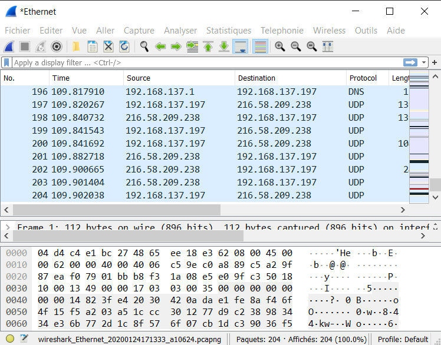

Ordinateur Client :

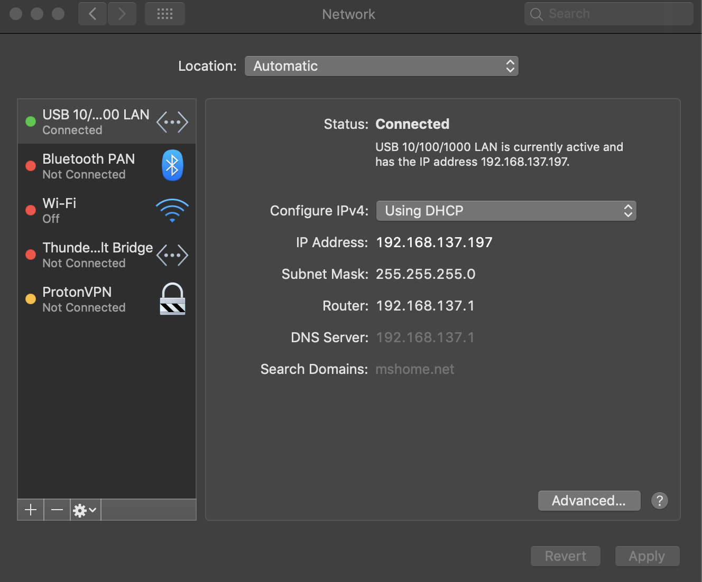
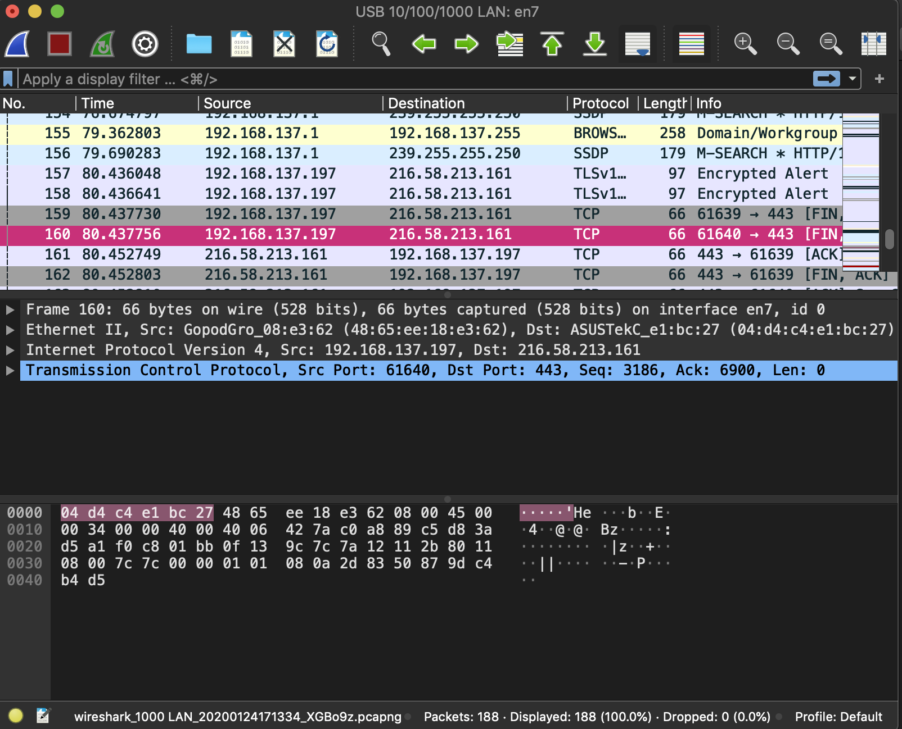

	* un netcat

Ordinateur gateway :

```
PS C:\Users\josep\Downloads> .\nc.exe -l -p 10000 192.168.137.197
hey !
lool
okok
^^
```

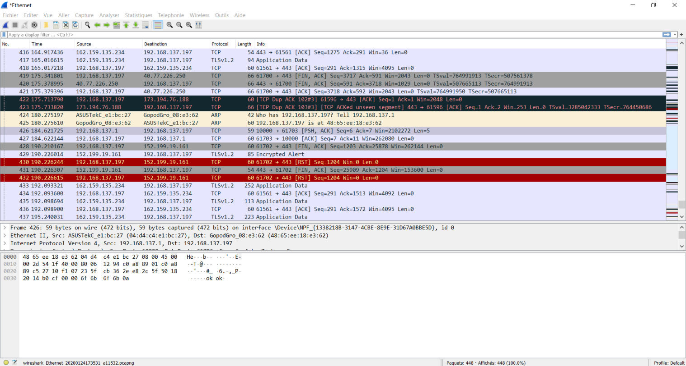

Ordinateur client :

```
nc 192.168.137.1 10000
hey !
lool
okok
^^
```

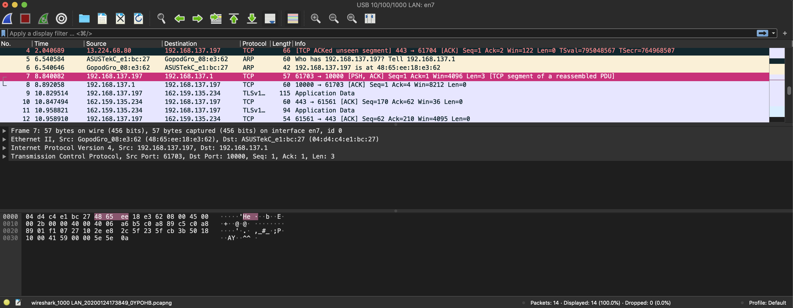

#### Firewall

-> Autoriser les ping
Autoriser les requêtes ECHO IMCMP de type 8 et de type 0


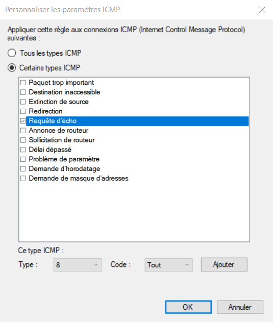

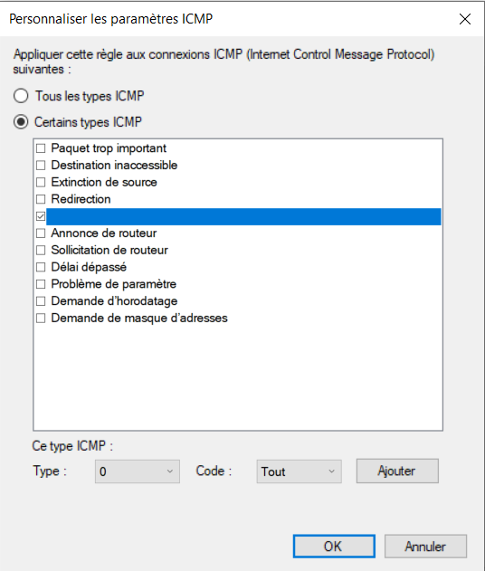

Commande saisie : ```ping 192.168.1.2 ```

```
PING 192.168.1.2 (192.168.1.2): 56 data bytes
64 bytes from 192.168.1.2: icmp_seq=0 ttl=128 time=0.652 ms
64 bytes from 192.168.1.2: icmp_seq=1 ttl=128 time=0.449 ms
64 bytes from 192.168.1.2: icmp_seq=2 ttl=128 time=0.440 ms
64 bytes from 192.168.1.2: icmp_seq=3 ttl=128 time=0.738 ms
^C
--- 192.168.1.2 ping statistics ---
4 packets transmitted, 4 packets received, 0.0% packet loss
round-trip min/avg/max/stddev = 0.440/0.570/0.738/0.129 ms
```

Ping du 2e ordinateur 

```
PS C:\Users\josep> ping 192.168.1.1

Envoi d’une requête 'Ping'  192.168.1.1 avec 32 octets de données :
Réponse de 192.168.1.1 : octets=32 temps=2 ms TTL=64
Réponse de 192.168.1.1 : octets=32 temps=1 ms TTL=64
Réponse de 192.168.1.1 : octets=32 temps=1 ms TTL=64
Réponse de 192.168.1.1 : octets=32 temps=2 ms TTL=64

Statistiques Ping pour 192.168.1.1:
Paquets : envoyés = 4, reçus = 4, perdus = 0 (perte 0%),
Durée approximative des boucles en millisecondes :
Minimum = 1ms, Maximum = 2ms, Moyenne = 1ms
```

-> Autoriser nc sur un port spécifique

Le firewall est toujours activé
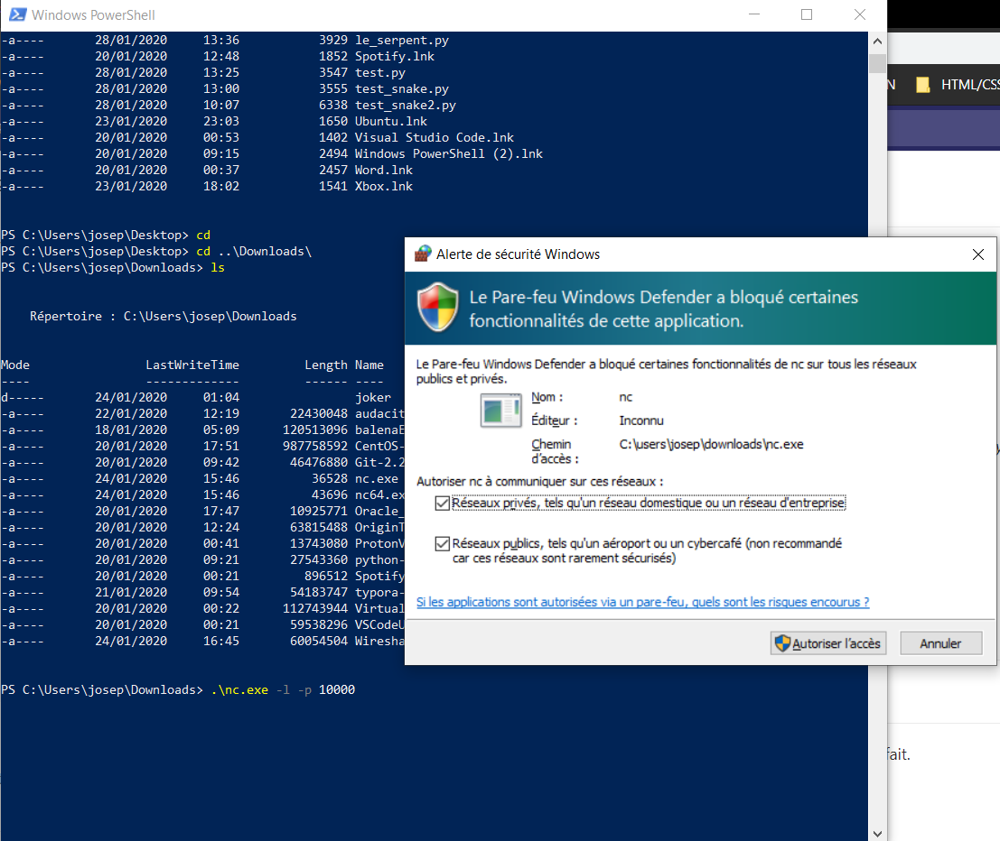

Communication avec Netcat sur le port 10 000 : 

```PS C:\Users\josep\Downloads> .\nc.exe -l p 10000
izhfz
fghj
ishvs
```

```
PS D:\Logiciel autre\netcat-win32-1.12> ./nc.exe 192.168.1.1 10000
izhfz
fghj
ishvs
```


### III - Manipulations d'autres outils/protocoles côté client

#### DHCP

* afficher l'adresse IP du serveur DHCP du réseau WiFi YNOV

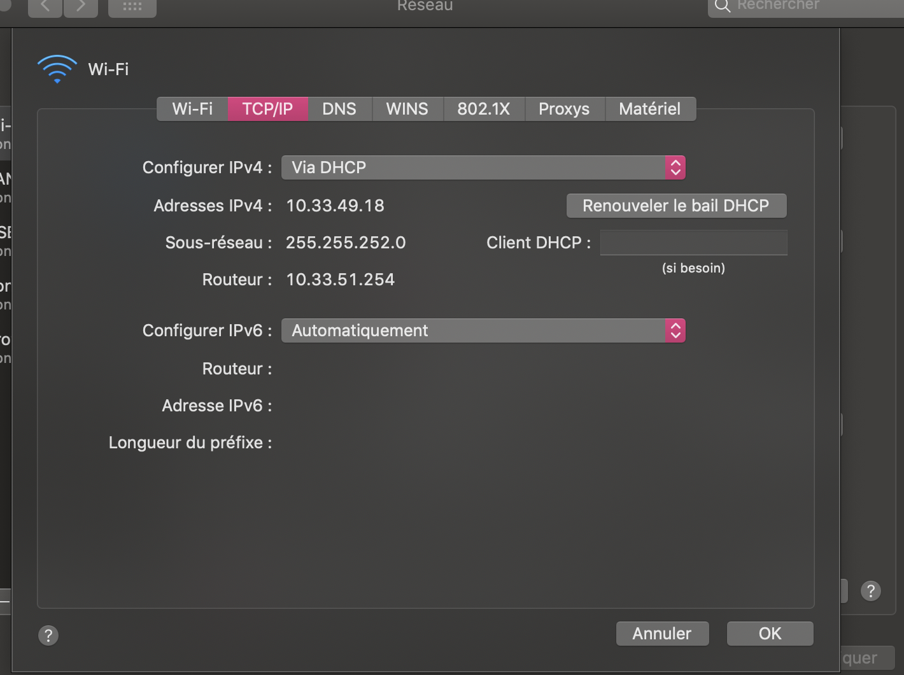

L'IP du serveur DHCP est la même que celle du routeur donc : 10.33.51.254

```
leaduvigneau@MacBook-Pro-de-lea  ~   master ?  sudo ipconfig getifaddr en0
10.33.51.254
```

* Trouver la date d'expiration de votre bail DHCP

``` leaduvigneau@MacBook-Pro-de-lea  ~ ipconfig getpacket en0  ```
```  
op = BOOTREPLY
htype = 1
flags = 0
hlen = 6
hops = 0
xid = 0x185c0019
secs = 0
ciaddr = 0.0.0.0
yiaddr = 10.33.49.18
siaddr = 0.0.0.0
giaddr = 0.0.0.0
chaddr = a4:83:e7:56:dd:32
sname = 
file = 
options:
Options count is 8
dhcp_message_type (uint8): ACK 0x5
server_identifier (ip): 10.33.51.254
lease_time (uint32): 0x147f4
subnet_mask (ip): 255.255.252.0
router (ip_mult): {10.33.51.254}
domain_name_server (ip_mult): {10.33.10.20, 10.33.10.2, 8.8.8.8}
domain_name (string): auvence.co
end (none):
```

``` leaduvigneau@MacBook-Pro-de-lea  ~ sudo cat /var/db/dhcpclient/leases/en0-1,a4:83:e7:56:dd:32 
<?xml version="1.0" encoding="UTF-8"?>
<!DOCTYPE plist PUBLIC "-//Apple//DTD PLIST 1.0//EN" "http://www.apple.com/DTDs/PropertyList-1.0.dtd">
<plist version="1.0">
<dict>
<key>IPAddress</key>
<string>10.33.49.18</string>
<key>LeaseLength</key>
<integer>83956</integer>
<key>LeaseStartDate</key>
<date>2020-01-28T15:14:46Z</date>
<key>PacketData</key>
<data>
AgEGABhcABkAAAAAAAAAAAohMRIAAAAAAAAAAKSD51bdMgAAAAAAAAAAAAAAAAAAAAAA
AAAAAAAAAAAAAAAAAAAAAAAAAAAAAAAAAAAAAAAAAAAAAAAAAAAAAAAAAAAAAAAAAAAA
AAAAAAAAAAAAAAAAAAAAAAAAAAAAAAAAAAAAAAAAAAAAAAAAAAAAAAAAAAAAAAAAAAAA
AAAAAAAAAAAAAAAAAAAAAAAAAAAAAAAAAAAAAAAAAAAAAAAAAAAAAAAAAAAAAAAAAAAA
AAAAAAAAAAAAAAAAAAAAAAAAAAAAAAAAAAAAAAAAAABjglNjNQEFNgQKITP+MwQAAUf0
AQT///wAAwQKITP+BgwKIQoUCiEKAggICAgPCmF1dmVuY2UuY2//AAAAAAAA
</data>
<key>RouterHardwareAddress</key>
<data>
AA1INXYj
</data>
<key>RouterIPAddress</key>
<string>10.33.51.254</string>
<key>SSID</key>
<string>WiFi@YNOV</string>
</dict>
```

Lease Start c'est l'heure et la date à laquelle j'ai obtenu cet IP du DHCP. LeaseLenght c'est la durée du bail en réseau.
Donc 2020-01-28 15:14:46 + 83956 seconde = environ 23h

* demandez une nouvelle adresse IP (en ligne de commande)
```
leaduvigneau@MacBook-Pro-de-lea  ~   master ?  sudo ipconfig set en0 BOOTP
leaduvigneau@MacBook-Pro-de-lea  ~   master ?  sudo ipconfig set en0 DHCP 
leaduvigneau@MacBook-Pro-de-lea  ~   master ?  sudo ifconfig en0 down 
leaduvigneau@MacBook-Pro-de-lea  ~   master ?  sudo ifconfig en0 up 
```


#### DNS

*  trouver l'adresse IP du serveur DNS que connaît votre ordinateur
*  faites un lookup pour ggogle.com
*  faites un lookup pour ynov.com

L'adresse IP du serveur DNS que connait mon ordinateur est 10.33.10.148.

```
leaduvigneau@MacBook-Pro-de-lea  ~   master   nslookup google.com
Server:		10.33.10.148
Address:	10.33.10.148#53

Non-authoritative answer:
Name:	google.com
Address: 216.58.213.174

leaduvigneau@MacBook-Pro-de-lea  ~   master ?  nslookup ynov.com  
Server:		10.33.10.148
Address:	10.33.10.148#53

Non-authoritative answer:
Name:	ynov.com
Address: 217.70.184.38
```

* Interpréter les résultats de ces commandes :

Nous pouvons voir grâce à cette commande, l'IP du serveur DNS et le port par lequel passe ma requête (ici : #53). Nous voyons aussi l'adresse IP du serveur de google.com ou ynov.com.


* faites un reverse lookup pour :
* l'adresse 78.74.21.21
* l'adresse 92.146.54.88

```
leaduvigneau@MacBook-Pro-de-lea  ~   master ?  nslookup 78.74.21.21
Server:		10.33.10.148
Address:	10.33.10.148#53

Non-authoritative answer:
21.21.74.78.in-addr.arpa	name = host-78-74-21-21.homerun.telia.com.

Authoritative answers can be found from:

leaduvigneau@MacBook-Pro-de-lea  ~   master ?  nslookup 92.146.54.88
Server:		10.33.10.148
Address:	10.33.10.148#53

Non-authoritative answer:
88.54.146.92.in-addr.arpa	name = apoitiers-654-1-167-88.w92-146.abo.wanadoo.fr.

Authoritative answers can be found from:
```

* interpréter les résultats :

Cette commande permet de voira partir de l'IP, le nom de domaine qui correspond à l'adresse d'hébergement ou à un DNS.