# TP 2 - Réseau

## I. Créataion et utilisation simple d'une VM CentOS 7

### 4. Configuration réseau d'une machine CentOS

*Déterminer la liste de vos cartes réseau, les informations qui y sont liées, et la fonction de chacune.*

| Name   | IP           | MAC               | Fonction                              |
| ------ | ------------ | ----------------- | ------------------------------------- |
| enp0s3 | 10.0.2.15/24 | 08:00:27:1a:d0:e0 | Permet connexion Nat                  |
| enp0s8 | 10.2.1.2/24  | 08:00:27:ba:35:a6 | Permet connexion au réseau privé hôte |

J'ai remplacé l'adresse IP de ma carte réseau Host-Only par celle-ci : 10.2.1.3

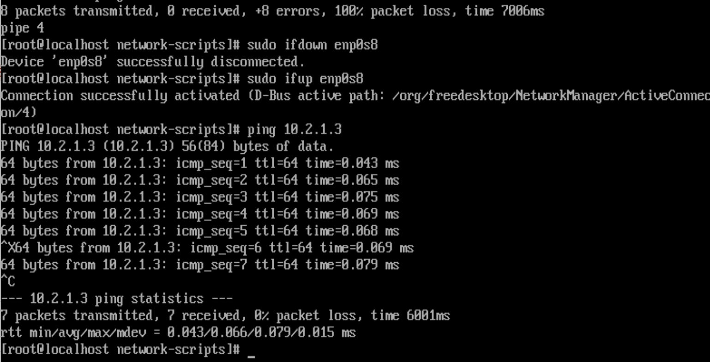

### 5. Appréhension de quelques commandes

*Faites un scan nmap du réseau host-only :*

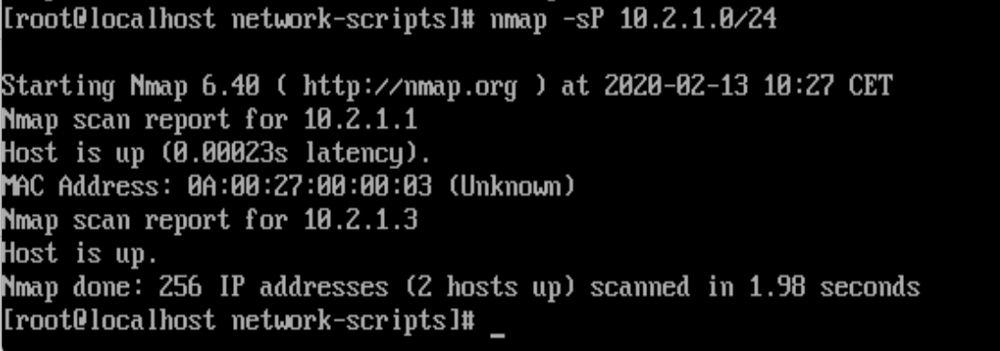

L'adresse MAC de l'hôte est : 0A:00:27:00:00:03. 
L'adresse MAC de la carte reseau enp0s8 de ma VM est : 08:00:27:ba:35:a6.

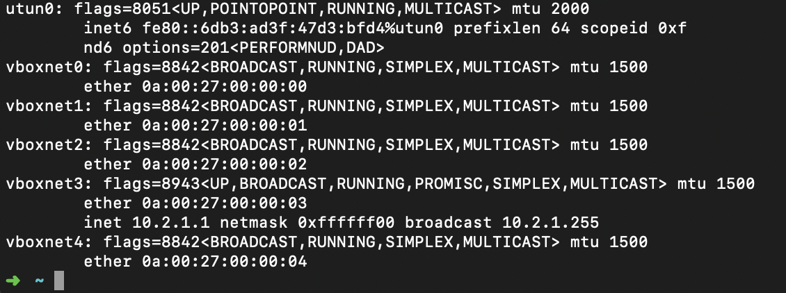

L'adresse MAC du PC hôte est bien identique à celle sur le scan nmap.

*Utiliser `ss` pour lister les ports TCP et UDP en écoute sur la machine :*

Il y a donc 5 programmes qui écoutent sur les ports :

| Nom des programmes | Numéro de ports                |
| ------------------ | ------------------------------ |
| dhclient           | 68 (toutes les IP)             |
| master             | 25 (uniquement IP = 127.0.0.1) |
| sshd               | 22 (toutes les IP)             |
| master             | 25 (toutes les IPv6)           |
| sshd               | 22 (toutes les IPv6.0)         |

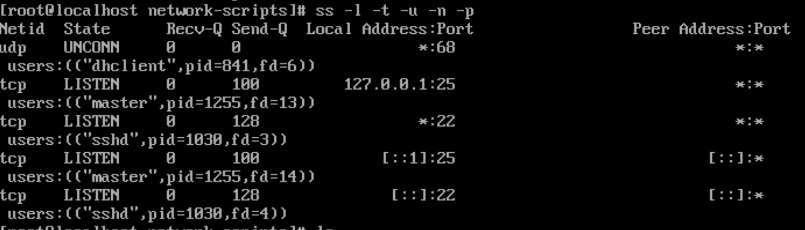

*essayez quand même de le lancer vite fait, pendant un `ping` vers votre PC hôte par exemple :*

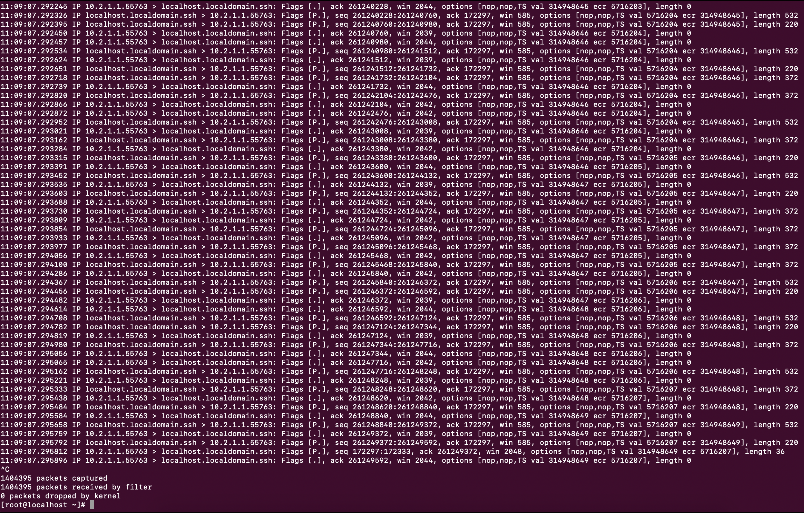

## Notion de ports

### SSH

*Mode permissive pour SELinux :*

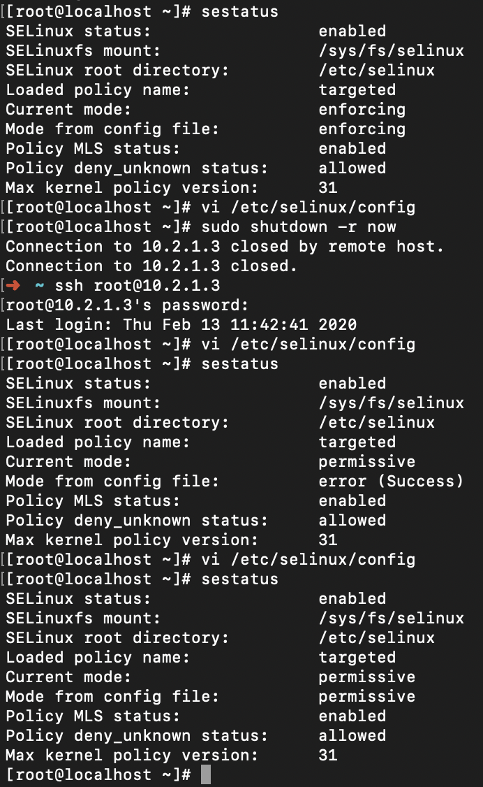

*Déterminer sur quelle(s) IP(s) et sur quel(s) port(s) le serveur SSH écoute actuellement :*

```shell
[root@localhost ~]# ss -ltunp
Netid State      Recv-Q Send-Q     Local Address:Port                    Peer Address:Port              
udp   UNCONN     0      0                      *:68                                 *:*                   users:(("dhclient",pid=838,fd=6))
tcp   LISTEN     0      100            127.0.0.1:25                                 *:*                   users:(("master",pid=1293,fd=13))
tcp   LISTEN     0      128                    *:22                                 *:*                   users:(("sshd",pid=1064,fd=3))
tcp   LISTEN     0      100                [::1]:25                              [::]:*                   users:(("master",pid=1293,fd=14))
tcp   LISTEN     0      128                 [::]:22                              [::]:*                   users:(("sshd",pid=1064,fd=4))
[root@localhost ~]# 
```

Le port ssh écoute actuellement sur le port 22 toutes les IP.

*Effectuer une connexion SSH :*

```shell
➜  ~ ssh root@10.2.1.3
root@10.2.1.3's password: 
Last login: Thu Feb 13 11:43:18 2020 from 10.2.1.1
[root@localhost ~]# 
```

```shell
➜  ~ ssh root@10.2.1.3
root@10.2.1.3's password: 
Last login: Thu Feb 13 11:43:18 2020 from 10.2.1.1
[root@localhost ~]# ss -ltunp
Netid State      Recv-Q Send-Q     Local Address:Port                    Peer Address:Port              
udp   UNCONN     0      0                      *:68                                 *:*                   users:(("dhclient",pid=838,fd=6))
tcp   LISTEN     0      100            127.0.0.1:25                                 *:*                   users:(("master",pid=1293,fd=13))
tcp   LISTEN     0      128                    *:22                                 *:*                   users:(("sshd",pid=1064,fd=3))
tcp   LISTEN     0      100                [::1]:25                              [::]:*                   users:(("master",pid=1293,fd=14))
tcp   LISTEN     0      128                 [::]:22                              [::]:*                   users:(("sshd",pid=1064,fd=4))
[root@localhost ~]# 
```


### Firewall

#### A. SSH

*Modifier le port du service SSH :*

```shell
[root@localhost ~]# vi /etc/ssh/sshd_config
[root@localhost ~]# cat /etc/ssh/sshd_config
#	$OpenBSD: sshd_config,v 1.100 2016/08/15 12:32:04 naddy Exp $

# This is the sshd server system-wide configuration file.  See
# sshd_config(5) for more information.

# This sshd was compiled with PATH=/usr/local/bin:/usr/bin

# The strategy used for options in the default sshd_config shipped with
# OpenSSH is to specify options with their default value where
# possible, but leave them commented.  Uncommented options override the
# default value.

# If you want to change the port on a SELinux system, you have to tell
# SELinux about this change.
# semanage port -a -t ssh_port_t -p tcp #PORTNUMBER
#
Port 10000
#AddressFamily any
#ListenAddress 0.0.0.0
#ListenAddress ::

HostKey /etc/ssh/ssh_host_rsa_key
#HostKey /etc/ssh/ssh_host_dsa_key
HostKey /etc/ssh/ssh_host_ecdsa_key
HostKey /etc/ssh/ssh_host_ed25519_key

[...]

# override default of no subsystems
Subsystem	sftp	/usr/libexec/openssh/sftp-server

# Example of overriding settings on a per-user basis
#Match User anoncvs
#	X11Forwarding no
#	AllowTcpForwarding no
#	PermitTTY no
#	ForceCommand cvs server
[root@localhost ~]# sudo systemctl restart sshd
[root@localhost ~]# 
```

Après modification, le numero de port devrait être maintenant 10 000.

*Vérifier que le service SSH écoute sur le nouveau port choisi*

```shell
[root@localhost ~]# ss -ltunp
Netid  State      Recv-Q Send-Q                                        Local Address:Port                                                       Peer Address:Port              
udp    UNCONN     0      0                                                         *:68                                                                    *:*                   users:(("dhclient",pid=838,fd=6))
tcp    LISTEN     0      100                                               127.0.0.1:25                                                                    *:*                   users:(("master",pid=1293,fd=13))
tcp    LISTEN     0      128                                                       *:10000                                                                 *:*                   users:(("sshd",pid=1437,fd=3))
tcp    LISTEN     0      100                                                   [::1]:25                                                                 [::]:*                   users:(("master",pid=1293,fd=14))
tcp    LISTEN     0      128                                                    [::]:10000                                                              [::]:*                   users:(("sshd",pid=1437,fd=4))
[root@localhost ~]# exit
déconnexion
Connection to 10.2.1.3 closed.
➜  ~ ssh root@10.2.1.3
ssh: connect to host 10.2.1.3 port 22: Connection refused
```

Le service SSH écoute sur le nouveau port mais la connexoin ssh échoue à cause du firewall.

*Vérifier la bonne connexion :*

```shell
➜  ~ ssh root@10.2.1.3 -p 10000
root@10.2.1.3's password: 
Last login: Thu Feb 13 12:09:14 2020 from 10.2.1.1
[root@localhost ~]# 
```

#### B. Netcat

*Comme dans le précédent TP, on va faire un ptit chat. La VM sera le serveur, le PC sera le client :*

​	– 1er Terminal de la VM :

```shell
[root@localhost ~]# sudo firewall-cmd --add-port=20000/tcp --permanent
success
[root@localhost ~]# sudo systemctl restart sshd
success
[root@localhost ~]# nc 10.2.1.1 20000
jhzge
```

– 2nd Terminal sur l'hôte :

```shell
➜  ~ nc -l 20000               
jhzge
```

– 3ieme Terminal sur la VM :

```shell
➜  ~ ssh root@10.2.1.3 -p 10000
root@10.2.1.3's password: 
[root@localhost ~]# ss -tunp
Netid  State      Recv-Q Send-Q Local Address:Port               Peer Address:Port              
tcp    ESTAB      0      0      10.2.1.3:10000              10.2.1.1:49329               users:(("sshd",pid=1328,fd=3))
tcp    ESTAB      0      0      10.2.1.3:10000              10.2.1.1:49380               users:(("sshd",pid=1367,fd=3))
tcp    ESTAB      0      0      10.2.1.3:38798              10.2.1.1:20000               users:(("nc",pid=1366,fd=3))
```

*Inversez les rôles, le PC est le serveur netcat, la VM est le client :*

​	– 1er Terminal de l'hôte :

```shell
➜  ~ nc 10.2.1.3 20000
uhzhch
vkhkzlvn
bondouuuuuur
goodbye
ooo
ooo
```

– 2nd Terminal sur la VM :

```shell
➜  ~ ssh root@10.2.1.3 -p 10000
root@10.2.1.3's password: 
Last login: Thu Feb 20 10:17:29 2020
[root@localhost ~]# nc -l 20000
uhzhch
vkhkzlvn
bondouuuuuur
goodbye
ooo
ooo
```

– 3ieme Terminal sur l'hôte :

```shell
➜  ~ netstat -p tcp -n | grep 20000
tcp4       0      0  10.2.1.1.64094         10.2.1.3.20000         ESTABLISHED
```


### 3. Wireshark

Pendant que le PC joue le rôle du serveur

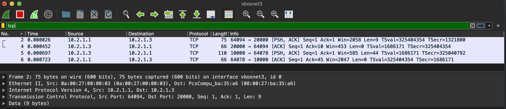

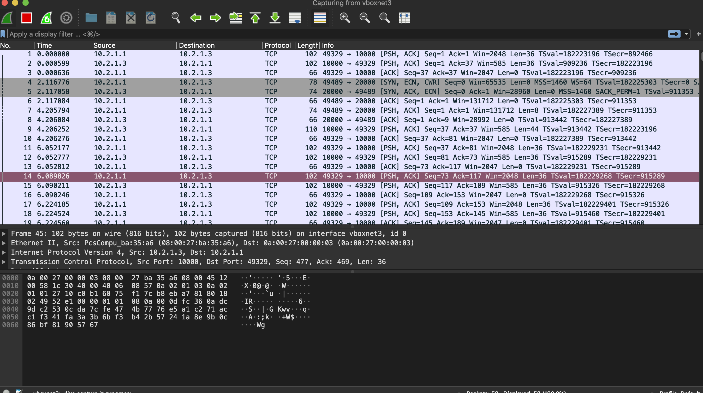

Puis pendant que la VM joue le rôle du serveur

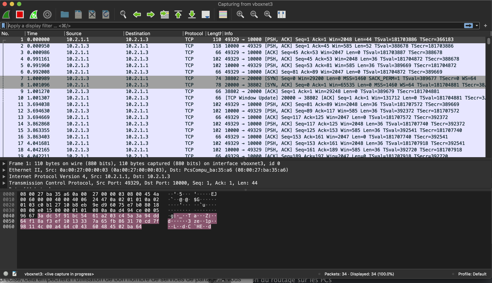

Le contenu des messages envoyés avec `netcat` est visible dans Wireshark par le protocole TCP. Les trois messages  d'établissement de la connexion sont ceux avec [SYN], [SYN, ACK], [ACK].

## III. Routage statique (duo avec Marie Dugoua)

### 1. Préparation des hôtes 

#### Préparation avec câble

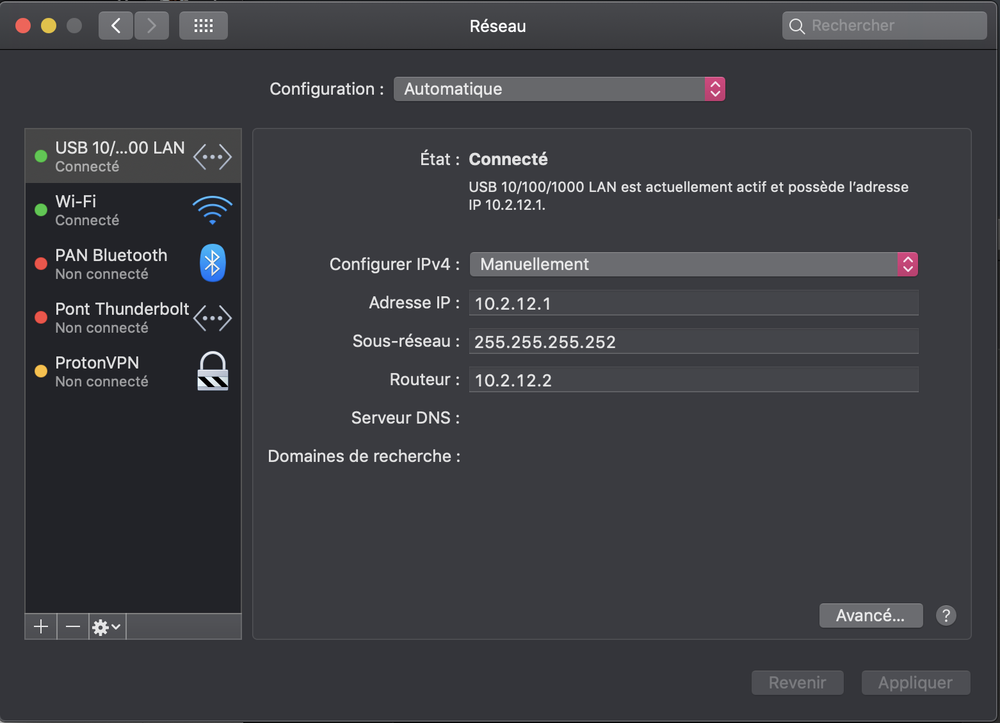

#### Préparation VirtualBox

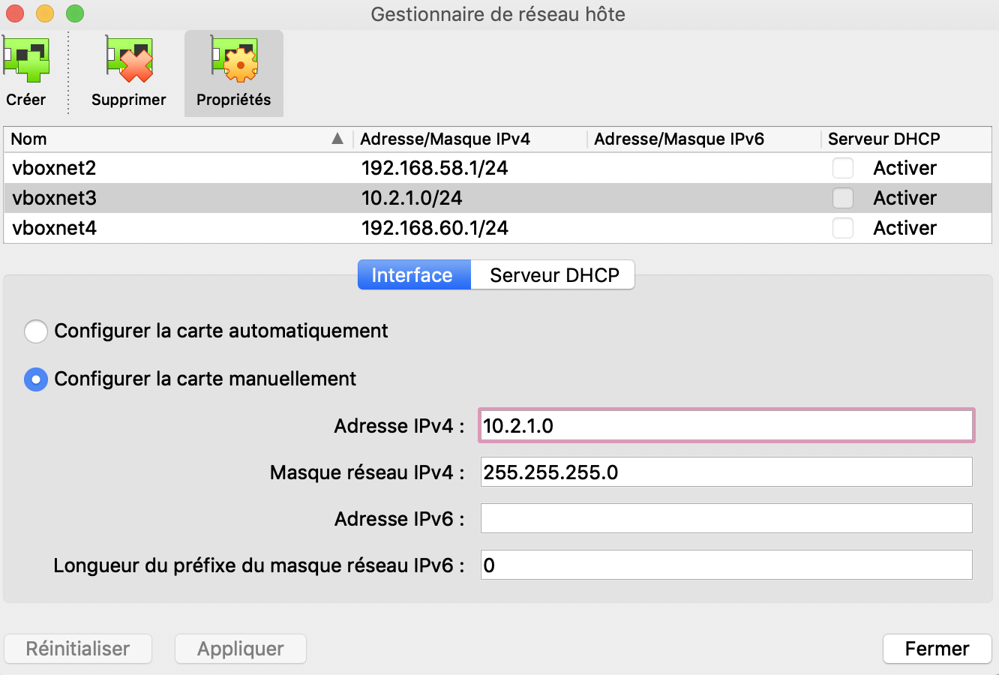

#### Check

PC1 et PC2 se ping en utilisant le réseau `12`

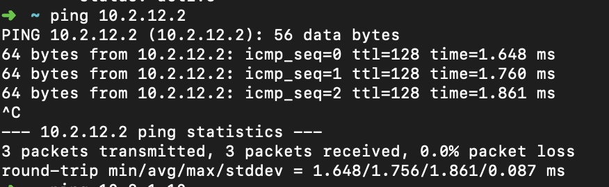

```shell
# VM1 et PC1 se ping en utilisant le réseau `1`

➜  ~ ping 10.2.1.2
PING 10.2.1.2 (10.2.1.2): 56 data bytes
64 bytes from 10.2.1.2: icmp_seq=0 ttl=64 time=0.490 ms
64 bytes from 10.2.1.2: icmp_seq=1 ttl=64 time=0.588 ms
64 bytes from 10.2.1.2: icmp_seq=2 ttl=64 time=0.599 ms
^C
--- 10.2.1.2 ping statistics ---
3 packets transmitted, 3 packets received, 0.0% packet loss
round-trip min/avg/max/stddev = 0.490/0.559/0.599/0.049 ms
➜  ~ 
```

```shell
# PC2 et VM2 se ping en utilisant le reseau 2

➜  ~ ping 10.2.2.2
PING 10.2.2.2 (10.2.2.2): 56 data bytes
64 bytes from 10.2.2.2: icmp_seq=0 ttl=64 time=0.275 ms
64 bytes from 10.2.2.2: icmp_seq=1 ttl=64 time=0.606 ms
64 bytes from 10.2.2.2: icmp_seq=2 ttl=64 time=0.353 ms
^C
--- 10.2.2.2 ping statistics ---
3 packets transmitted, 3 packets received, 0.0% packet loss
round-trip min/avg/max/stddev = 0.275/0.411/0.606/0.141 ms
```

#### Activation du routage sur les PCs

```shell
➜  ~ sudo sysctl -w net.inet.ip.forwarding=1
Password:
net.inet.ip.forwarding: 0 -> 1
```

### 2. Configuration du routage

#### A. PC1

```shell
➜  ~ sudo route -n add -net 10.2.2.0/24 10.2.12.2
Password:
add net 10.2.2.0: gateway 10.2.12.2
```

```shell
➜  ~ ping 10.2.2.1
PING 10.2.2.1 (10.2.2.1): 56 data bytes
64 bytes from 10.2.2.1: icmp_seq=0 ttl=64 time=0.549 ms
64 bytes from 10.2.2.1: icmp_seq=1 ttl=64 time=0.727 ms
64 bytes from 10.2.2.1: icmp_seq=2 ttl=64 time=0.770 ms
^C
--- 10.2.2.1 ping statistics ---
3 packets transmitted, 3 packets received, 0.0% packet loss
round-trip min/avg/max/stddev = 0.549/0.682/0.770/0.096 ms
➜  ~ 
```

#### B. PC2

```shell
# PC2 créer la route via le reseau 12
➜  ~ sudo route -n add -net 10.2.1.0/24 10.2.12.1
Password:
add net 10.2.1.0: gateway 10.2.12.1

# PC2 ping 10.2.1.1
➜  ~ ping 10.2.1.1
PING 10.2.1.1 (10.2.1.1): 56 data bytes
64 bytes from 10.2.1.1: icmp_seq=0 ttl=64 time=0.359 ms
64 bytes from 10.2.1.1: icmp_seq=1 ttl=64 time=0.480 ms
64 bytes from 10.2.1.1: icmp_seq=2 ttl=64 time=0.750 ms
64 bytes from 10.2.1.1: icmp_seq=3 ttl=64 time=0.663 ms
64 bytes from 10.2.1.1: icmp_seq=4 ttl=64 time=0.821 ms
^C
--- 10.2.1.1 ping statistics ---
5 packets transmitted, 5 packets received, 0.0% packet loss
round-trip min/avg/max/stddev = 0.359/0.615/0.821/0.171 ms
```

#### C. VM1

```shell
[root@localhost ~]# ip route add 10.2.2.0/24 via 10.2.1.1 dev enp0s8
[root@localhost ~]# ip route show
default via 10.0.2.2 dev enp0s3 proto dhcp metric 100 
10.2.1.0/24 dev enp0s8 proto kernel scope link src 10.2.1.2 metric 101 
10.2.2.0/24 via 10.2.1.1 dev enp0s8 
```

```shell
[root@localhost ~]# ping 10.2.2.1
PING 10.2.2.1 (10.2.2.1) 56(84) bytes of data.
64 bytes from 10.2.2.1: icmp_seq=1 ttl=63 time=0.611 ms
64 bytes from 10.2.2.1: icmp_seq=2 ttl=63 time=1.10 ms
64 bytes from 10.2.2.1: icmp_seq=3 ttl=63 time=1.05 ms
^C
--- 10.2.2.1 ping statistics ---
3 packets transmitted, 3 received, 0% packet loss, time 2009ms
rtt min/avg/max/mdev = 0.611/0.925/1.107/0.224 ms
```

```shell
[root@localhost ~]# traceroute 10.2.2.1
traceroute to 10.2.2.1 (10.2.2.1), 30 hops max, 60 byte packets
 1  pc1.tp2.b1 (10.2.1.1)  0.221 ms  0.173 ms  0.064 ms
 2  pc2.tp2.b1 (10.2.2.1)  1.015 ms  0.941 ms  0.973 ms
```

#### D. VM2

```shell
# VM2 joint le reseau
[root@localhost ~]# ip route add 10.2.1.0/24 via 10.2.2.1 dev enp0s8
[root@localhost ~]# ip route show
10.2.1.0/24 via 10.2.2.1 dev enp0s8
10.2.2.0/24 dev enp0s8 proto kernel scope link src 10.2.2.2 metric 100

# VM2 peut ping 10.2.1.1 (PC1)
[root@localhost ~]# ping 10.2.1.1
PING 10.2.1.1 (10.2.1.1) 56(84) bytes of data.
64 bytes from 10.2.1.1: icmp_seq=1 ttl=63 time=0.525 ms
64 bytes from 10.2.1.1: icmp_seq=2 ttl=63 time=1.03 ms
64 bytes from 10.2.1.1: icmp_seq=3 ttl=63 time=1.12 ms
64 bytes from 10.2.1.1: icmp_seq=4 ttl=63 time=1.11 ms
64 bytes from 10.2.1.1: icmp_seq=5 ttl=63 time=1.17 ms
64 bytes from 10.2.1.1: icmp_seq=6 ttl=63 time=0.810 ms
^C
--- 10.2.1.1 ping statistics ---
6 packets transmitted, 6 received, 0% packet loss, time 5004ms
rtt min/avg/max/mdev = 0.525/0.964/1.175/0.229 ms

# traceroute 10.2.1.1(VM1)
[root@localhost ~]# traceroute 10.2.1.1
traceroute to 10.2.1.1 (10.2.1.1), 30 hops max, 60 byte packets
 1  pc2.tp2.b1 (10.2.2.1)  0.136 ms  0.110 ms  0.157 ms
 2  pc1.tp2.b1 (10.2.1.1)  0.667 ms  0.567 ms  0.516 ms
```

#### E. El gran final

```shell
[root@localhost ~]# ping 10.2.2.2
PING 10.2.2.2 (10.2.2.2) 56(84) bytes of data.
64 bytes from 10.2.2.2: icmp_seq=1 ttl=62 time=1.30 ms
64 bytes from 10.2.2.2: icmp_seq=2 ttl=62 time=1.40 ms
64 bytes from 10.2.2.2: icmp_seq=3 ttl=62 time=1.53 ms
^C
--- 10.2.2.2 ping statistics ---
3 packets transmitted, 3 received, 0% packet loss, time 2010ms
rtt min/avg/max/mdev = 1.302/1.416/1.539/0.106 ms
[root@localhost ~]# 
```

### 3. Configuration des noms de domaine

```shell
[root@localhost etc]# cat hosts
127.0.0.1   localhost localhost.localdomain localhost4 localhost4.localdomain4
::1         localhost localhost.localdomain localhost6 localhost6.localdomain6
10.2.2.2    vm2.tp2.b1
10.2.1.1    pc1.tp2.b1
10.2.1.2    vm1.tp2.b1
10.2.2.1    pc2.tp2.b1
```

```shell
# vm1.tp2.b1 ping vm2.tp2.b1

[root@localhost etc]# ping vm2.tp2.b1
PING vm2.tp2.b1 (10.2.2.2) 56(84) bytes of data.
64 bytes from vm2.tp2.b1 (10.2.2.2): icmp_seq=1 ttl=62 time=1.31 ms
64 bytes from vm2.tp2.b1 (10.2.2.2): icmp_seq=2 ttl=62 time=1.49 ms
64 bytes from vm2.tp2.b1 (10.2.2.2): icmp_seq=3 ttl=62 time=1.11 ms
^C
--- vm2.tp2.b1 ping statistics ---
3 packets transmitted, 3 received, 0% packet loss, time 2006ms
rtt min/avg/max/mdev = 1.114/1.309/1.499/0.157 ms
[root@localhost etc]# 
```

```shell
# vm1.tp2.b1 traceroute vers vm2.tp2.b1

[root@localhost ~]# traceroute vm2.tp2.b1
traceroute to vm2.tp2.b1 (10.2.2.2), 30 hops max, 60 byte packets
 1  pc1.tp2.b1 (10.2.1.1)  0.253 ms  0.298 ms  0.222 ms
 2  * * *
 3  vm2.tp2.b1 (10.2.2.2)  1.028 ms !X  0.814 ms !X  0.985 ms !X
[root@localhost ~]# 
```

```shell
# vm1.tp2.b1 netcat serveur, vm2.tp2.b1 netcat client

[root@localhost ~]# nc vm2.tp2.b1 20000
hello bella
hi

[root@localhost ~]# nc -l 20000
hello bella
hi
```

## Bilan

## Annexe 1 : Désactiver SELinux

