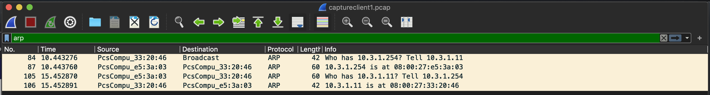
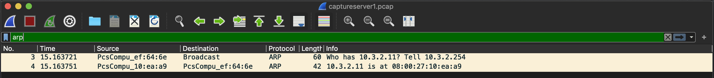
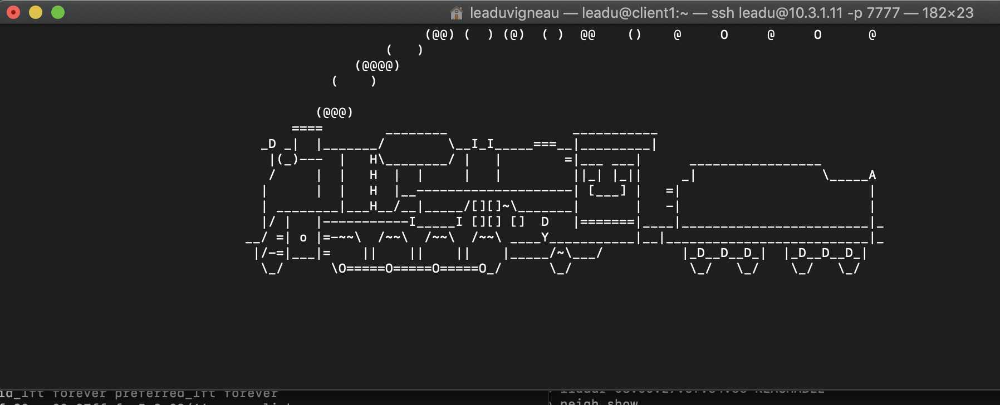
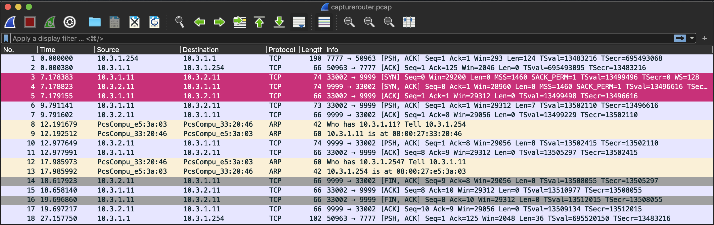
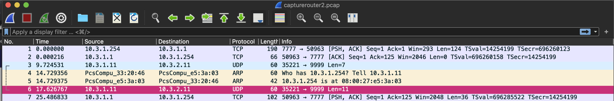
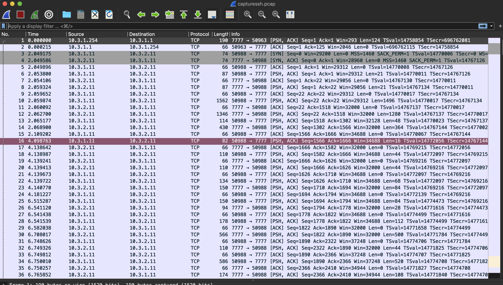

# TP 3 - Routage, ARP, Spéléologie réseau

## Préparation de l'environnement

### Mise à jour du patron

### Mise en place du lab

#### Réseaux

#### Tableau d'adressage

#### Schéma réseau

#### Indications

🌞 **Prouvez que chacun des points de la préparation de l'environnement ci-dessus ont été respectés** :

- Carte NAT désactivée

  1. Client1

     ```shell
     [leadu@client1 ~]$ ip a
     1: lo: <LOOPBACK,UP,LOWER_UP> mtu 65536 qdisc noqueue state UNKNOWN group default qlen 1000
         link/loopback 00:00:00:00:00:00 brd 00:00:00:00:00:00
         inet 127.0.0.1/8 scope host lo
            valid_lft forever preferred_lft forever
         inet6 ::1/128 scope host 
            valid_lft forever preferred_lft forever
     2: enp0s3: <BROADCAST,MULTICAST,UP,LOWER_UP> mtu 1500 qdisc pfifo_fast state UP group default qlen 1000
         link/ether 08:00:27:36:c7:3d brd ff:ff:ff:ff:ff:ff
     3: enp0s8: <BROADCAST,MULTICAST,UP,LOWER_UP> mtu 1500 qdisc pfifo_fast state UP group default qlen 1000
         link/ether 08:00:27:33:20:46 brd ff:ff:ff:ff:ff:ff
         inet 10.3.1.11/24 brd 10.3.1.255 scope global noprefixroute enp0s8
            valid_lft forever preferred_lft forever
         inet6 fe80::a00:27ff:fe33:2046/64 scope link 
            valid_lft forever preferred_lft forever
     [leadu@client1 ~]$ 
     ```

  2. Server1

     ```shell
     [leadu@server1 ~]$ ip a
     1: lo: <LOOPBACK,UP,LOWER_UP> mtu 65536 qdisc noqueue state UNKNOWN group default qlen 1000
         link/loopback 00:00:00:00:00:00 brd 00:00:00:00:00:00
         inet 127.0.0.1/8 scope host lo
            valid_lft forever preferred_lft forever
         inet6 ::1/128 scope host 
            valid_lft forever preferred_lft forever
     2: enp0s3: <BROADCAST,MULTICAST,UP,LOWER_UP> mtu 1500 qdisc pfifo_fast state UP group default qlen 1000
         link/ether 08:00:27:36:c7:3d brd ff:ff:ff:ff:ff:ff
     3: enp0s8: <BROADCAST,MULTICAST,UP,LOWER_UP> mtu 1500 qdisc pfifo_fast state UP group default qlen 1000
         link/ether 08:00:27:10:ea:a9 brd ff:ff:ff:ff:ff:ff
         inet 10.3.2.11/24 brd 10.3.2.255 scope global noprefixroute enp0s8
            valid_lft forever preferred_lft forever
         inet6 fe80::a00:27ff:fe10:eaa9/64 scope link 
            valid_lft forever preferred_lft forever
     [leadu@server1 ~]$ 
     ```

  3. Router

     ```shell
     [leadu@router ~]$ ip a
     1: lo: <LOOPBACK,UP,LOWER_UP> mtu 65536 qdisc noqueue state UNKNOWN group default qlen 1000
         link/loopback 00:00:00:00:00:00 brd 00:00:00:00:00:00
         inet 127.0.0.1/8 scope host lo
            valid_lft forever preferred_lft forever
         inet6 ::1/128 scope host 
            valid_lft forever preferred_lft forever
     2: enp0s3: <BROADCAST,MULTICAST,UP,LOWER_UP> mtu 1500 qdisc pfifo_fast state UP group default qlen 1000
         link/ether 08:00:27:36:c7:3d brd ff:ff:ff:ff:ff:ff
     3: enp0s8: <BROADCAST,MULTICAST,UP,LOWER_UP> mtu 1500 qdisc pfifo_fast state UP group default qlen 1000
         link/ether 08:00:27:e5:3a:03 brd ff:ff:ff:ff:ff:ff
         inet 10.3.1.254/24 brd 10.3.1.255 scope global noprefixroute enp0s8
            valid_lft forever preferred_lft forever
         inet6 fe80::a00:27ff:fee5:3a03/64 scope link 
            valid_lft forever preferred_lft forever
     4: enp0s9: <BROADCAST,MULTICAST,UP,LOWER_UP> mtu 1500 qdisc pfifo_fast state UP group default qlen 1000
         link/ether 08:00:27:ef:64:6e brd ff:ff:ff:ff:ff:ff
         inet 10.3.2.254/24 brd 10.3.2.255 scope global noprefixroute enp0s9
            valid_lft forever preferred_lft forever
         inet6 fe80::a00:27ff:feef:646e/64 scope link 
            valid_lft forever preferred_lft forever
     [leadu@router ~]$ 
     ```

- Serveur SSH fonctionnel qui écoute sur le port 7777/tcp

  1. Client 1

     ```shell
     [leadu@client1 ~]$ ss -tn
     State      Recv-Q Send-Q         Local Address:Port                        Peer Address:Port              
     ESTAB      0      0                  10.3.1.11:7777                            10.3.1.1:53733              
     [leadu@client1 ~]$ 
     ```

  2. Server1

     ```shell
     [leadu@server1 ~]$ ss -tn
     State      Recv-Q Send-Q Local Address:Port               Peer Address:Port              
     ESTAB      0      0      10.3.2.11:7777               10.3.2.1:53784              
     [leadu@server1 ~]$ 
     ```

  3. Router

     ```shell
     [leadu@router ~]$ ss -tn
     State      Recv-Q Send-Q Local Address:Port               Peer Address:Port              
     ESTAB      0      0      10.3.2.254:7777               10.3.2.1:53828              
     ESTAB      0      0      10.3.1.254:7777               10.3.1.1:53876              
     [leadu@router ~]$ 
     ```

     

- Pare-feu activé et configuré

  1. Client 1

     ```shell
     [leadu@client1 ~]$ sudo firewall-cmd --list-all
     [sudo] password for leadu: 
     public (active)
       target: default
       icmp-block-inversion: no
       interfaces: enp0s8
       sources: 
       services: dhcpv6-client ssh
       ports: 80/tcp 7777/tcp
       protocols: 
       masquerade: no
       forward-ports: 
       source-ports: 
       icmp-blocks: 
       rich rules: 
     	
     [leadu@client1 ~]$ 
     ```

  2. Server1

     ```shell
     [leadu@server1 ~]$ sudo firewall-cmd --list-all
     [sudo] password for leadu: 
     public (active)
       target: default
       icmp-block-inversion: no
       interfaces: enp0s8
       sources: 
       services: dhcpv6-client ssh
       ports: 80/tcp 7777/tcp
       protocols: 
       masquerade: no
       forward-ports: 
       source-ports: 
       icmp-blocks: 
       rich rules: 
     	
     [leadu@server1 ~]$ 
     ```

  3. Router

     ```shell
     [leadu@router ~]$ sudo firewall-cmd --list-all
     [sudo] password for leadu: 
     public (active)
       target: default
       icmp-block-inversion: no
       interfaces: enp0s8 enp0s9
       sources: 
       services: dhcpv6-client ssh
       ports: 80/tcp 7777/tcp
       protocols: 
       masquerade: no
       forward-ports: 
       source-ports: 
       icmp-blocks: 
       rich rules: 
     	
     [leadu@router ~]$
     ```

- Nom de domaine configuré

  1. Client 1

     ```shell
     [leadu@client1 ~]$ hostname
     client1.net1.tp3
     [leadu@client1 ~]$ 
     ```

  2. Server1

     ```shell
     [leadu@server1 ~]$ hostname
     server1.net2.tp3
     [leadu@server1 ~]$ 
     ```

  3. Router

     ```shell
     [leadu@router ~]$ hostname
     router.tp3
     [leadu@router ~]$ 
     ```

- Fichiers `/etc/hosts` de toutes les machines configurés

  1. Client 1

     ```shell
     [leadu@client1 ~]$ sudo cat /etc/hosts
     127.0.0.1   localhost localhost.localdomain localhost4 localhost4.localdomain4
     ::1         localhost localhost.localdomain localhost6 localhost6.localdomain6
     
     10.3.1.11   client1
     10.3.2.11   server1
     10.3.1.254  router
     [leadu@client1 ~]$ 
     ```

  2. Server1

     ```shell
     [leadu@server1 ~]$ sudo cat /etc/hosts
     127.0.0.1   localhost localhost.localdomain localhost4 localhost4.localdomain4
     ::1         localhost localhost.localdomain localhost6 localhost6.localdomain6
     10.3.2.11   server1
     10.3.1.11   client1
     10.3.2.254  router
     [leadu@server1 ~]$ 
     ```

  3. Router

     ```shell
     [leadu@router ~]$ sudo cat /etc/hosts
     127.0.0.1   localhost localhost.localdomain localhost4 localhost4.localdomain4
     ::1         localhost localhost.localdomain localhost6 localhost6.localdomain6
     
     10.3.1.254  router.net1
     10.3.1.11   client1
     10.3.2.254  router.net2
     10.3.2.11   server1
     [leadu@router ~]$ 
     ```

- Réseaux et adressage des machines

  1. Client 1
  
     ```shell
     [leadu@client1 ~]$ ip a
     1: lo: <LOOPBACK,UP,LOWER_UP> mtu 65536 qdisc noqueue state UNKNOWN group default qlen 1000
         link/loopback 00:00:00:00:00:00 brd 00:00:00:00:00:00
         inet 127.0.0.1/8 scope host lo
            valid_lft forever preferred_lft forever
         inet6 ::1/128 scope host 
            valid_lft forever preferred_lft forever
     2: enp0s3: <BROADCAST,MULTICAST,UP,LOWER_UP> mtu 1500 qdisc pfifo_fast state UP group default qlen 1000
         link/ether 08:00:27:36:c7:3d brd ff:ff:ff:ff:ff:ff
     3: enp0s8: <BROADCAST,MULTICAST,UP,LOWER_UP> mtu 1500 qdisc pfifo_fast state UP group default qlen 1000
         link/ether 08:00:27:33:20:46 brd ff:ff:ff:ff:ff:ff
         inet 10.3.1.11/24 brd 10.3.1.255 scope global noprefixroute enp0s8
            valid_lft forever preferred_lft forever
         inet6 fe80::a00:27ff:fe33:2046/64 scope link 
            valid_lft forever preferred_lft forever
     [leadu@client1 ~]$ 
     ```
  
     ```shell
     [leadu@client1 ~]$ ping router
     PING router (10.3.1.254) 56(84) bytes of data.
     64 bytes from router (10.3.1.254): icmp_seq=1 ttl=64 time=0.660 ms
     64 bytes from router (10.3.1.254): icmp_seq=2 ttl=64 time=0.628 ms
     64 bytes from router (10.3.1.254): icmp_seq=3 ttl=64 time=0.883 ms
     ^C
     --- router ping statistics ---
     3 packets transmitted, 3 received, 0% packet loss, time 2007ms
     rtt min/avg/max/mdev = 0.628/0.723/0.883/0.117 ms
     [leadu@client1 ~]$ 
     ```
  
  2. Server1
  
     ```shell
     [leadu@server1 ~]$ ip a
     1: lo: <LOOPBACK,UP,LOWER_UP> mtu 65536 qdisc noqueue state UNKNOWN group default qlen 1000
         link/loopback 00:00:00:00:00:00 brd 00:00:00:00:00:00
         inet 127.0.0.1/8 scope host lo
            valid_lft forever preferred_lft forever
         inet6 ::1/128 scope host 
            valid_lft forever preferred_lft forever
     2: enp0s3: <BROADCAST,MULTICAST,UP,LOWER_UP> mtu 1500 qdisc pfifo_fast state UP group default qlen 1000
         link/ether 08:00:27:36:c7:3d brd ff:ff:ff:ff:ff:ff
     3: enp0s8: <BROADCAST,MULTICAST,UP,LOWER_UP> mtu 1500 qdisc pfifo_fast state UP group default qlen 1000
         link/ether 08:00:27:10:ea:a9 brd ff:ff:ff:ff:ff:ff
         inet 10.3.2.11/24 brd 10.3.2.255 scope global noprefixroute enp0s8
            valid_lft forever preferred_lft forever
         inet6 fe80::a00:27ff:fe10:eaa9/64 scope link 
            valid_lft forever preferred_lft forever
     [leadu@server1 ~]$ 
     ```
  
     ```shell
     [leadu@server1 ~]$ ping router
     PING router (10.3.2.254) 56(84) bytes of data.
     64 bytes from router (10.3.2.254): icmp_seq=1 ttl=64 time=0.425 ms
     64 bytes from router (10.3.2.254): icmp_seq=2 ttl=64 time=0.685 ms
     64 bytes from router (10.3.2.254): icmp_seq=3 ttl=64 time=0.653 ms
     ^C
     --- router ping statistics ---
     3 packets transmitted, 3 received, 0% packet loss, time 2002ms
     rtt min/avg/max/mdev = 0.425/0.587/0.685/0.119 ms
     [leadu@server1 ~]$ 
     ```
  
  3. Router
  
     ```shell
     [leadu@router ~]$ ip a
     1: lo: <LOOPBACK,UP,LOWER_UP> mtu 65536 qdisc noqueue state UNKNOWN group default qlen 1000
         link/loopback 00:00:00:00:00:00 brd 00:00:00:00:00:00
         inet 127.0.0.1/8 scope host lo
            valid_lft forever preferred_lft forever
         inet6 ::1/128 scope host 
            valid_lft forever preferred_lft forever
     2: enp0s3: <BROADCAST,MULTICAST,UP,LOWER_UP> mtu 1500 qdisc pfifo_fast state UP group default qlen 1000
         link/ether 08:00:27:36:c7:3d brd ff:ff:ff:ff:ff:ff
     3: enp0s8: <BROADCAST,MULTICAST,UP,LOWER_UP> mtu 1500 qdisc pfifo_fast state UP group default qlen 1000
         link/ether 08:00:27:e5:3a:03 brd ff:ff:ff:ff:ff:ff
         inet 10.3.1.254/24 brd 10.3.1.255 scope global noprefixroute enp0s8
            valid_lft forever preferred_lft forever
         inet6 fe80::a00:27ff:fee5:3a03/64 scope link 
            valid_lft forever preferred_lft forever
     4: enp0s9: <BROADCAST,MULTICAST,UP,LOWER_UP> mtu 1500 qdisc pfifo_fast state UP group default qlen 1000
         link/ether 08:00:27:ef:64:6e brd ff:ff:ff:ff:ff:ff
         inet 10.3.2.254/24 brd 10.3.2.255 scope global noprefixroute enp0s9
            valid_lft forever preferred_lft forever
         inet6 fe80::a00:27ff:feef:646e/64 scope link 
            valid_lft forever preferred_lft forever
     [leadu@router ~]$ 
     ```
  
     ```shell
     [leadu@router ~]$ ping client1
     PING client1 (10.3.1.11) 56(84) bytes of data.
     64 bytes from client1 (10.3.1.11): icmp_seq=1 ttl=64 time=0.590 ms
     64 bytes from client1 (10.3.1.11): icmp_seq=2 ttl=64 time=0.529 ms
     64 bytes from client1 (10.3.1.11): icmp_seq=3 ttl=64 time=0.722 ms
     ^C
     --- client1 ping statistics ---
     3 packets transmitted, 3 received, 0% packet loss, time 2009ms
     rtt min/avg/max/mdev = 0.529/0.613/0.722/0.085 ms
     [leadu@router ~]$ 
     ```
  
     ```shell
     [leadu@router ~]$ ping server1
     PING server1 (10.3.2.11) 56(84) bytes of data.
     64 bytes from server1 (10.3.2.11): icmp_seq=1 ttl=64 time=0.689 ms
     64 bytes from server1 (10.3.2.11): icmp_seq=2 ttl=64 time=0.588 ms
     64 bytes from server1 (10.3.2.11): icmp_seq=3 ttl=64 time=0.592 ms
     ^C
     --- server1 ping statistics ---
     3 packets transmitted, 3 received, 0% packet loss, time 2004ms
     rtt min/avg/max/mdev = 0.588/0.623/0.689/0.046 ms
     [leadu@router ~]$ 
     ```

## Mise en place du routage

### Configuration du routage sur `router`

```shell
[leadu@router ~]$ sudo sysctl -w net.ipv4.conf.all.forwarding=1
[sudo] password for leadu: 
net.ipv4.conf.all.forwarding = 1
[leadu@router ~]$ 
```

### Ajouter les routes statiques

🌞 **Ajouter les routes nécessaires pour que client1 puisse joindre `net2`**

```shell
[leadu@client1 ~]$ ip r s
default via 10.3.1.254 dev enp0s8 proto static metric 101 
10.3.1.0/24 dev enp0s8 proto kernel scope link src 10.3.1.11 metric 101 
[leadu@client1 ~]$ 
```

🌞 **Ajouter les routes nécessaires pour que server1 puisse joindre `net1`**

```shell
[leadu@server1 network-scripts]$ ip r s
10.3.1.0/24 via 10.3.2.254 dev enp0s8 proto static metric 101 
10.3.2.0/24 dev enp0s8 proto kernel scope link src 10.3.2.11 metric 101 
[leadu@server1 network-scripts]$ 
```

**Tester le bon fonctionnement avec des pings**

```shell
PING CLIENT1 -> SERVER1

[leadu@client1 network-scripts]$ ping server1
PING server1 (10.3.2.11) 56(84) bytes of data.
64 bytes from server1 (10.3.2.11): icmp_seq=1 ttl=63 time=0.713 ms
64 bytes from server1 (10.3.2.11): icmp_seq=2 ttl=63 time=1.28 ms
64 bytes from server1 (10.3.2.11): icmp_seq=3 ttl=63 time=1.29 ms
64 bytes from server1 (10.3.2.11): icmp_seq=4 ttl=63 time=1.13 ms
^C
--- server1 ping statistics ---
4 packets transmitted, 4 received, 0% packet loss, time 3003ms
rtt min/avg/max/mdev = 0.713/1.108/1.296/0.239 ms
[leadu@client1 network-scripts]$ 


PING SERVER1 -> CLIENT1

[leadu@server1 network-scripts]$ ping client1
PING client1 (10.3.1.11) 56(84) bytes of data.
^C
--- client1 ping statistics ---
8 packets transmitted, 0 received, 100% packet loss, time 7002ms

[leadu@server1 network-scripts]$ ping client1
PING client1 (10.3.1.11) 56(84) bytes of data.
64 bytes from client1 (10.3.1.11): icmp_seq=1 ttl=63 time=0.766 ms
64 bytes from client1 (10.3.1.11): icmp_seq=2 ttl=63 time=1.29 ms
64 bytes from client1 (10.3.1.11): icmp_seq=3 ttl=63 time=1.58 ms
^C
--- client1 ping statistics ---
3 packets transmitted, 3 received, 0% packet loss, time 2003ms
rtt min/avg/max/mdev = 0.766/1.213/1.583/0.340 ms
[leadu@server1 network-scripts]$ 
```

**Tester le bon fonctionnement avec avec traceroute**

```shell
[leadu@client1 network-scripts]$ traceroute server1
traceroute to server1 (10.3.2.11), 30 hops max, 60 byte packets
 1  router (10.3.1.254)  0.561 ms  0.348 ms  0.482 ms
 2  router (10.3.1.254)  0.429 ms !X  0.373 ms !X  0.168 ms !X
[leadu@client1 network-scripts]$ 
```

```shell
[leadu@server1 network-scripts]$ traceroute client1
traceroute to client1 (10.3.1.11), 30 hops max, 60 byte packets
 1  router (10.3.2.254)  0.324 ms  0.172 ms  0.255 ms
 2  router (10.3.2.254)  0.207 ms !X  0.177 ms !X  0.169 ms !X
[leadu@server1 network-scripts]$ 
```

### Comprendre le routage

- 🌞 **Faites moi un 'tit tableau représentant cette trame choisie :**

|                                             | MAC src                  | MAC dst                  | IP src            | IP dst          |
| ------------------------------------------- | ------------------------ | ------------------------ | ----------------- | --------------- |
| Dans `net1` (trame qui entre dans `router`) | ``` 08:00:27:e5:3a:03``` | ```0a:00:27:00:00:05 ``` | ```10.3.1.254 ``` | ```10.3.1.1 ``` |
| Dans `net2` (trame qui sort de `router`)    | ```08:00:27:ef:64:6e ``` | ```0a:00:27:00:00:06 ``` | ```10.3.2.254 ``` | ```10.3.2.1 ``` |

```shell
[leadu@router ~]$ sudo tcpdump -n -nn -i enp0s8 -w capture1.pcap
[sudo] password for leadu: 
tcpdump: listening on enp0s8, link-type EN10MB (Ethernet), capture size 262144 bytes
^C13 packets captured
14 packets received by filter
0 packets dropped by kernel
[leadu@router ~]$ 

[leadu@router ~]$ sudo tcpdump -n -nn -i enp0s9 -w capture2.pcap
tcpdump: listening on enp0s9, link-type EN10MB (Ethernet), capture size 262144 bytes
^C13 packets captured
13 packets received by filter
0 packets dropped by kernel
[leadu@router ~]$ 

➜  ~ scp -P 7777 leadu@10.3.1.254:/home/leadu/capture1.pcap ./
leadu@10.3.1.254's password: 
/etc/profile.d/lang.sh: line 19: warning: setlocale: LC_CTYPE: cannot change locale (UTF-8): No such file or directory
capture1.pcap                                 100%  708     1.2MB/s   00:00    
➜  ~ 

➜  ~ scp -P 7777 leadu@10.3.2.254:/home/leadu/capture2.pcap ./
leadu@10.3.2.254's password: 
/etc/profile.d/lang.sh: line 19: warning: setlocale: LC_CTYPE: cannot change locale (UTF-8): No such file or directory
capture2.pcap                                 100% 1020     1.7MB/s   00:00    
➜  ~ 
```

## ARP

### Tables ARP

🌞 **Affichez la table ARP de chacun des machines et expliquez toutes les lignes**

La table ARP permet d'enregistrer des couples d'adresse IPv4 et MAC à qui on a déjà envoyé ou reçu des requêtes. Il y a sur une ligne quatre informations : l'adresse IPv4, l'interface de réseau, l'adresse MAC ainsi que l'état du réseau (STALE, DELAY, REACHABLE).

*Table ARP client1 :*

```shell
[leadu@client1 network-scripts]$ ip neigh show
10.3.1.1 dev enp0s8 lladdr 0a:00:27:00:00:05 REACHABLE
10.3.1.254 dev enp0s8 lladdr 08:00:27:e5:3a:03 REACHABLE
[leadu@client1 network-scripts]$ 

```

La première ligne affiche l'adresse IPv4 du réseau Host-Only1 (vboxnet5) ainsi que son adresse MAC. La seconde ligne diffuse l'adresse IP du router dans le réseau net1 ainsi que son adresse MAC.

*Table ARP server1 :*

```shell
[leadu@server1 network-scripts]$ ip neigh show
10.3.2.254 dev enp0s8 lladdr 08:00:27:ef:64:6e STALE
10.3.2.1 dev enp0s8 lladdr 0a:00:27:00:00:06 DELAY
[leadu@server1 network-scripts]$ 
```

La première ligne donne l'adresse IPv4 du router dans le réseau net2 ainsi que son adresse MAC. La seconde ligne affiche l'adresse IP du réseau Host-Only2 (vboxnet6) ainsi que son adresse MAC. 

Table ARP router :*

```shell
[leadu@router ~]$ ip neigh show
10.3.2.11 dev enp0s9 lladdr 08:00:27:10:ea:a9 STALE
10.3.1.1 dev enp0s8 lladdr 0a:00:27:00:00:05 STALE
10.3.1.11 dev enp0s8 lladdr 08:00:27:33:20:46 STALE
10.3.2.1 dev enp0s9 lladdr 0a:00:27:00:00:06 DELAY
[leadu@router ~]$ 
```

La première ligne affiche les adresses IPv4 et MAC du Server1 dans le réseau net2. La seconde ligne montre les adresses IPv4 et MAC du réseau host-only 1. La troisième représente les adresses IPv4 et MAC du Client1 dans le réseau net1. La dernière ligne donne les adresses IPv4 et MAC du réseau host-Only 2.

### Requêtes ARP

#### Table ARP 1

🌞 mettez en évidence le changement dans la table ARP de `client1`

```shell
[leadu@router ~]$ sudo ip neigh flush all
[sudo] password for leadu: 
[leadu@router ~]$ 
```

```shell
[leadu@client1 ~]$ sudo ip neigh flush all
[sudo] password for leadu: 
[leadu@client1 network-scripts]$ ip neigh show
10.3.1.1 dev enp0s8 lladdr 0a:00:27:00:00:05 REACHABLE
[leadu@client1 network-scripts]$ ping server1
PING server1 (10.3.2.11) 56(84) bytes of data.
64 bytes from server1 (10.3.2.11): icmp_seq=1 ttl=63 time=1.47 ms
64 bytes from server1 (10.3.2.11): icmp_seq=2 ttl=63 time=0.883 ms
64 bytes from server1 (10.3.2.11): icmp_seq=3 ttl=63 time=1.06 ms
^C
--- server1 ping statistics ---
3 packets transmitted, 3 received, 0% packet loss, time 2002ms
rtt min/avg/max/mdev = 0.883/1.140/1.478/0.250 ms
[leadu@client1 network-scripts]$ ip neigh show
10.3.1.1 dev enp0s8 lladdr 0a:00:27:00:00:05 REACHABLE
10.3.1.254 dev enp0s8 lladdr 08:00:27:e5:3a:03 REACHABLE
[leadu@client1 network-scripts]$ 
```

#### Table ARP 2

🌞 mettez en évidence le changement dans la table ARP de `server1`

```shell
[leadu@server1 ~]$ sudo ip neigh flush all
[sudo] password for leadu: 
[leadu@server1 ~]$ 

[leadu@router ~]$ sudo ip neigh flush all
[sudo] password for leadu: 
[leadu@router ~]$ 

[leadu@client1 network-scripts]$ sudo ip neigh flush all
[sudo] password for leadu: 
[leadu@client1 network-scripts]$ ip neigh show
10.3.1.1 dev enp0s8 lladdr 0a:00:27:00:00:05 REACHABLE
[leadu@client1 network-scripts]$ ping server1
PING server1 (10.3.2.11) 56(84) bytes of data.
64 bytes from server1 (10.3.2.11): icmp_seq=1 ttl=63 time=1.55 ms
64 bytes from server1 (10.3.2.11): icmp_seq=2 ttl=63 time=1.19 ms
64 bytes from server1 (10.3.2.11): icmp_seq=3 ttl=63 time=1.12 ms
^C
--- server1 ping statistics ---
3 packets transmitted, 3 received, 0% packet loss, time 2003ms
rtt min/avg/max/mdev = 1.127/1.294/1.559/0.193 ms
[leadu@client1 network-scripts]$ ip neigh show
10.3.1.1 dev enp0s8 lladdr 0a:00:27:00:00:05 REACHABLE
10.3.1.254 dev enp0s8 lladdr 08:00:27:e5:3a:03 REACHABLE
[leadu@client1 network-scripts]$ 
```

```shell
avant: 
[leadu@server1 ~]$ ip neigh show
10.3.2.1 dev enp0s8 lladdr 0a:00:27:00:00:06 REACHABLE

après :
[leadu@server1 ~]$ ip neigh show
10.3.2.1 dev enp0s8 lladdr 0a:00:27:00:00:06 REACHABLE
10.3.2.254 dev enp0s8 lladdr 08:00:27:ef:64:6e REACHABLE
[leadu@server1 ~]$ 
```

#### `tcpdump` 1

🌞 mettez en évidence **toutes** les trames ARP capturées lors de cet échange, et expliquer chacune d'entre elles

```shell
[leadu@router ~]$ sudo ip neigh flush all
[sudo] password for leadu: 
[leadu@router ~]$ 

[leadu@client1 network-scripts]$ sudo ip neigh flush all
[sudo] password for leadu: 
[leadu@client1 network-scripts]$ 
```

```shell
Avant :
[leadu@client1 network-scripts]$ ip neigh show
10.3.1.1 dev enp0s8 lladdr 0a:00:27:00:00:05 DELAY
[leadu@client1 network-scripts]$ 

[leadu@router ~]$ ip neigh show
10.3.1.1 dev enp0s8 lladdr 0a:00:27:00:00:05 DELAY
[leadu@router ~]$ 

[leadu@server1 ~]$ ip neigh show
10.3.2.1 dev enp0s8 lladdr 0a:00:27:00:00:06 DELAY
10.3.2.254 dev enp0s8 lladdr 08:00:27:ef:64:6e STALE
[leadu@server1 ~]$ 
```

```shell
[leadu@client1 network-scripts]$ ping server1
PING server1 (10.3.2.11) 56(84) bytes of data.
64 bytes from server1 (10.3.2.11): icmp_seq=1 ttl=63 time=1.92 ms
64 bytes from server1 (10.3.2.11): icmp_seq=2 ttl=63 time=1.01 ms
64 bytes from server1 (10.3.2.11): icmp_seq=3 ttl=63 time=1.99 ms
^C
--- server1 ping statistics ---
3 packets transmitted, 3 received, 0% packet loss, time 2004ms
rtt min/avg/max/mdev = 1.011/1.645/1.997/0.449 ms
[leadu@client1 network-scripts]$ 
```

```shell
[leadu@client1 ~]$ sudo tcpdump -n -nn -i enp0s8 -w captureclient1.pcap
[sudo] password for leadu: 
tcpdump: listening on enp0s8, link-type EN10MB (Ethernet), capture size 262144 bytes
^C107 packets captured
109 packets received by filter
0 packets dropped by kernel
[leadu@client1 ~]$ 
```

```shell
Après :
[leadu@client1 ~]$ ip neigh show
10.3.1.1 dev enp0s8 lladdr 0a:00:27:00:00:05 REACHABLE
10.3.1.254 dev enp0s8 lladdr 08:00:27:e5:3a:03 STALE
[leadu@client1 ~]$ 

[leadu@router ~]$ ip neigh show
10.3.1.11 dev enp0s8 lladdr 08:00:27:33:20:46 STALE
10.3.1.1 dev enp0s8 lladdr 0a:00:27:00:00:05 STALE
10.3.2.11 dev enp0s9 lladdr 08:00:27:10:ea:a9 STALE
10.3.2.1 dev enp0s9 lladdr 0a:00:27:00:00:06 DELAY
[leadu@router ~]$ 

[leadu@server1 ~]$ ip neigh show
10.3.2.1 dev enp0s8 lladdr 0a:00:27:00:00:06 DELAY
10.3.2.254 dev enp0s8 lladdr 08:00:27:ef:64:6e STALE
[leadu@server1 ~]$ 
```

```shell
➜  ~ scp -P 7777 leadu@10.3.1.11:/home/leadu/yo.pcap ./
leadu@10.3.1.11's password: 
/etc/profile.d/lang.sh: line 19: warning: setlocale: LC_CTYPE: cannot change locale (UTF-8): No such file or directory
yo.pcap                                       100%   12KB   8.7MB/s   00:00    
➜  ~ 
```



#### `tcpdump` 2

🌞 mettez en évidence **toutes** les trames ARP capturées lors de cet échange, et expliquer chacune d'entre elles

```shell
[leadu@server1 ~]$ sudo ip neigh flush all
[sudo] password for leadu: 
[leadu@server1 ~]$ 

[leadu@client1 ~]$ sudo ip neigh flush all
[sudo] password for leadu: 
[leadu@client1 ~]$ 

[leadu@router ~]$ sudo ip neigh flush all
[sudo] password for leadu: 
[leadu@router ~]$ 
```

```shell
Avant :
[leadu@server1 ~]$ ip neigh show
10.3.2.1 dev enp0s8 lladdr 0a:00:27:00:00:06 DELAY
[leadu@server1 ~]$ 

[leadu@client1 ~]$ ip neigh show
10.3.1.1 dev enp0s8 lladdr 0a:00:27:00:00:05 DELAY
[leadu@client1 ~]$ 

[leadu@router ~]$ ip neigh show
10.3.2.1 dev enp0s9 lladdr 0a:00:27:00:00:06 REACHABLE
[leadu@router ~]$ 
```

```shell
[leadu@client1 network-scripts]$ ping server1
PING server1 (10.3.2.11) 56(84) bytes of data.
64 bytes from server1 (10.3.2.11): icmp_seq=1 ttl=63 time=1.20 ms
64 bytes from server1 (10.3.2.11): icmp_seq=2 ttl=63 time=1.12 ms
64 bytes from server1 (10.3.2.11): icmp_seq=3 ttl=63 time=1.08 ms
^C
--- server1 ping statistics ---
3 packets transmitted, 3 received, 0% packet loss, time 2003ms
rtt min/avg/max/mdev = 1.083/1.136/1.206/0.064 ms
[leadu@client1 network-scripts]$ 
```

```shell
[leadu@server1 ~]$ sudo tcpdump -n -nn -i enp0s8 -w captureserver1.pcap
tcpdump: listening on enp0s8, link-type EN10MB (Ethernet), capture size 262144 bytes
^C11 packets captured
11 packets received by filter
0 packets dropped by kernel
[leadu@server1 ~]$ 
```

```shell
Après :
[leadu@client1 ~]$ ip neigh show
10.3.1.1 dev enp0s8 lladdr 0a:00:27:00:00:05 DELAY
10.3.1.254 dev enp0s8 lladdr 08:00:27:e5:3a:03 STALE
[leadu@client1 ~]$ 

[leadu@router ~]$ ip neigh show
10.3.1.11 dev enp0s8 lladdr 08:00:27:33:20:46 STALE
10.3.2.11 dev enp0s9 lladdr 08:00:27:10:ea:a9 STALE
10.3.2.1 dev enp0s9 lladdr 0a:00:27:00:00:06 DELAY
[leadu@router ~]$ 

[leadu@server1 ~]$ ip neigh show
10.3.2.1 dev enp0s8 lladdr 0a:00:27:00:00:06 DELAY
10.3.2.254 dev enp0s8 lladdr 08:00:27:ef:64:6e STALE
[leadu@server1 ~]$ 
```

```shell
➜  ~ scp -P 7777 leadu@10.3.2.11:/home/leadu/captureserver1.pcap ./
leadu@10.3.2.11's password: 
/etc/profile.d/lang.sh: line 19: warning: setlocale: LC_CTYPE: cannot change locale (UTF-8): No such file or directory
captureclient2.pcap                           100% 1248     2.4MB/s   00:00    
➜  ~ 
```



#### u okay bro ?

🌞 Expliquer, en une suite d'étapes claires, toutes les trames ARP échangées lorsque `client1` envoie un `ping` vers `server1`, en traversant la machine `router`.

Lorsque client1 envoie un ping vers server1 via le router, une requête sur l'adresse de broadcast est lancée. On cherche l'adresse IPv4 du router dans le réseau net1. 
Le router répond en précisant son adresse MAC et envoie une requête à l'IP qui a lancé la première requête. Il envoie aussi une requête sur l'adresse de broadcast du réseau net2. On cherche l'adresse de destination du ping (10.3.2.11).
Le client1 lui répond et confirme son IP et précise sa MAC.
Le server1 lui répond, confirme son IP et précise sa MAC.
Le server1 renvoie une requête à l'adresse du router dans le reseau net2, celle qui vient de lui envoyer une requête, et lui demande de confirmer son IP et sa MAC.
Le router lui précise sa MAC et son IP dans le réseau net2.

### Entracte : Donner un accès internet aux VMs

🌞 **Permettre un accès WAN (Internet) à `client1`**

Configurer le router :

```shell
[leadu@router ~]$ sudo ifup enp0s3
Connection successfully activated (D-Bus active path: /org/freedesktop/NetworkManager/ActiveConnection/3)
[leadu@router ~]$[leadu@router ~]$ firewall-cmd --add-masquerade --permanent
Authorization failed.
    Make sure polkit agent is running or run the application as superuser.
[leadu@router ~]$ sudo !!
sudo firewall-cmd --add-masquerade --permanent
[sudo] password for leadu: 
success
[leadu@router ~]$ sudo firewall-cmd --reload
success
```

Configurer le client1 :

```shell
[leadu@client1 ~]$ ip neigh show
10.3.1.1 dev enp0s8 lladdr 0a:00:27:00:00:05 DELAY
10.3.1.254 dev enp0s8 lladdr 08:00:27:e5:3a:03 STALE
[leadu@client1 ~]$ sudo echo "GATEWAY=10.3.1.254" >> /etc/sysconfig/network
-bash: /etc/sysconfig/network: Permission denied
[leadu@client1 ~]$ ip r s
10.3.1.0/24 dev enp0s8 proto kernel scope link src 10.3.1.11 metric 101 
10.3.2.0/24 via 10.3.1.254 dev enp0s8 proto static metric 101 
[leadu@client1 ~]$ sudo vi /etc/sysconfig/network-scripts/ifcfg-enp0s8
[sudo] password for leadu: 
[leadu@client1 ~]$ cat /etc/sysconfig/network-scripts/ifcfg-enp0s8
BOOTPROTO=static
NAME=enp0s8
DEVICE=enp0s8
ONBOOT=yes
IPADDR=10.3.1.11
NETMASK=255.255.255.0
GATEWAY=10.3.1.254
[leadu@client1 ~]$ sudo vi /etc/resolv.conf 
[leadu@client1 ~]$ cat /etc/resolv.conf 
# Generated by NetworkManager
search net1.tp3
nameserver 8.8.8.8
[leadu@client1 ~]$ systemctl restart network
==== AUTHENTICATING FOR org.freedesktop.systemd1.manage-units ===
Authentication is required to manage system services or units.
Authenticating as: leadu
Password: 
==== AUTHENTICATION COMPLETE ===
[leadu@client1 ~]$ ping 8.8.8.8
PING 8.8.8.8 (8.8.8.8) 56(84) bytes of data.
64 bytes from 8.8.8.8: icmp_seq=1 ttl=61 time=33.5 ms
64 bytes from 8.8.8.8: icmp_seq=2 ttl=61 time=34.0 ms
64 bytes from 8.8.8.8: icmp_seq=3 ttl=61 time=31.3 ms
^C
--- 8.8.8.8 ping statistics ---
3 packets transmitted, 3 received, 0% packet loss, time 2001ms
rtt min/avg/max/mdev = 31.333/32.953/34.006/1.172 ms
[leadu@client1 ~]$ curl google.com
<HTML><HEAD><meta http-equiv="content-type" content="text/html;charset=utf-8">
<TITLE>301 Moved</TITLE></HEAD><BODY>
<H1>301 Moved</H1>
The document has moved
<A HREF="http://www.google.com/">here</A>.
</BODY></HTML>
[leadu@client1 ~]$ traceroute 8.8.8.8
traceroute to 8.8.8.8 (8.8.8.8), 30 hops max, 60 byte packets
 1  router (10.3.1.254)  0.360 ms  0.258 ms  0.204 ms
 2  10.0.2.2 (10.0.2.2)  0.694 ms  0.660 ms  0.614 ms
 3  * * *
 4  80.10.233.81 (80.10.233.81)  12.999 ms  13.845 ms  14.101 ms
 5  193.249.214.238 (193.249.214.238)  19.710 ms  20.605 ms  22.195 ms
 6  ae42-0.nipoi202.Poitiers.francetelecom.net (193.252.100.30)  34.423 ms  28.240 ms  28.360 ms
 7  193.252.137.14 (193.252.137.14)  34.161 ms *  35.990 ms
 8  et-13-0-0-0.pastr3.-.opentransit.net (193.251.132.45)  45.136 ms et-15-0-3-0.pastr3.-.opentransit.net (193.251.151.167)  36.798 ms 81.52.200.215 (81.52.200.215)  43.708 ms
 9  74.125.147.10 (74.125.147.10)  38.669 ms 74.125.50.250 (74.125.50.250)  40.077 ms  40.212 ms
10  * 108.170.245.1 (108.170.245.1)  41.450 ms *
11  dns.google (8.8.8.8)  33.808 ms  33.437 ms  37.495 ms
[leadu@client1 ~]$ dig google.com

; <<>> DiG 9.11.4-P2-RedHat-9.11.4-9.P2.el7 <<>> google.com
;; global options: +cmd
;; Got answer:
;; ->>HEADER<<- opcode: QUERY, status: NOERROR, id: 35199
;; flags: qr rd ra; QUERY: 1, ANSWER: 1, AUTHORITY: 0, ADDITIONAL: 1

;; OPT PSEUDOSECTION:
; EDNS: version: 0, flags:; udp: 512
;; QUESTION SECTION:
;google.com.			IN	A

;; ANSWER SECTION:
google.com.		162	IN	A	216.58.201.238

;; Query time: 41 msec
;; SERVER: 8.8.8.8#53(8.8.8.8)
;; WHEN: Tue Mar 17 16:51:16 CET 2020
;; MSG SIZE  rcvd: 55

[leadu@client1 ~]$ sudo yum install -y epel-release
[sudo] password for leadu: 
Failed to set locale, defaulting to C
Loaded plugins: fastestmirror
Loading mirror speeds from cached hostfile
 * base: centos.mirrors.proxad.net
 * extras: centos.mirrors.proxad.net
 * updates: miroir.univ-paris13.fr
base                                                     | 3.6 kB     00:00     
extras                                                   | 2.9 kB     00:00     
updates                                                  | 2.9 kB     00:00     
Resolving Dependencies
--> Running transaction check
---> Package epel-release.noarch 0:7-11 will be installed
--> Finished Dependency Resolution

Dependencies Resolved

================================================================================
 Package                Arch             Version         Repository        Size
================================================================================
Installing:
 epel-release           noarch           7-11            extras            15 k

Transaction Summary
================================================================================
Install  1 Package

Total download size: 15 k
Installed size: 24 k
Downloading packages:
epel-release-7-11.noarch.rpm                               |  15 kB   00:00     
Running transaction check
Running transaction test
Transaction test succeeded
Running transaction
  Installing : epel-release-7-11.noarch                                     1/1 
  Verifying  : epel-release-7-11.noarch                                     1/1 

Installed:
  epel-release.noarch 0:7-11                                                    

Complete!
[leadu@client1 ~]$ sudo yum install -y sl
Failed to set locale, defaulting to C
Loaded plugins: fastestmirror
Loading mirror speeds from cached hostfile
epel/x86_64/metalink                                     |  23 kB     00:00     
 * base: centos.mirrors.proxad.net
 * epel: mirror.in2p3.fr
 * extras: centos.mirrors.proxad.net
 * updates: miroir.univ-paris13.fr
epel                                                     | 5.3 kB     00:00     
(1/3): epel/x86_64/group_gz                                |  95 kB   00:00     
(2/3): epel/x86_64/updateinfo                              | 1.0 MB   00:00     
(3/3): epel/x86_64/primary_db                              | 6.7 MB   00:04     
Resolving Dependencies
--> Running transaction check
---> Package sl.x86_64 0:5.02-1.el7 will be installed
--> Finished Dependency Resolution

Dependencies Resolved

================================================================================
 Package       Arch              Version                  Repository       Size
================================================================================
Installing:
 sl            x86_64            5.02-1.el7               epel             14 k

Transaction Summary
================================================================================
Install  1 Package

Total download size: 14 k
Installed size: 17 k
Downloading packages:
warning: /var/cache/yum/x86_64/7/epel/packages/sl-5.02-1.el7.x86_64.rpm: Header V3 RSA/SHA256 Signature, key ID 352c64e5: NOKEY
Public key for sl-5.02-1.el7.x86_64.rpm is not installed
sl-5.02-1.el7.x86_64.rpm                                   |  14 kB   00:00     
Retrieving key from file:///etc/pki/rpm-gpg/RPM-GPG-KEY-EPEL-7
Importing GPG key 0x352C64E5:
 Userid     : "Fedora EPEL (7) <epel@fedoraproject.org>"
 Fingerprint: 91e9 7d7c 4a5e 96f1 7f3e 888f 6a2f aea2 352c 64e5
 Package    : epel-release-7-11.noarch (@extras)
 From       : /etc/pki/rpm-gpg/RPM-GPG-KEY-EPEL-7
Running transaction check
Running transaction test
Transaction test succeeded
Running transaction
  Installing : sl-5.02-1.el7.x86_64                                         1/1 
  Verifying  : sl-5.02-1.el7.x86_64                                         1/1 

Installed:
  sl.x86_64 0:5.02-1.el7                                                        

Complete!
[leadu@client1 ~]$ sl

```



## Plus de `tcpdump`

### TCP et UDP

#### Warm-up

```shell
[leadu@client1 ~]$ sudo firewall-cmd --list-all
[sudo] password for leadu: 
public (active)
  target: default
  icmp-block-inversion: no
  interfaces: enp0s8
  sources: 
  services: dhcpv6-client ssh
  ports: 80/tcp 7777/tcp 9999/tcp 9999/udp
  protocols: 
  masquerade: no
  forward-ports: 
  source-ports: 
  icmp-blocks: 
  rich rules: 
	
[leadu@client1 ~]$ nc -l 10.3.2.11 -t 9999
Ncat: bind to 10.3.2.11:9999: Cannot assign requested address. QUITTING.
[leadu@client1 ~]$ nc 10.3.2.11 -t 9999
kjgl
coucou
heyyyy

```

```shell
[leadu@server1 ~]$ sudo firewall-cmd --list-all
public (active)
  target: default
  icmp-block-inversion: no
  interfaces: enp0s8
  sources: 
  services: dhcpv6-client ssh
  ports: 80/tcp 7777/tcp 9999/tcp 9999/udp
  protocols: 
  masquerade: no
  forward-ports: 
  source-ports: 
  icmp-blocks: 
  rich rules: 
	
[leadu@server1 ~]$ nc 10.3.1.11 -t 9999
Ncat: Connection refused.
[leadu@server1 ~]$ nc -l -t 9999
kjgl
coucou
heyyyy

```

```shell
[leadu@server1 ~]$ nc -l -u 9999
coucouuuu
yooooo
```

```shell
[leadu@client1 ~]$ nc 10.3.2.11 -u 9999
coucouuuu
yooooo
```

#### Analyse de trames

🌞 **TCP** :

```shell
[leadu@router ~]$ sudo tcpdump -n -nn -i enp0s8 -w capturerouter.pcap
tcpdump: listening on enp0s8, link-type EN10MB (Ethernet), capture size 262144 bytes
^C18 packets captured
20 packets received by filter
0 packets dropped by kernel
[leadu@router ~]$ 
```

```shell
[leadu@server1 ~]$ nc -l -t 9999
yooooo
hihaaaa
^C
[leadu@server1 ~]$ 
```

```shell
[leadu@client1 ~]$ nc 10.3.2.11 -t 9999
yooooo
hihaaaa
^C
[leadu@client1 ~]$ 
```



Le 3-way handshake TCP représente les trois messages [SYN], [SYN, ACK], [ACK].
Le [SYN] : Le client qui veut établir une connexion va envoyer un paquet SYN au server.
Le [SYN, ACK] : Le server va répondre au client avec un paquet SYN ACK.
Le ACK : Le client renvoie un paquet ACK au server pour accusé de réception.

Les échanges PSH, ACK, etc qui suivent correspondent à mes pings. [PSH, ACK] : correspond à l'envoie. L'[ACK] correspond à la réponse de la bonne réception.

La fin de la connexion se termine par deux fois [FIN, ACK] [ACK]. Quand l'un envoie une demande de fin, l'autre lui répond qu'il a bien recu la demande puis lui renvoie une demande de fin à son tour. L'autre lui répond pour confirmer la bonne réception. La connexion prend alors fin.

🌞 **UDP** :

```shell
[leadu@router ~]$ sudo tcpdump -n -nn -i enp0s8 -w capturerouter2.pcap
[sudo] password for leadu: 
tcpdump: listening on enp0s8, link-type EN10MB (Ethernet), capture size 262144 bytes
^C7 packets captured
8 packets received by filter
0 packets dropped by kernel
[leadu@router ~]$ 
```

```shell
[leadu@server1 ~]$ nc -l -u 9999
coucou
yo udppppp
^C
[leadu@server1 ~]$ 


[leadu@client1 ~]$ nc 10.3.2.11 -u 9999
coucou
yo udppppp
^C
[leadu@client1 ~]$ 
```

```shell
➜  ~ scp -P 7777 leadu@10.3.1.254:/home/leadu/capturerouter2.pcap ./
leadu@10.3.1.254's password: 
/etc/profile.d/lang.sh: line 19: warning: setlocale: LC_CTYPE: cannot change locale (UTF-8): No such file or directory
capturerouter2.pcap                           100%  716     1.1MB/s   00:00    
```



Les différences entre TCP et UDP :
–TCP est plus lent qu'UDP parce qu'il demande des accusé de reception à chaque échange. Au contraire, UDP, ne demande aucune vérification.
–La connexion TCP est stable à contrario de la connexion UDP qui ne l'est pas.

#### SSH

🌞 Effectuez une connexion SSH depuis `client1` vers `server1`

```shell
[leadu@router ~]$ sudo tcpdump -n -nn -i enp0s8 -w capturessh.pcap
[sudo] password for leadu: 
tcpdump: listening on enp0s8, link-type EN10MB (Ethernet), capture size 262144 bytes
^C43 packets captured
44 packets received by filter
0 packets dropped by kernel
[leadu@router ~]$ 


[leadu@client1 ~]$ ssh leadu@10.3.2.11 -p 7777
The authenticity of host '[10.3.2.11]:7777 ([10.3.2.11]:7777)' can't be established.
ECDSA key fingerprint is SHA256:8sM2PvJC2qxtY8ezqUN5R4dj9yl86f8Q31mfgk9RnRU.
ECDSA key fingerprint is MD5:fc:a2:46:13:79:1f:18:71:05:8e:aa:b6:10:ad:6e:15.
Are you sure you want to continue connecting (yes/no)? yes
Warning: Permanently added '[10.3.2.11]:7777' (ECDSA) to the list of known hosts.
leadu@10.3.2.11's password: 
Last login: Tue Mar 17 14:23:42 2020 from 10.3.2.1
[leadu@server1 ~]$ 

```



Le protocole utilisé en SSH est le protocole TCP.

#### Récap

## Bonus

### ARP cache poisoning

🌞 Par exemple, créez une deuxième machine client `client2`. Depuis `client2`, faites croire à `client1` que vous êtes sa passerelle.

```shell
[leadu@client2 ~]$ sudo ip neigh flush all
[sudo] password for leadu: 
[leadu@client2 ~]$ arping -c 1 -I enp0s8 10.3.1.11
ARPING 10.3.1.11 from 10.3.1.7 enp0s8
Unicast reply from 10.3.1.11 [08:00:27:33:20:46]  0.960ms
Sent 1 probes (1 broadcast(s))
Received 1 response(s)

[leadu@client1 ~]$ sudo ip neigh flush all
[sudo] password for leadu: 
[leadu@client1 ~]$ ip neigh show
10.3.1.7 dev enp0s8 lladdr 08:00:27:b2:82:8b STALE
10.3.1.1 dev enp0s8 lladdr 0a:00:27:00:00:05 REACHABLE
```

### Serveur Web

🌞 **Mettre en place un serveur web NGINX sur `server1`**

```shell

```

