# TP 4 - Cisco, Routage, DHCP

## I. Topologie 1 : simple

### \1. Présentation de la topo

#### A. Schéma

#### B. Objectifs

Tous les clients du réseau peuvent joindre leur passerelle.

- `guest1` peut joindre `router1`
- `admin1` peut joindre `router1`

Les clients `guest1` et `admin1` peuvent se joindre.

####C. Tableau des réseaux

| Réseau | Address       |
| ------ | ------------- |
| admins | `10.4.1.0/24` |
| guests | `10.4.2.0/24` |

#### D. Tableau d'adressage

| Machine | Type         | admins     | guests     |
| ------- | ------------ | ---------- | ---------- |
| admin1  | VM CentOS7   | 10.4.1.11  | x          |
| guest1  | VPCS         | x          | 10.4.2.11  |
| router1 | Router C3600 | 10.4.1.254 | 10.4.2.254 |

### \2. Mise en place

#### A. Topologie GNS3

Drag'n'drop porn :

- drag'n drop d'un routeur C3600 dans GN3
- drag'n'drop de la machine CentOS7 précédemment importée
- drag'n'drop d'un VPCS
- reliez les comme dans le schéma ci-dessus
- **turn on all the shit**

#### B. Définition d'IPs statiques

##### >`admin1`

🌞 **Configurer la machine CentOS7** :

-  [désactivation de SELinux]()
-  installation de paquets liés au réseau, en particulier `traceroute` pour ce TP
-  [définition d'une IP statique]() (se référer au tableau d'adressage)
-  [définition d'un nom d'hôte]()

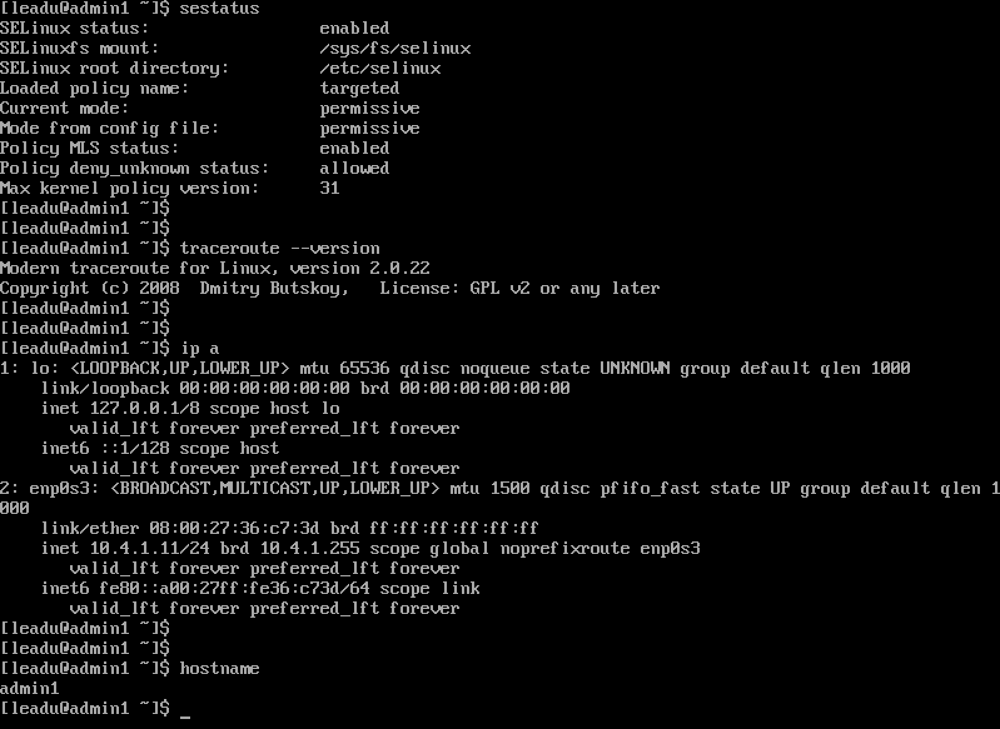

##### >`router1`

🌞 **Configurer le routeur** :

-  [définition d'une IP statique]() (se référer au tableau d'adressage)

  ```cisco
  router1#show ip int br
  Interface                  IP-Address      OK? Method Status                Protocol
  FastEthernet0/0            10.4.2.254      YES NVRAM  up                    up      
  FastEthernet1/0            10.4.1.254      YES NVRAM  up                    up      
  router1#
  ```

-  définition d'un nom (depuis l'interface de GNS3)

  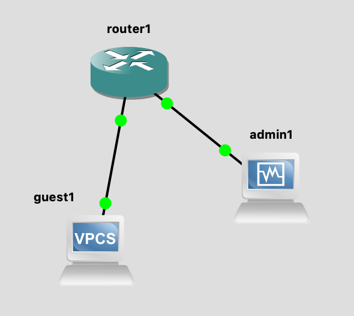

##### >`guest1`

🌞 **Configurer le VPCS** :

-  définition d'une IP statique

  ```vpcs
  guest1> ip 10.4.2.11 10.4.2.254
  Checking for duplicate address...
  PC1 : 10.4.2.11 255.255.255.0 gateway 10.4.2.254
  
  guest1> sh
  
  NAME   IP/MASK              GATEWAY           MAC                LPORT  RHOST:PORT
  guest1 10.4.2.11/24         10.4.2.254        00:50:79:66:68:00  20007  127.0.0.1:20008
         fe80::250:79ff:fe66:6800/64
  
  guest1> save
  Saving startup configuration to startup.vpc
  .  done
  
  guest1> 
  ```

-  définition d'un nom (depuis l'interface de GNS3)

  

##### > Vérification

🌞 Vérifier et **PROUVER** que :

-  `guest1` peut joindre le routeur

  ```cisco
  guest1> ping 10.4.2.254
  84 bytes from 10.4.2.254 icmp_seq=1 ttl=255 time=9.094 ms
  84 bytes from 10.4.2.254 icmp_seq=2 ttl=255 time=6.484 ms
  84 bytes from 10.4.2.254 icmp_seq=3 ttl=255 time=5.303 ms
  84 bytes from 10.4.2.254 icmp_seq=4 ttl=255 time=6.188 ms
  ^C
  guest1> 
  ```

-  `admin1` peut joindre le routeur

  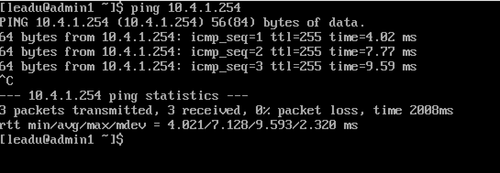

-  `router1` peut joindre les deux autres machines

  ```cisco
  router1#ping 10.4.1.11
  
  Type escape sequence to abort.
  Sending 5, 100-byte ICMP Echos to 10.4.1.11, timeout is 2 seconds:
  !!!!!
  Success rate is 100 percent (5/5), round-trip min/avg/max = 32/51/64 ms
  router1#ping 10.4.2.11
  
  Type escape sequence to abort.
  Sending 5, 100-byte ICMP Echos to 10.4.2.11, timeout is 2 seconds:
  !!!!!
  Success rate is 100 percent (5/5), round-trip min/avg/max = 32/32/32 ms
  router1#
  ```

- vérifier la table ARP de `router1`

  . Par vérifier, j'entends :

  - s'assurer qu'il a bien `guest1` et `admin1` dans sa table ARP

    ```cisco
    router1#show arp      
    Protocol  Address          Age (min)  Hardware Addr   Type   Interface
    Internet  10.4.1.11               0   0800.2736.c73d  ARPA   FastEthernet1/0
    Internet  10.4.2.11               0   0050.7966.6800  ARPA   FastEthernet0/0
    Internet  10.4.1.254              -   cc01.0589.0010  ARPA   FastEthernet1/0
    Internet  10.4.2.254              -   cc01.0589.0000  ARPA   FastEthernet0/0
    router1#
    ```

  - s'assurer que les adresses MAC sont les bonnes (en les affichant directement depuis `guest1` et `admin1`)

    ````cisco
    guest1> sh
    
    NAME   IP/MASK              GATEWAY           MAC                LPORT  RHOST:PORT
    guest1 10.4.2.11/24         10.4.2.254        00:50:79:66:68:00  20007  127.0.0.1:20008
           fe80::250:79ff:fe66:6800/64
    
    guest1> 
    ````

    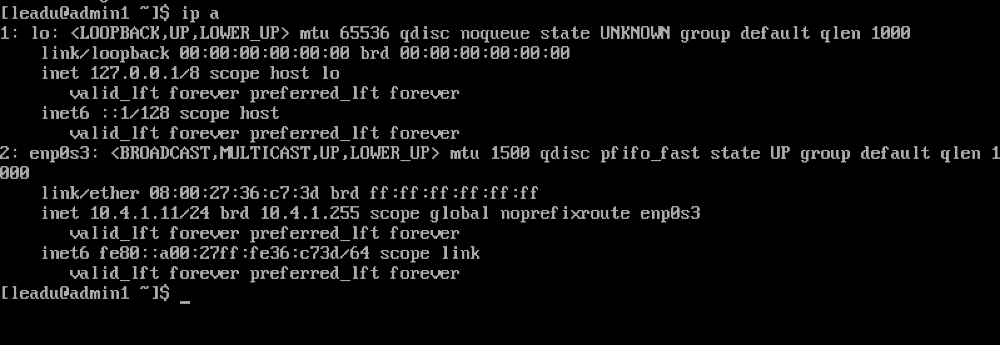

    Les addresses MAC sont bien identiques.

#### C. Routage

##### `router1`

Pour voir votre table de routage :

```shell
show ip route
```

##### `admin1`

🌞 **Ajouter une route sur `admin1` pour qu'il puisse joindre le réseau `guests`**

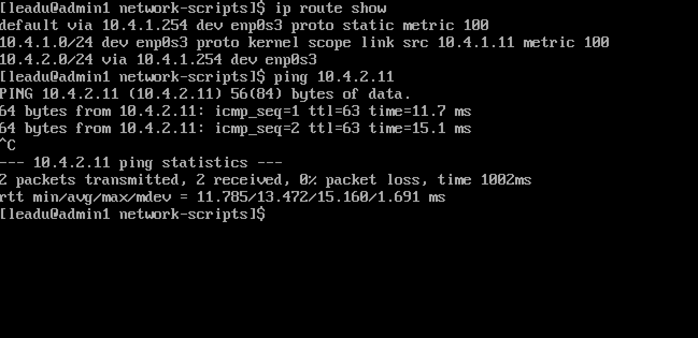

##### `guest1`

🌞 **Ajouter une route sur `guests` pour qu'il puisse joindre le réseau `admin1` **

```
guest1> sh ip

NAME        : guest1[1]
IP/MASK     : 10.4.2.11/24
GATEWAY     : 10.4.2.254
DNS         : 
MAC         : 00:50:79:66:68:00
LPORT       : 20007
RHOST:PORT  : 127.0.0.1:20008
MTU:        : 1500
```

##### Vérification

🌞 Vérifier et **PROUVER** que :

-  `guest1` peut joindre le `admin1` et réciproquement

  ```
  guest1> ping 10.4.1.11
  84 bytes from 10.4.1.11 icmp_seq=1 ttl=63 time=19.413 ms
  84 bytes from 10.4.1.11 icmp_seq=2 ttl=63 time=15.723 ms
  84 bytes from 10.4.1.11 icmp_seq=3 ttl=63 time=14.716 ms
  ^C
  guest1> 
  ```

  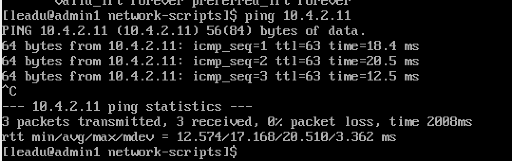

-  les paquets transitent par `router`

  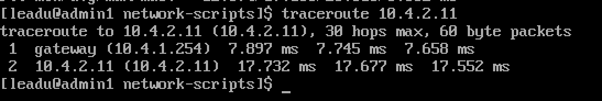

  ```
  guest1> trace 10.4.1.11
  trace to 10.4.1.11, 8 hops max, press Ctrl+C to stop
   1   10.4.2.254   9.738 ms  9.083 ms  9.880 ms
   2   *10.4.1.11   18.268 ms (ICMP type:3, code:10, Host administratively prohibited)
  
  guest1> 
  ```

## II. Topologie 2 : dumb switches

### \1. Présentation de la topo

#### A. Schéma

#### B. Objectifs

Tous les clients du réseau peuvent joindre leur passerelle. Les clients `guest1` et `admin1` peuvent se joindre

### \2. Mise en place

#### A. Topologie GNS3

#### B. Setup ?

#### C. Vérification

🌞 Vérifier et **PROUVER** que :

- `guest1` peut toujours joindre le `admin1` et réciproquement

  ```
  guest1> ping 10.4.1.11
  84 bytes from 10.4.1.11 icmp_seq=1 ttl=63 time=21.420 ms
  84 bytes from 10.4.1.11 icmp_seq=2 ttl=63 time=13.092 ms
  84 bytes from 10.4.1.11 icmp_seq=3 ttl=63 time=19.579 ms
  ^C
  guest1> 
  ```

  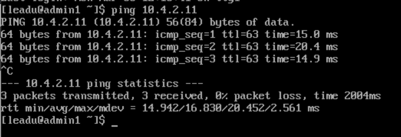

- les paquets transitent toujours par `router`

  ```
  guest1> trace 10.4.1.11
  trace to 10.4.1.11, 8 hops max, press Ctrl+C to stop
   1   10.4.2.254   9.624 ms  9.845 ms  9.844 ms
   2   *10.4.1.11   18.692 ms (ICMP type:3, code:10, Host administratively prohibited)
  
  guest1> 
  ```

  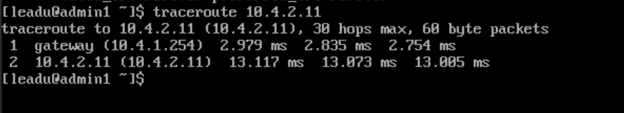

## III. Topologie 3 : adding nodes and NAT

### \1. Présentation de la topo

#### A. Schéma

#### B. Objectifs

### \2. Mise en place

#### A. Topologie GNS3

##### Tableau des réseaux

| Reseau | Address     |
| ------ | ----------- |
| admins | 10.4.1.0/24 |
| guests | 10.4.2.0/24 |

##### Tableau d'adressage

| Machine | Type          | admins     | guests     |
| ------- | ------------- | ---------- | ---------- |
| admin1  | VM CentOS7    | 10.4.1.11  | x          |
| guest1  | VPCS          | x          | 10.4.2.11  |
| guest2  | VPCS          | x          | 10.4.2.12  |
| guest3  | VPCS          | x          | 10.4.2.13  |
| router1 | Routeur C3600 | 10.4.1.254 | 10.4.2.254 |

#### B. VPCS

🌞 **Configurer les VPCS**

- : définition d'une IP statique en ajoutant une route pour qu'ils puissent joindre le réseau `admins`

  ```
  guest2> ip 10.4.2.12 255.255.255.0 10.4.2.254
  Checking for duplicate address...
  PC1 : 10.4.2.12 255.255.255.0 gateway 10.4.2.254
  
  guest2> 
  ```

  ```
  guest3> ip 10.4.2.13 255.255.255.0 10.4.2.254 
  Checking for duplicate address...
  PC1 : 10.4.2.13 255.255.255.0 gateway 10.4.2.254
  
  guest3> 
  ```

🌞 Vérifier et **PROUVER** que les VPCS joignent le réseau `admins`

```
guest1> ping 10.4.1.11
84 bytes from 10.4.1.11 icmp_seq=1 ttl=63 time=19.452 ms
84 bytes from 10.4.1.11 icmp_seq=2 ttl=63 time=16.792 ms
84 bytes from 10.4.1.11 icmp_seq=3 ttl=63 time=17.330 ms
^C
guest1> 
```

```
guest2> ping 10.4.1.11
84 bytes from 10.4.1.11 icmp_seq=1 ttl=63 time=19.747 ms
84 bytes from 10.4.1.11 icmp_seq=2 ttl=63 time=12.832 ms
84 bytes from 10.4.1.11 icmp_seq=3 ttl=63 time=16.592 ms
^C
guest2> 
```

```
guest3> ping 10.4.1.11
84 bytes from 10.4.1.11 icmp_seq=1 ttl=63 time=19.401 ms
84 bytes from 10.4.1.11 icmp_seq=2 ttl=63 time=17.851 ms
^C
guest3> 
```

#### C. Accès WAN

##### Donner un accès WAN au routeur

🌞 **Configurer le routeur**

- [récupérer une IP en DHCP]() sur l'interface branchée au nuage NAT

  ```
  router1#conf t
  Enter configuration commands, one per line.  End with CNTL/Z.
  router1(config)#interface fastEthernet 2/0
  router1(config-if)#ip address dhcp
  router1(config-if)#duplex auto
  router1(config-if)#speed auto
  router1(config-if)#no shut
  router1(config-if)#exit
  router1(config)#exit
  *Mar  1 00:08:44.859: %LINK-3-UPDOWN: Interface FastEthernet2/0, changed state to up
  *Mar  1 00:08:45.859: %LINEPROTO-5-UPDOWN: Line protocol on Interface FastEthernet2/0, changed state to up
  router1(config)#exit
  router1#
  *Mar  1 00:08:46.987: %SYS-5-CONFIG_I: Configured from console by console
  router1#copy running-config startup-config
  Destination filename [startup-config]? 
  *Mar  1 00:08:56.795: %DHCP-6-ADDRESS_ASSIGN: Interface FastEthernet2/0 assigned DHCP address 192.168.122.50, mask 255.255.255.0, hostname router1
  
  
  Building configuration...
  [OK]
  router1#show ip int br
  Interface                  IP-Address      OK? Method Status                Protocol
  FastEthernet0/0            10.4.2.254      YES NVRAM  up                    up      
  FastEthernet1/0            10.4.1.254      YES NVRAM  up                    up      
  FastEthernet2/0            192.168.122.50  YES DHCP   up                    up      
  router1#
  ```
  
- [configurer un NAT simple sur le routeur]()

  ```
  router1#show ip int br
  Interface                  IP-Address      OK? Method Status                Protocol
  FastEthernet0/0            10.4.2.254      YES NVRAM  up                    up      
  FastEthernet1/0            10.4.1.254      YES NVRAM  up                    up      
  FastEthernet2/0            192.168.122.50  YES DHCP   up                    up      
  router1#show ip int br
  Interface                  IP-Address      OK? Method Status                Protocol
  FastEthernet0/0            10.4.2.254      YES NVRAM  up                    up      
  FastEthernet1/0            10.4.1.254      YES NVRAM  up                    up      
  FastEthernet2/0            192.168.122.50  YES DHCP   up                    up      
  router1#conf t
  Enter configuration commands, one per line.  End with CNTL/Z.
  router1(config)#interface fastEthernet 0/0
  router1(config-if)#ip nat inside 
  *Mar  1 00:13:08.143: %LINEPROTO-5-UPDOWN: Line protocol on Interface NVI0, changed state to up
  router1(config-if)#exit
  router1(config)#interface fastEthernet 1/0
  router1(config-if)#ip nat inside
  router1(config-if)#exit
  router1(config)#interface fastEthernet 2/0
  router1(config-if)#ip nat outside 
  router1(config-if)#exit
  router1(config)#access-list 1 permit any
  router1(config)#$de source list 1 interface fastEthernet 2/0 overload          
  router1(config)#exit
  router1#
  *Mar  1 00:16:25.635: %SYS-5-CONFIG_I: Configured from console by console
  router1#copy running-config startup-config
  Destination filename [startup-config]? 
  Building configuration...
  [OK]
  ```

  

##### Configurer les clients

🌞 Configurer tous les clients du réseau (client du réseau `admins` et clients du réseau `guests`)

- Si ce n'est pas déjà fait, ajouter une route par défaut sur tous les clients du réseau `admins` (y'en a qu'un) et du réseau `guests`.

  ```
  guest1> sh ip
  
  NAME        : guest1[1]
  IP/MASK     : 10.4.2.11/24
  GATEWAY     : 10.4.2.254
  DNS         : 
  MAC         : 00:50:79:66:68:00
  LPORT       : 20011
  RHOST:PORT  : 127.0.0.1:20012
  MTU:        : 1500
  
  guest1> 
  ```

  ```
  guest2> sh ip
  
  NAME        : guest2[1]
  IP/MASK     : 10.4.2.12/24
  GATEWAY     : 10.4.2.254
  DNS         : 
  MAC         : 00:50:79:66:68:01
  LPORT       : 20017
  RHOST:PORT  : 127.0.0.1:20018
  MTU:        : 1500
  
  guest2>
  ```

  ```
  guest3> sh ip
  
  NAME        : guest3[1]
  IP/MASK     : 10.4.2.13/24
  GATEWAY     : 10.4.2.254
  DNS         : 
  MAC         : 00:50:79:66:68:02
  LPORT       : 20019
  RHOST:PORT  : 127.0.0.1:20020
  MTU:        : 1500
  
  guest3> 
  ```

  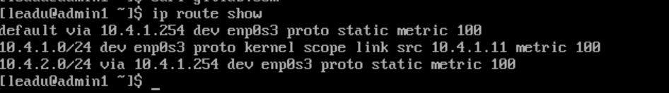

-  Configurer l'utilisation d'un serveur DNS (mettez 

  ```
  1.1.1.1
  ```

  )

  - pour `admin1`, il y a toujours [une section dans le mémo CentOS]()
  
    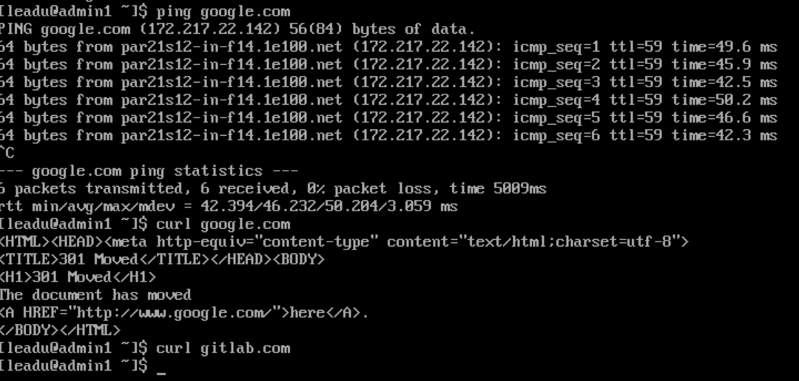
  
  - pour les VPCS dans le réseau `guests`... mmmh... démerdez-vous :)
  
    ```
    guest1> ip dns 1.1.1.1
    
    guest1> sh ip
    
    NAME        : guest1[1]
    IP/MASK     : 10.4.2.11/24
    GATEWAY     : 10.4.2.254
    DNS         : 1.1.1.1  
    MAC         : 00:50:79:66:68:00
    LPORT       : 20011
    RHOST:PORT  : 127.0.0.1:20012
    MTU:        : 1500
    
    guest1> save
    Saving startup configuration to startup.vpc
    .  done
    
    guest1> 
    ```
  
    ```
    guest2> ip dns 1.1.1.1
    
    guest2> sh ip
    
    NAME        : guest2[1]
    IP/MASK     : 10.4.2.12/24
    GATEWAY     : 10.4.2.254
    DNS         : 1.1.1.1  
    MAC         : 00:50:79:66:68:01
    LPORT       : 20017
    RHOST:PORT  : 127.0.0.1:20018
    MTU:        : 1500
    
    guest2> save
    Saving startup configuration to startup.vpc
    .  done
    
    guest2> 
    ```
  
    ```
    guest3> ip dns 1.1.1.1
    
    guest3> sh ip
    
    NAME        : guest3[1]
    IP/MASK     : 10.4.2.13/24
    GATEWAY     : 10.4.2.254
    DNS         : 1.1.1.1  
    MAC         : 00:50:79:66:68:02
    LPORT       : 20019
    RHOST:PORT  : 127.0.0.1:20020
    MTU:        : 1500
    
    guest3> save
    Saving startup configuration to startup.vpc
    .  done
    
    guest3> 
    ```

##### Vérification

🌞 Vérifier et **PROUVER** que :

- le routeur a un accès WAN (internet)

  ```
  router1#ping 1.1.1.1                                  
  
  Type escape sequence to abort.
  Sending 5, 100-byte ICMP Echos to 1.1.1.1, timeout is 2 seconds:
  !!!!!
  Success rate is 100 percent (5/5), round-trip min/avg/max = 96/98/108 ms
  router1#
  ```

  

- tous les clients du réseau `admins` (y'en a toujours qu'un) et ceux du réseau `guests` ont un accès WAN (internet) et que tous les clients du réseau ont de la résolution de noms grâce au serveur DNS configuré

  ```
  guest1> ping www.google.com
  www.google.com resolved to 172.217.19.228
  84 bytes from 172.217.19.228 icmp_seq=1 ttl=59 time=50.009 ms
  84 bytes from 172.217.19.228 icmp_seq=2 ttl=59 time=47.933 ms
  84 bytes from 172.217.19.228 icmp_seq=3 ttl=59 time=47.813 ms
  ^C
  guest1> 
  ```

  ```
  guest2> ping www.google.com
  www.google.com resolved to 172.217.19.228
  84 bytes from 172.217.19.228 icmp_seq=1 ttl=59 time=49.702 ms
  84 bytes from 172.217.19.228 icmp_seq=2 ttl=59 time=46.514 ms
  84 bytes from 172.217.19.228 icmp_seq=3 ttl=59 time=46.449 ms
  ^C
  guest2> 
  ```

  ```
  guest3> ping www.google.com
  www.google.com resolved to 172.217.19.228
  84 bytes from 172.217.19.228 icmp_seq=1 ttl=59 time=49.504 ms
  84 bytes from 172.217.19.228 icmp_seq=2 ttl=59 time=45.731 ms
  84 bytes from 172.217.19.228 icmp_seq=3 ttl=59 time=46.603 ms
  ^C
  guest3> 
  ```

  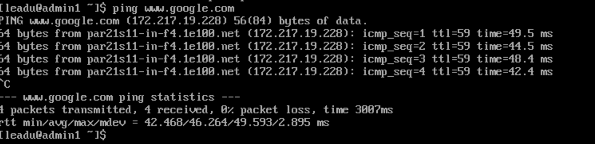

## IV. Topologie 4 : home-made DHCP

### \1. Présentation de la topo

#### A. Schéma

#### B. Objectifs

##### Tableau d'adressage

| Machine | Type          | admins     | guests     |
| ------- | ------------- | ---------- | ---------- |
| admin1  | VM CentOS7    | 10.4.1.11  | x          |
| guest1  | VPCS          | x          | DHCP       |
| guest2  | VPCS          | x          | DHCP       |
| guest3  | VPCS          | x          | DHCP       |
| router1 | Routeur C3600 | 10.4.1.254 | 10.4.2.254 |
| dhcp    | VM CentOS7    | x          | 10.4.2.253 |

### \2. Mise en place

#### A. Topologie GNS3

#### B. Setup de la VM

**Configuration de base**

- [ ]  [désactivation de SELinux]()
- [ ]  installation de paquets liés au réseau, en particulier `traceroute` pour ce TP
- [ ]  [définition d'une IP statique]() (se référer au tableau d'adressage)
- [ ]  [définition d'un nom d'hôte]()
- [ ]  [ajout de la route par défaut]()

**Configuration du serveur DHCP**

- [ ]  insttallation du paquet `dhcp`

- [ ]  configurer le fichier 

  ```
  /etc/dhcp/dhcpd.conf
  ```

  - je vous ai fait [un p'tit modèle pré-configuré et commenté](). *C'est pas bo ça ?*

- [ ]  démarrer le service `dhcpd`

```
$ sudo systemctl start dhcpd
```

🌞 Vérifier et **PROUVER** que :

- vous avez des ports UDP en écoute (regardez sur internet les ports utilisés par DHCP)

  Les ports UDP 67 et 68 sont les ports standards utilisés pour le dhcp.

  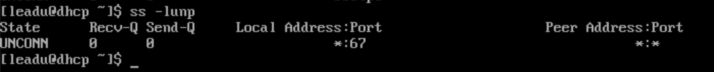

🌞 Tester le DHCP :

- attribuez une IP en DHCP à l'un des membres du réseau `guests` (un VPCS) et vérifiez et prouvez que vous récupérez, en plus de l'IP, l'adresse de la passerelle

```
guest1> ip dhcp    
DDORA IP 10.4.2.100/24 GW 10.4.2.254

guest1> save
Saving startup configuration to startup.vpc
.  done

guest1> 
```

🌞 Observer et mettre en évidence les échanges DHCP (oué change "DORA")

- vous pouvez faire Clic droit sur un lien dans GNS3 et démarrer une capture Wireshark

- trames à observer :

  - Discover*

  - *Offer*
  - *Request*
  - *Acknowledge*

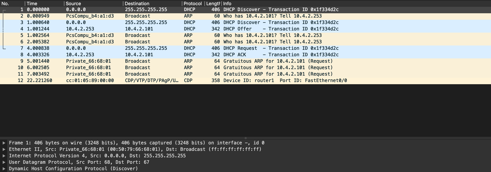


