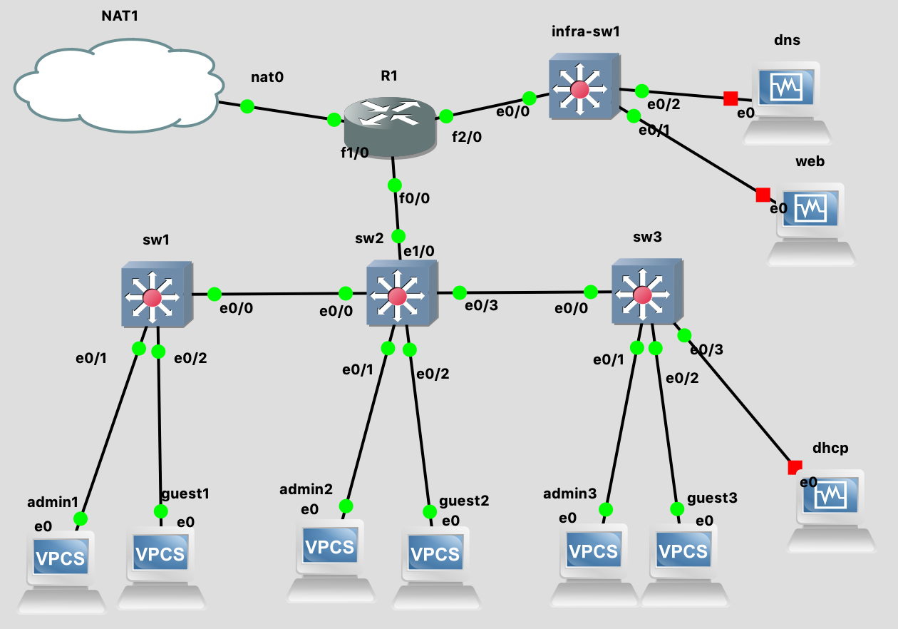

# TP 5 - Une "vraie" topologie ?

## I. Toplogie 1 - intro VLAN

### Mise en place de la topologie

#### Topologie



#### Tableau des réseaux

#### Tableau d'adressage

### Setup clients

Mettez des IPs aux clients (VPCS).

🌞 Tout ce beau monde doit se `ping`

- les *admins* se joignent entre eux

  ```shell
  admin1> ping 10.5.10.12
  84 bytes from 10.5.10.12 icmp_seq=1 ttl=64 time=0.555 ms
  84 bytes from 10.5.10.12 icmp_seq=2 ttl=64 time=0.602 ms
  ^C
  admin1> 
  ```

  ```shell
  admin2> ping 10.5.10.11
  84 bytes from 10.5.10.11 icmp_seq=1 ttl=64 time=1.013 ms
  84 bytes from 10.5.10.11 icmp_seq=2 ttl=64 time=0.685 ms
  ^C
  admin2> 
  ```

- les *guests* se joignent entre eux

  ```shell
  guest1> ping 10.5.20.12
  84 bytes from 10.5.20.12 icmp_seq=1 ttl=64 time=0.405 ms
  84 bytes from 10.5.20.12 icmp_seq=2 ttl=64 time=0.702 ms
  84 bytes from 10.5.20.12 icmp_seq=3 ttl=64 time=0.776 ms
  ^C
  guest1> 
  ```

  ```shell
  guest2> ping 10.5.20.11
  84 bytes from 10.5.20.11 icmp_seq=1 ttl=64 time=0.753 ms
  84 bytes from 10.5.20.11 icmp_seq=2 ttl=64 time=0.611 ms
  ^C
  guest2> 
  ```

### Setup VLANs

#### Tableau des VLANs

#### Mise en place

🌞 **Mettez en place les VLANs** sur vos switches

- les ports vers les clients (*admins* et *guests*) sont en *access*

- les ports qui relient deux switches sont en *trunk*

  ```shell
  IOU1#show vlan
  
  VLAN Name                             Status    Ports
  ---- -------------------------------- --------- -------------------------------
  1    default                          active    Et0/3, Et1/0, Et1/1, Et1/2
                                                  Et1/3, Et2/0, Et2/1, Et2/2
                                                  Et2/3, Et3/0, Et3/1, Et3/2
                                                  Et3/3
  10   admins                           active    Et0/1
  20   guests                           active    Et0/2
  1002 fddi-default                     act/unsup 
  1003 token-ring-default               act/unsup 
  1004 fddinet-default                  act/unsup 
  1005 trnet-default                    act/unsup 
  
  VLAN Type  SAID       MTU   Parent RingNo BridgeNo Stp  BrdgMode Trans1 Trans2
  ---- ----- ---------- ----- ------ ------ -------- ---- -------- ------ ------
  1    enet  100001     1500  -      -      -        -    -        0      0   
  10   enet  100010     1500  -      -      -        -    -        0      0   
  20   enet  100020     1500  -      -      -        -    -        0      0   
  1002 fddi  101002     1500  -      -      -        -    -        0      0   
  1003 tr    101003     1500  -      -      -        -    -        0      0   
  1004 fdnet 101004     1500  -      -      -        ieee -        0      0   
  1005 trnet 101005     1500  -      -      -        ibm  -        0      0   
            
  
  Primary Secondary Type              Ports
  ------- --------- ----------------- ------------------------------------------
  
  IOU1#show interface trunk
  
  Port        Mode             Encapsulation  Status        Native vlan
  Et0/0       on               802.1q         trunking      1
  
  Port        Vlans allowed on trunk
  Et0/0       1-4094
  
  Port        Vlans allowed and active in management domain
  Et0/0       1,10,20
  
  Port        Vlans in spanning tree forwarding state and not pruned
  Et0/0       1,10,20
  IOU1#
  ```

  

  ```shell
  IOU2#show vlan                         
  
  VLAN Name                             Status    Ports
  ---- -------------------------------- --------- -------------------------------
  1    default                          active    Et0/3, Et1/0, Et1/1, Et1/2
                                                  Et1/3, Et2/0, Et2/1, Et2/2
                                                  Et2/3, Et3/0, Et3/1, Et3/2
                                                  Et3/3
  10   admins                           active    Et0/1
  20   guests                           active    Et0/2
  1002 fddi-default                     act/unsup 
  1003 token-ring-default               act/unsup 
  1004 fddinet-default                  act/unsup 
  1005 trnet-default                    act/unsup 
  
  VLAN Type  SAID       MTU   Parent RingNo BridgeNo Stp  BrdgMode Trans1 Trans2
  ---- ----- ---------- ----- ------ ------ -------- ---- -------- ------ ------
  1    enet  100001     1500  -      -      -        -    -        0      0   
  10   enet  100010     1500  -      -      -        -    -        0      0   
  20   enet  100020     1500  -      -      -        -    -        0      0   
  1002 fddi  101002     1500  -      -      -        -    -        0      0   
  1003 tr    101003     1500  -      -      -        -    -        0      0   
  1004 fdnet 101004     1500  -      -      -        ieee -        0      0   
  1005 trnet 101005     1500  -      -      -        ibm  -        0      0   
            
  
  Primary Secondary Type              Ports
  ------- --------- ----------------- ------------------------------------------
  
  IOU2#show interface trunk
  
  Port        Mode             Encapsulation  Status        Native vlan
  Et0/0       on               802.1q         trunking      1
  
  Port        Vlans allowed on trunk
  Et0/0       1-4094
  
  Port        Vlans allowed and active in management domain
  Et0/0       1,10,20
  
  Port        Vlans in spanning tree forwarding state and not pruned
  Et0/0       1,10,20
  IOU2#
  ```

🌞 **Vérifier que**

- les *guests* peuvent toujours se `ping`, idem pour les *admins*

  ```shell
  guest1> ping 10.5.20.12
  84 bytes from 10.5.20.12 icmp_seq=1 ttl=64 time=1.132 ms
  84 bytes from 10.5.20.12 icmp_seq=2 ttl=64 time=1.047 ms
  84 bytes from 10.5.20.12 icmp_seq=3 ttl=64 time=1.265 ms
  ^C
  guest1> 
  ```

  ```shell
  guest2> ping 10.5.20.11
  84 bytes from 10.5.20.11 icmp_seq=1 ttl=64 time=0.366 ms
  84 bytes from 10.5.20.11 icmp_seq=2 ttl=64 time=0.561 ms
  ^C
  guest2> 
  ```

  ```shell
  admin2> ping 10.5.10.11
  84 bytes from 10.5.10.11 icmp_seq=1 ttl=64 time=0.315 ms
  84 bytes from 10.5.10.11 icmp_seq=2 ttl=64 time=0.584 ms
  84 bytes from 10.5.10.11 icmp_seq=3 ttl=64 time=0.835 ms
  ^C
  admin2> 
  ```

  ```shell
  admin1> ping 10.5.10.12
  84 bytes from 10.5.10.12 icmp_seq=1 ttl=64 time=0.558 ms
  84 bytes from 10.5.10.12 icmp_seq=2 ttl=64 time=0.486 ms
  ^C
  admin1> 
  ```

- montrer que si un des *guests* change d'IP vers une IP du réseau `admins`, il ne peut **PAS** joindre les autres *admins*

  ```shell
  guest1> sh ip
  
  NAME        : guest1[1]
  IP/MASK     : 10.5.10.13/24
  GATEWAY     : 0.0.0.0
  DNS         : 
  MAC         : 00:50:79:66:68:01
  LPORT       : 20012
  RHOST:PORT  : 127.0.0.1:20013
  MTU:        : 1500
  
  guest1> ping 10.5.10.12
  host (10.5.10.12) not reachable
  
  guest1> 
  ```

## II. Topologie 2 - VLAN, sous-interface, NAT

### Mise en place de la topologie

#### Topologie

#### Tableau des réseaux

#### Tableau d'adressage

### Adressage

Configurer les IPs de toutes les machines **- sauf `r1` -**.

🌞 Vérifier que :

- les *guests* peuvent `ping` les autres *guests*

  ```shell
  guest1> ping 10.5.20.12
  84 bytes from 10.5.20.12 icmp_seq=1 ttl=64 time=0.597 ms
  84 bytes from 10.5.20.12 icmp_seq=2 ttl=64 time=0.911 ms
  ^C
  guest1> ping 10.5.20.13
  84 bytes from 10.5.20.13 icmp_seq=1 ttl=64 time=0.583 ms
  84 bytes from 10.5.20.13 icmp_seq=2 ttl=64 time=0.976 ms
  ^C
  guest1> 
  ```

  ```shell
  guest2> ping 10.5.20.11
  84 bytes from 10.5.20.11 icmp_seq=1 ttl=64 time=0.721 ms
  84 bytes from 10.5.20.11 icmp_seq=2 ttl=64 time=0.777 ms
  ^C
  guest2> ping 10.5.20.13
  84 bytes from 10.5.20.13 icmp_seq=1 ttl=64 time=0.498 ms
  84 bytes from 10.5.20.13 icmp_seq=2 ttl=64 time=0.649 ms
  ^C
  guest2> 
  ```

  ```shell
  guest3> ping 10.5.20.11
  84 bytes from 10.5.20.11 icmp_seq=1 ttl=64 time=1.345 ms
  84 bytes from 10.5.20.11 icmp_seq=2 ttl=64 time=0.860 ms
  ^C
  guest3> ping 10.5.20.12
  84 bytes from 10.5.20.12 icmp_seq=1 ttl=64 time=1.343 ms
  84 bytes from 10.5.20.12 icmp_seq=2 ttl=64 time=0.809 ms
  84 bytes from 10.5.20.12 icmp_seq=3 ttl=64 time=0.801 ms
  84 bytes from 10.5.20.12 icmp_seq=4 ttl=64 time=0.812 ms
  84 bytes from 10.5.20.12 icmp_seq=5 ttl=64 time=0.612 ms
  ^C
  guest3> 
  ```

- les *admins* peuvent `ping` les autres *admins*

  ```shell
  admin1> ping 10.5.10.13
  84 bytes from 10.5.10.13 icmp_seq=1 ttl=64 time=0.597 ms
  84 bytes from 10.5.10.13 icmp_seq=2 ttl=64 time=0.830 ms
  ^C
  admin1> ping 10.5.10.12
  84 bytes from 10.5.10.12 icmp_seq=1 ttl=64 time=0.521 ms
  84 bytes from 10.5.10.12 icmp_seq=2 ttl=64 time=0.811 ms
  ^C
  admin1> 
  ```

  ```shell
  admin2> ping 10.5.10.11
  84 bytes from 10.5.10.11 icmp_seq=1 ttl=64 time=0.828 ms
  84 bytes from 10.5.10.11 icmp_seq=2 ttl=64 time=0.698 ms
  ^C
  admin2> ping 10.5.10.13
  84 bytes from 10.5.10.13 icmp_seq=1 ttl=64 time=0.500 ms
  84 bytes from 10.5.10.13 icmp_seq=2 ttl=64 time=0.627 ms
  ^C
  admin2> 
  ```

  ```shell
  admin3> ping 10.5.10.12
  84 bytes from 10.5.10.12 icmp_seq=1 ttl=64 time=0.519 ms
  84 bytes from 10.5.10.12 icmp_seq=2 ttl=64 time=0.708 ms
  ^C
  admin3> ping 10.5.10.11
  84 bytes from 10.5.10.11 icmp_seq=1 ttl=64 time=0.568 ms
  84 bytes from 10.5.10.11 icmp_seq=2 ttl=64 time=0.762 ms
  ^C
  admin3> 
  ```

### VLAN

🌞 **[Configurez les VLANs]() sur l'ensemble des switches**

```shell
IOU1#show vlan

VLAN Name                             Status    Ports
---- -------------------------------- --------- -------------------------------
1    default                          active    Et0/3, Et1/0, Et1/1, Et1/2
                                                Et1/3, Et2/0, Et2/1, Et2/2
                                                Et2/3, Et3/0, Et3/1, Et3/2
                                                Et3/3
10   VLAN0010                         active    Et0/1
20   VLAN0020                         active    Et0/2
1002 fddi-default                     act/unsup 
1003 token-ring-default               act/unsup 
1004 fddinet-default                  act/unsup 
1005 trnet-default                    act/unsup 

VLAN Type  SAID       MTU   Parent RingNo BridgeNo Stp  BrdgMode Trans1 Trans2
---- ----- ---------- ----- ------ ------ -------- ---- -------- ------ ------
1    enet  100001     1500  -      -      -        -    -        0      0   
10   enet  100010     1500  -      -      -        -    -        0      0   
20   enet  100020     1500  -      -      -        -    -        0      0   
1002 fddi  101002     1500  -      -      -        -    -        0      0   
1003 tr    101003     1500  -      -      -        -    -        0      0   
1004 fdnet 101004     1500  -      -      -        ieee -        0      0   
1005 trnet 101005     1500  -      -      -        ibm  -        0      0   
          

Primary Secondary Type              Ports
------- --------- ----------------- ------------------------------------------

IOU1#show interface trunk

Port        Mode             Encapsulation  Status        Native vlan
Et0/0       on               802.1q         trunking      1

Port        Vlans allowed on trunk
Et0/0       1-4094

Port        Vlans allowed and active in management domain
Et0/0       1,10,20

Port        Vlans in spanning tree forwarding state and not pruned
Et0/0       1,10,20
IOU1#
```

```shell
IOU2#show vlan

VLAN Name                             Status    Ports
---- -------------------------------- --------- -------------------------------
1    default                          active    Et1/1, Et1/2, Et1/3, Et2/0
                                                Et2/1, Et2/2, Et2/3, Et3/0
                                                Et3/1, Et3/2, Et3/3
10   VLAN0010                         active    Et0/1
20   VLAN0020                         active    Et0/2
1002 fddi-default                     act/unsup 
1003 token-ring-default               act/unsup 
1004 fddinet-default                  act/unsup 
1005 trnet-default                    act/unsup 

VLAN Type  SAID       MTU   Parent RingNo BridgeNo Stp  BrdgMode Trans1 Trans2
---- ----- ---------- ----- ------ ------ -------- ---- -------- ------ ------
1    enet  100001     1500  -      -      -        -    -        0      0   
10   enet  100010     1500  -      -      -        -    -        0      0   
20   enet  100020     1500  -      -      -        -    -        0      0   
1002 fddi  101002     1500  -      -      -        -    -        0      0   
1003 tr    101003     1500  -      -      -        -    -        0      0   
1004 fdnet 101004     1500  -      -      -        ieee -        0      0   
1005 trnet 101005     1500  -      -      -        ibm  -        0      0   

          

Primary Secondary Type              Ports
------- --------- ----------------- ------------------------------------------

IOU2#show interface trunk

Port        Mode             Encapsulation  Status        Native vlan
Et0/0       on               802.1q         trunking      1
Et0/3       on               802.1q         trunking      1
Et1/0       on               802.1q         trunking      1

Port        Vlans allowed on trunk
Et0/0       1-4094
Et0/3       1-4094
Et1/0       1-4094

Port        Vlans allowed and active in management domain
Et0/0       1,10,20
Et0/3       1,10,20
Et1/0       1,10,20

Port        Vlans in spanning tree forwarding state and not pruned
Et0/0       1,10,20
Et0/3       1,10,20
Et1/0       1,10,20
IOU2#
```

```shell
sw3#show vlan

VLAN Name                             Status    Ports
---- -------------------------------- --------- -------------------------------
1    default                          active    Et0/3, Et1/0, Et1/1, Et1/2
                                                Et1/3, Et2/0, Et2/1, Et2/2
                                                Et2/3, Et3/0, Et3/1, Et3/2
                                                Et3/3
10   admins                           active    Et0/1
20   guests                           active    Et0/2
1002 fddi-default                     act/unsup 
1003 token-ring-default               act/unsup 
1004 fddinet-default                  act/unsup 
1005 trnet-default                    act/unsup 

VLAN Type  SAID       MTU   Parent RingNo BridgeNo Stp  BrdgMode Trans1 Trans2
---- ----- ---------- ----- ------ ------ -------- ---- -------- ------ ------
1    enet  100001     1500  -      -      -        -    -        0      0   
10   enet  100010     1500  -      -      -        -    -        0      0   
20   enet  100020     1500  -      -      -        -    -        0      0   
1002 fddi  101002     1500  -      -      -        -    -        0      0   
1003 tr    101003     1500  -      -      -        -    -        0      0   
1004 fdnet 101004     1500  -      -      -        ieee -        0      0   
1005 trnet 101005     1500  -      -      -        ibm  -        0      0   
          

Primary Secondary Type              Ports
------- --------- ----------------- ------------------------------------------

sw3#show interface trunk

Port        Mode             Encapsulation  Status        Native vlan
Et0/0       on               802.1q         trunking      1

Port        Vlans allowed on trunk
Et0/0       1-4094

Port        Vlans allowed and active in management domain
Et0/0       1,10,20

Port        Vlans in spanning tree forwarding state and not pruned
Et0/0       1,10,20
sw3#
```

🌞 Vérifier et prouver qu'un *guest* qui prend un IP du réseau `admins` ne peut joindre aucune machine.

```shell
guest3> sh ip

NAME        : guest3[1]
IP/MASK     : 10.5.10.14/24
GATEWAY     : 0.0.0.0
DNS         : 
MAC         : 00:50:79:66:68:05
LPORT       : 20034
RHOST:PORT  : 127.0.0.1:20035
MTU:        : 1500

guest3> ping 10.5.20.11
No gateway found

guest3> ping 10.5.20.12
No gateway found

guest3> ping 10.5.10.11
host (10.5.10.11) not reachable

guest3> ping 10.5.10.12
host (10.5.10.12) not reachable

guest3> ping 10.5.10.13
host (10.5.10.13) not reachable

guest3>
```

### Sous-interfaces

🌞 **Configurez les sous-interfaces de votre routeur**

```shell
R1#conf t
Enter configuration commands, one per line.  End with CNTL/Z.
R1(config)#interface Et0/0.10 
                     ^
% Invalid input detected at '^' marker.

R1(config)#interface fastEthernet0/0.10
R1(config-subif)#encapsulation dot1Q 10
R1(config-subif)#ip address 10.5.10.254 255.255.255.0
R1(config-subif)#exit
R1(config)#interface fastEthernet0/0.20        
R1(config-subif)#encapsulation dot1Q 20              
R1(config-subif)#ip address 10.5.20.254 255.255.255.0
R1(config-subif)#exit
R1(config)#interface fastEthernet0
% Incomplete command.

R1(config)#interface fastEthernet0/0
R1(config-if)#no shut
R1(config-if)#exit
*Mar  1 00:05:04.963: %LINK-3-UPDOWN: Interface FastEthernet0/0, changed state to up
*Mar  1 00:05:05.963: %LINEPROTO-5-UPDOWN: Line protocol on Interface FastEthernet0/0, changed state to up
R1(config-if)#exit
R1(config)#exit
```

🌞 Vérifier que les *clients* et les *guests* peuvent maintenant ping leur passerelle respective

```shell
admin1> ping 10.5.10.254
84 bytes from 10.5.10.254 icmp_seq=1 ttl=255 time=9.165 ms
84 bytes from 10.5.10.254 icmp_seq=2 ttl=255 time=7.576 ms
^C
admin1> 
```

```shell
admin2> ping 10.5.10.254
84 bytes from 10.5.10.254 icmp_seq=1 ttl=255 time=9.841 ms
84 bytes from 10.5.10.254 icmp_seq=2 ttl=255 time=6.512 ms
^C
admin2> 
```

```shell
admin3> ping 10.5.10.254
84 bytes from 10.5.10.254 icmp_seq=1 ttl=255 time=9.445 ms
84 bytes from 10.5.10.254 icmp_seq=2 ttl=255 time=6.261 ms
^C
admin3> 
```


```shell
guest1> ping 10.5.20.254
84 bytes from 10.5.20.254 icmp_seq=1 ttl=255 time=9.060 ms
84 bytes from 10.5.20.254 icmp_seq=2 ttl=255 time=9.569 ms
^C
guest1> 
```

```shell
guest2> ping 10.5.20.254
84 bytes from 10.5.20.254 icmp_seq=1 ttl=255 time=9.175 ms
84 bytes from 10.5.20.254 icmp_seq=2 ttl=255 time=8.155 ms
^C
guest2> 
```

```shell
guest3> ping 10.5.20.254
84 bytes from 10.5.20.254 icmp_seq=1 ttl=255 time=9.252 ms
84 bytes from 10.5.20.254 icmp_seq=2 ttl=255 time=8.368 ms
84 bytes from 10.5.20.254 icmp_seq=3 ttl=255 time=9.358 ms
^C
guest3> 
```


### NAT

🌞 **[Configurer un source NAT]() sur le routeur** (comme au [TP4]())

```shell
R1#sh ip int br
Interface                  IP-Address      OK? Method Status                Protocol
FastEthernet0/0            unassigned      YES unset  up                    up      
FastEthernet0/0.10         10.5.10.254     YES manual up                    up      
FastEthernet0/0.20         10.5.20.254     YES manual up                    up      
FastEthernet1/0            unassigned      YES unset  administratively down down    
R1#conf t
Enter configuration commands, one per line.  End with CNTL/Z.
R1(config)#interface fastEthernet1/0
R1(config-if)#ip address dhcp
R1(config-if)#no shut
R1(config-if)#exit
R1(config)#
*Mar  1 00:20:41.331: %LINK-3-UPDOWN: Interface FastEthernet1/0, changed state to up
*Mar  1 00:20:42.331: %LINEPROTO-5-UPDOWN: Line protocol on Interface FastEthernet1/0, changed state to up
R1(config)#exit
R1#
*Mar  1 00:20:48.067: %SYS-5-CONFIG_I: Configured from console by console
*Mar  1 00:20:55.819: %DHCP-6-ADDRESS_ASSIGN: Interface FastEthernet1/0 assigned DHCP address 192.168.122.87, mask 255.255.255.0, hostname R1
R1#copy running-config startup-config
Destination filename [startup-config]? 
Building configuration...
[OK]
R1#sh ip int br
Interface                  IP-Address      OK? Method Status                Protocol
FastEthernet0/0            unassigned      YES unset  up                    up      
FastEthernet0/0.10         10.5.10.254     YES manual up                    up      
FastEthernet0/0.20         10.5.20.254     YES manual up                    up      
FastEthernet1/0            192.168.122.87  YES DHCP   up                    up      
R1#conf t
Enter configuration commands, one per line.  End with CNTL/Z.
R1(config)#interface fastEthernet 0/0
R1(config-if)#ip nat inside

*Mar  1 00:23:01.383: %LINEPROTO-5-UPDOWN: Line protocol on Interface NVI0, changed state to up
R1(config-if)#exit
R1(config)#interface fastEthernet0/0.10
R1(config-subif)#ip nat inside
R1(config-subif)#exit
R1(config)#interface fastEthernet0/0.20
R1(config-subif)#ip nat inside
R1(config-subif)#exit
R1(config)#interface fastEthernet 1/0
R1(config-if)#ip nat outside
R1(config-if)#exit
R1(config)#exit
R1#
*Mar  1 00:23:31.167: %SYS-5-CONFIG_I: Configured from console by console
R1#copy running-config startup-config
Destination filename [startup-config]? 
Building configuration...
[OK]
R1#
```

🌞 Vérifier que les *clients* et les *admins* peuvent joindre Internet

```shell
admin1> ping 8.8.8.8
84 bytes from 8.8.8.8 icmp_seq=1 ttl=59 time=50.548 ms
84 bytes from 8.8.8.8 icmp_seq=2 ttl=59 time=48.662 ms
^C
admin1> 
```

```shell
admin2> ping 8.8.8.8
84 bytes from 8.8.8.8 icmp_seq=1 ttl=59 time=50.167 ms
84 bytes from 8.8.8.8 icmp_seq=2 ttl=59 time=47.724 ms
^C
admin2> 
```

```shell
admin3> ping 8.8.8.8
84 bytes from 8.8.8.8 icmp_seq=1 ttl=59 time=49.585 ms
84 bytes from 8.8.8.8 icmp_seq=2 ttl=59 time=47.669 ms
^C
admin3> 
```

```shell
guest1> ping 8.8.8.8
84 bytes from 8.8.8.8 icmp_seq=1 ttl=59 time=49.703 ms
84 bytes from 8.8.8.8 icmp_seq=2 ttl=59 time=48.081 ms
^C
guest1> 
```

```shell
guest2> ping 8.8.8.8
84 bytes from 8.8.8.8 icmp_seq=1 ttl=59 time=49.797 ms
84 bytes from 8.8.8.8 icmp_seq=2 ttl=59 time=49.175 ms
^C
guest2> 
```

```shell
guest3> ping 8.8.8.8
84 bytes from 8.8.8.8 icmp_seq=1 ttl=59 time=60.350 ms
84 bytes from 8.8.8.8 icmp_seq=2 ttl=59 time=48.720 ms
^C
guest3> 
```

## III. Topologie 3 - Ajouter des services

### Mise en place de la topologie

#### Topologie

#### Tableau des réseaux

#### Tableau d'adressage

###Basic setup

### Serveur DHCP

**Reprendre le [TP 4]() pour mettre en place le serveur DHCP.**

🌞 **Vérifier et prouver qu'un client branché à `client-sw3` peut récupérer une IP dynamiquement.**

```shell
guest3> ip dhcp
DDORA IP 10.5.20.101/24 GW 10.5.20.254

guest3> sh ip

NAME        : guest3[1]
IP/MASK     : 10.5.20.101/24
GATEWAY     : 10.5.20.254
DNS         : 1.1.1.1  
DHCP SERVER : 10.5.20.253
DHCP LEASE  : 580, 600/300/525
DOMAIN NAME : tp5.b1
MAC         : 00:50:79:66:68:05
LPORT       : 20041
RHOST:PORT  : 127.0.0.1:20042
MTU:        : 1500

guest3> 
```

### Serveur Web

🌞 **Tester que le serveur Web fonctionne**

- depuis le serveur web lui-même : `curl localhost:80`

  ```shell
  [leadu@web ~]$ sudo systemctl start nginx
  [leadu@web ~]$ curl localhost:80
  <!DOCTYPE HTML PUBLIC "-//W3C//DTD HTML 4.01 Transitional//EN">
  <html>
  <head>
    <title>Welcome to CentOS</title>
    <style rel="stylesheet" type="text/css"> 
  
  	html {
  	background-image:url(img/html-background.png);
  	background-color: white;
  	font-family: "DejaVu Sans", "Liberation Sans", sans-serif;
  	font-size: 0.85em;
  	line-height: 1.25em;
  	margin: 0 4% 0 4%;
  	}
  
  	body {
  	border: 10px solid #fff;
  	margin:0;
  	padding:0;
  	background: #fff;
  	}
  
  	/* Links */
  
  	a:link { border-bottom: 1px dotted #ccc; text-decoration: none; color: #204d92; }
  	a:hover { border-bottom:1px dotted #ccc; text-decoration: underline; color: green; }
  	a:active {  border-bottom:1px dotted #ccc; text-decoration: underline; color: #204d92; }
  	a:visited { border-bottom:1px dotted #ccc; text-decoration: none; color: #204d92; }
  	a:visited:hover { border-bottom:1px dotted #ccc; text-decoration: underline; color: green; }
   
  	.logo a:link,
  	.logo a:hover,
  	.logo a:visited { border-bottom: none; }
  
  	.mainlinks a:link { border-bottom: 1px dotted #ddd; text-decoration: none; color: #eee; }
  	.mainlinks a:hover { border-bottom:1px dotted #ddd; text-decoration: underline; color: white; }
  	.mainlinks a:active { border-bottom:1px dotted #ddd; text-decoration: underline; color: white; }
  	.mainlinks a:visited { border-bottom:1px dotted #ddd; text-decoration: none; color: white; }
  	.mainlinks a:visited:hover { border-bottom:1px dotted #ddd; text-decoration: underline; color: white; }
  
  	/* User interface styles */
  
  	#header {
  	margin:0;
  	padding: 0.5em;
  	background: #204D8C url(img/header-background.png);
  	text-align: left;
  	}
  
  	.logo {
  	padding: 0;
  	/* For text only logo */
  	font-size: 1.4em;
  	line-height: 1em;
  	font-weight: bold;
  	}
  
  	.logo img {
  	vertical-align: middle;
  	padding-right: 1em;
  	}
  
  	.logo a {
  	color: #fff;
  	text-decoration: none;
  	}
  
  	p {
  	line-height:1.5em;
  	}
  
  	h1 { 
  		margin-bottom: 0;
  		line-height: 1.9em; }
  	h2 { 
  		margin-top: 0;
  		line-height: 1.7em; }
  
  	#content {
  	clear:both;
  	padding-left: 30px;
  	padding-right: 30px;
  	padding-bottom: 30px;
  	border-bottom: 5px solid #eee;
  	}
  
      .mainlinks {
          float: right;
          margin-top: 0.5em;
          text-align: right;
      }
  
      ul.mainlinks > li {
      border-right: 1px dotted #ddd;
      padding-right: 10px;
      padding-left: 10px;
      display: inline;
      list-style: none;
      }
  
      ul.mainlinks > li.last,
      ul.mainlinks > li.first {
      border-right: none;
      }
  
    </style>
  
  </head>
  
  <body>
  
  <div id="header">
  
      <ul class="mainlinks">
          <li> <a href="http://www.centos.org/">Home</a> </li>
          <li> <a href="http://wiki.centos.org/">Wiki</a> </li>
          <li> <a href="http://wiki.centos.org/GettingHelp/ListInfo">Mailing Lists</a></li>
          <li> <a href="http://www.centos.org/download/mirrors/">Mirror List</a></li>
          <li> <a href="http://wiki.centos.org/irc">IRC</a></li>
          <li> <a href="https://www.centos.org/forums/">Forums</a></li>
          <li> <a href="http://bugs.centos.org/">Bugs</a> </li>
          <li class="last"> <a href="http://wiki.centos.org/Donate">Donate</a></li>
      </ul>
  
  	<div class="logo">
  		<a href="http://www.centos.org/"></a>
  	</div>
  
  </div>
  
  <div id="content">
  
  	<h1>Welcome to CentOS</h1>
  
  	<h2>The Community ENTerprise Operating System</h2>
  
  	<p><a href="http://www.centos.org/">CentOS</a> is an Enterprise-class Linux Distribution derived from sources freely provided
  to the public by Red Hat, Inc. for Red Hat Enterprise Linux.  CentOS conforms fully with the upstream vendors
  redistribution policy and aims to be functionally compatible. (CentOS mainly changes packages to remove upstream vendor
  branding and artwork.)</p>
  
  	<p>CentOS is developed by a small but growing team of core
  developers.&nbsp; In turn the core developers are supported by an active user community
  including system administrators, network administrators, enterprise users, managers, core Linux contributors and Linux enthusiasts from around the world.</p>
  
  	<p>CentOS has numerous advantages including: an active and growing user community, quickly rebuilt, tested, and QA'ed errata packages, an extensive <a href="http://www.centos.org/download/mirrors/">mirror network</a>, developers who are contactable and responsive, Special Interest Groups (<a href="http://wiki.centos.org/SpecialInterestGroup/">SIGs</a>) to add functionality to the core CentOS distribution, and multiple community support avenues including a <a href="http://wiki.centos.org/">wiki</a>, <a
  href="http://wiki.centos.org/irc">IRC Chat</a>, <a href="http://wiki.centos.org/GettingHelp/ListInfo">Email Lists</a>, <a href="https://www.centos.org/forums/">Forums</a>, <a href="http://bugs.centos.org/">Bugs Database</a>, and an <a
  href="http://wiki.centos.org/FAQ/">FAQ</a>.</p>
  
  	</div>
  
  </div>
  
  
  </body>
  </html>
  [leadu@web ~]$ 
  ```

- depuis une autre machine du réseau : `curl 10.5.30.12:80`

  ```shell
  [leadu@dns ~]$ curl 10.5.30.12:80
  <!DOCTYPE HTML PUBLIC "-//W3C//DTD HTML 4.01 Transitional//EN">
  <html>
  <head>
    <title>Welcome to CentOS</title>
    <style rel="stylesheet" type="text/css"> 
  
  	html {
  	background-image:url(img/html-background.png);
  	background-color: white;
  	font-family: "DejaVu Sans", "Liberation Sans", sans-serif;
  	font-size: 0.85em;
  	line-height: 1.25em;
  	margin: 0 4% 0 4%;
  	}
  
  	body {
  	border: 10px solid #fff;
  	margin:0;
  	padding:0;
  	background: #fff;
  	}
  
  	/* Links */
  
  	a:link { border-bottom: 1px dotted #ccc; text-decoration: none; color: #204d92; }
  	a:hover { border-bottom:1px dotted #ccc; text-decoration: underline; color: green; }
  	a:active {  border-bottom:1px dotted #ccc; text-decoration: underline; color: #204d92; }
  	a:visited { border-bottom:1px dotted #ccc; text-decoration: none; color: #204d92; }
  	a:visited:hover { border-bottom:1px dotted #ccc; text-decoration: underline; color: green; }
   
  	.logo a:link,
  	.logo a:hover,
  	.logo a:visited { border-bottom: none; }
  
  	.mainlinks a:link { border-bottom: 1px dotted #ddd; text-decoration: none; color: #eee; }
  	.mainlinks a:hover { border-bottom:1px dotted #ddd; text-decoration: underline; color: white; }
  	.mainlinks a:active { border-bottom:1px dotted #ddd; text-decoration: underline; color: white; }
  	.mainlinks a:visited { border-bottom:1px dotted #ddd; text-decoration: none; color: white; }
  	.mainlinks a:visited:hover { border-bottom:1px dotted #ddd; text-decoration: underline; color: white; }
  
  	/* User interface styles */
  
  	#header {
  	margin:0;
  	padding: 0.5em;
  	background: #204D8C url(img/header-background.png);
  	text-align: left;
  	}
  
  	.logo {
  	padding: 0;
  	/* For text only logo */
  	font-size: 1.4em;
  	line-height: 1em;
  	font-weight: bold;
  	}
  
  	.logo img {
  	vertical-align: middle;
  	padding-right: 1em;
  	}
  
  	.logo a {
  	color: #fff;
  	text-decoration: none;
  	}
  
  	p {
  	line-height:1.5em;
  	}
  
  	h1 { 
  		margin-bottom: 0;
  		line-height: 1.9em; }
  	h2 { 
  		margin-top: 0;
  		line-height: 1.7em; }
  
  	#content {
  	clear:both;
  	padding-left: 30px;
  	padding-right: 30px;
  	padding-bottom: 30px;
  	border-bottom: 5px solid #eee;
  	}
  
      .mainlinks {
          float: right;
          margin-top: 0.5em;
          text-align: right;
      }
  
      ul.mainlinks > li {
      border-right: 1px dotted #ddd;
      padding-right: 10px;
      padding-left: 10px;
      display: inline;
      list-style: none;
      }
  
      ul.mainlinks > li.last,
      ul.mainlinks > li.first {
      border-right: none;
      }
  
    </style>
  
  </head>
  
  <body>
  
  <div id="header">
  
      <ul class="mainlinks">
          <li> <a href="http://www.centos.org/">Home</a> </li>
          <li> <a href="http://wiki.centos.org/">Wiki</a> </li>
          <li> <a href="http://wiki.centos.org/GettingHelp/ListInfo">Mailing Lists</a></li>
          <li> <a href="http://www.centos.org/download/mirrors/">Mirror List</a></li>
          <li> <a href="http://wiki.centos.org/irc">IRC</a></li>
          <li> <a href="https://www.centos.org/forums/">Forums</a></li>
          <li> <a href="http://bugs.centos.org/">Bugs</a> </li>
          <li class="last"> <a href="http://wiki.centos.org/Donate">Donate</a></li>
      </ul>
  
  	<div class="logo">
  		<a href="http://www.centos.org/"></a>
  	</div>
  
  </div>
  
  <div id="content">
  
  	<h1>Welcome to CentOS</h1>
  
  	<h2>The Community ENTerprise Operating System</h2>
  
  	<p><a href="http://www.centos.org/">CentOS</a> is an Enterprise-class Linux Distribution derived from sources freely provided
  to the public by Red Hat, Inc. for Red Hat Enterprise Linux.  CentOS conforms fully with the upstream vendors
  redistribution policy and aims to be functionally compatible. (CentOS mainly changes packages to remove upstream vendor
  branding and artwork.)</p>
  
  	<p>CentOS is developed by a small but growing team of core
  developers.&nbsp; In turn the core developers are supported by an active user community
  including system administrators, network administrators, enterprise users, managers, core Linux contributors and Linux enthusiasts from around the world.</p>
  
  	<p>CentOS has numerous advantages including: an active and growing user community, quickly rebuilt, tested, and QA'ed errata packages, an extensive <a href="http://www.centos.org/download/mirrors/">mirror network</a>, developers who are contactable and responsive, Special Interest Groups (<a href="http://wiki.centos.org/SpecialInterestGroup/">SIGs</a>) to add functionality to the core CentOS distribution, and multiple community support avenues including a <a href="http://wiki.centos.org/">wiki</a>, <a
  href="http://wiki.centos.org/irc">IRC Chat</a>, <a href="http://wiki.centos.org/GettingHelp/ListInfo">Email Lists</a>, <a href="https://www.centos.org/forums/">Forums</a>, <a href="http://bugs.centos.org/">Bugs Database</a>, and an <a
  href="http://wiki.centos.org/FAQ/">FAQ</a>.</p>
  
  	</div>
  
  </div>
  
  
  </body>
  </html>
  [leadu@dns ~]$ 
  ```

### Serveur DNS

🌞 Ouvrir le port firewall lié au DHCP

- utilisez la commande ss pour trouver quel(s) port(s) vous devez ouvrir

```shell
[leadu@dhcp ~]$ ss -lunp
State      Recv-Q Send-Q Local Address:Port               Peer Address:Port              
UNCONN     0      0            *:67                       *:*                  
[leadu@dhcp ~]$ 
```

- ouvrez le port dans le firewall

```shell
[leadu@dns ~]$ sudo firewall-cmd --list-all
public (active)
  target: default
  icmp-block-inversion: no
  interfaces: enp0s3 enp0s8
  sources: 
  services: dhcpv6-client ssh
  ports: 80/tcp 22/tcp 67/udp 67/tcp 68/udp 68/tcp
  protocols: 
  masquerade: no
  forward-ports: 
  source-ports: 
  icmp-blocks: 
  rich rules: 
```

🌞 Tester, depuis un *guest* que les noms sont résolvables

```shell
guest2> ping client1.tp5.b1
client1.tp5.b1 resolved to 10.5.20.11
84 bytes from 10.5.20.11 icmp_seq=1 ttl=64 time=0.370 ms
84 bytes from 10.5.20.11 icmp_seq=2 ttl=64 time=0.717 ms
84 bytes from 10.5.20.11 icmp_seq=3 ttl=64 time=0.561 ms
^C
```

🌞 Modifier la configuration du serveur DNS

- Faire en sorte que tous les réseaux puissent profiter de la résolution de noms

```bash
[leadu@dns ~]$ sudo cat /var/named/tp5.b1.db
$TTL    604800
@   IN  SOA     ns1.tp5.b1. root.tp5.b1. (
                                                1001    ;Serial
                                                3H      ;Refresh
                                                15M     ;Retry
                                                1W      ;Expire
                                                1D      ;Minimum TTL
                                                );
Name Server Information
@      IN  NS      ns1.tp5.b1.

ns1 IN  A       10.5.30.11
guest1     IN  A       10.5.20.11
guest2     IN  A       10.5.20.12
guest3     IN  A       10.5.20.13

admin1  IN A    10.5.10.11
admin2  IN A    10.5.10.12
admin3  IN A    10.5.10.13

dhcp    IN A    10.5.20.253
web IN A    10.5.30.12

```

- Faire en sorte que toutes les machines (VPCS et VMs) puissent utiliser leurs noms respectifs pour communiquer

  ```shell
  guest2> ping dhcp.tp5.b1
  dhcp.tp5.b1 resolved to 10.5.20.253
  84 bytes from 10.5.20.253 icmp_seq=1 ttl=64 time=0.692 ms
  84 bytes from 10.5.20.253 icmp_seq=2 ttl=64 time=0.848 ms
  84 bytes from 10.5.20.253 icmp_seq=3 ttl=64 time=0.919 ms
  ^C
  
  guest3> ping web.tp5.b1
  web.tp5.b1 resolved to 10.5.30.12
  84 bytes from 10.5.30.12 icmp_seq=1 ttl=63 time=19.299 ms
  84 bytes from 10.5.30.12 icmp_seq=2 ttl=63 time=16.747 ms
  84 bytes from 10.5.30.12 icmp_seq=3 ttl=63 time=15.868 ms
  ^C
  
  ```

🌞 Ajouter l'option DHCP liée au DHCP

```shell
[leadu@dhcp ~]$ sudo cat /etc/dhcp/dhcpd.conf
#
# DHCP Server Configuration file.
#   see /usr/share/doc/dhcp*/dhcpd.conf.example
#   see dhcpd.conf(5) man page
## DHCP lease lifecycle

default-lease-time 600;
max-lease-time 7200;

# This server is the only DHCP server we got
# So it is the authoritative one
authoritative;

# Configure logging
log-facility local7;

# Actually configure the DHCP server to serve our network
subnet 10.5.20.0 netmask 255.255.255.0 {
  # IPs that our DHCP server can give to client
  range 10.5.20.100 10.5.20.150;

  # Domain name served and DNS server (optional)
  # The DHCP server gives this info to clients
  option domain-name "tp5.b1";
  option domain-name-servers 10.5.30.11;

  # Gateway of the network (optional)
  # The DHCP server gives this info to clients
  option routers 10.5.20.254;

  # Specify broadcast addres of the network (optional)
  option broadcast-address 10.5.20.255;
}
```

## Pour aller plus loin...

### DHCP snooping

### IP Source Guard

### VLAN Access Map