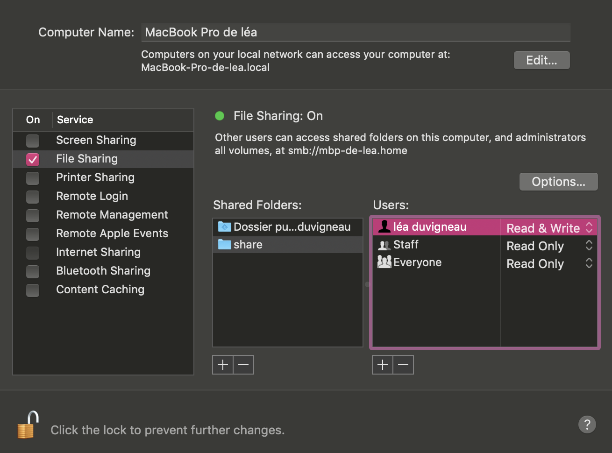
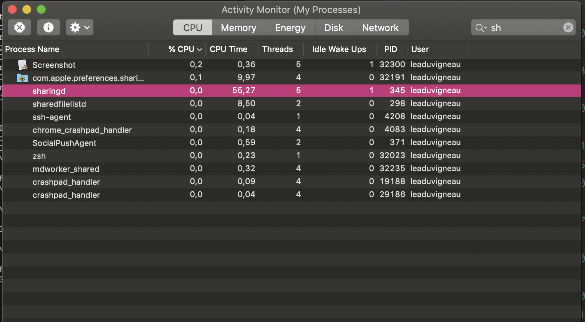
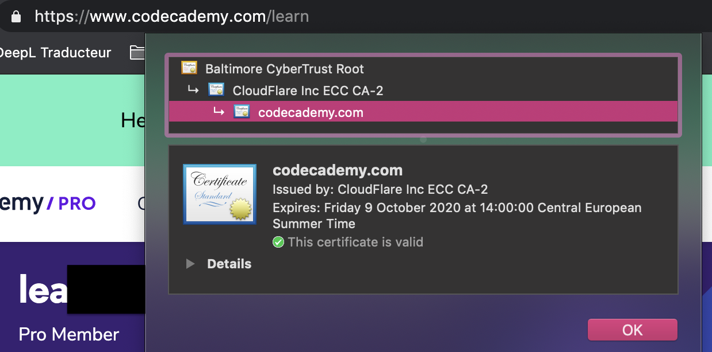
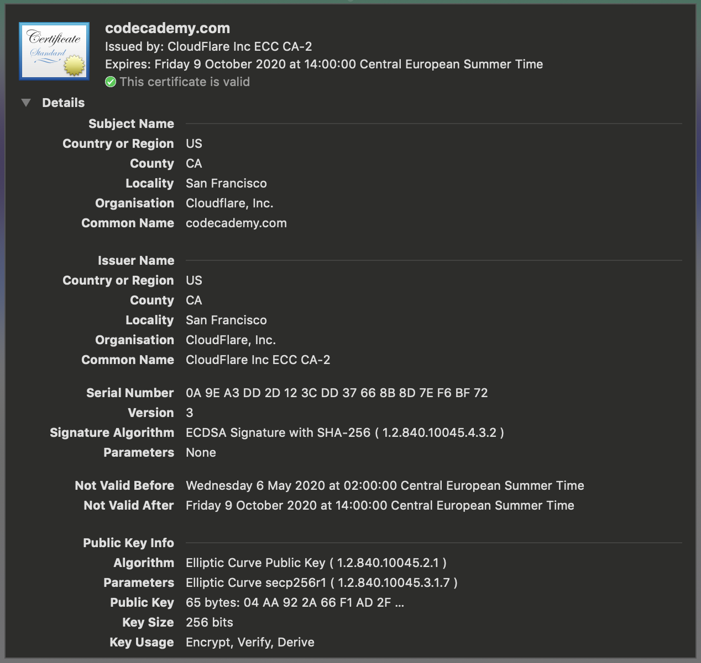
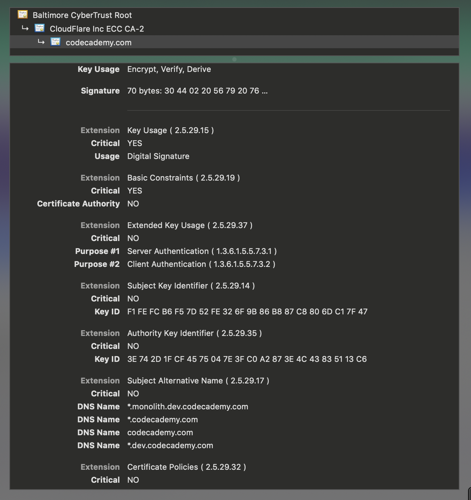
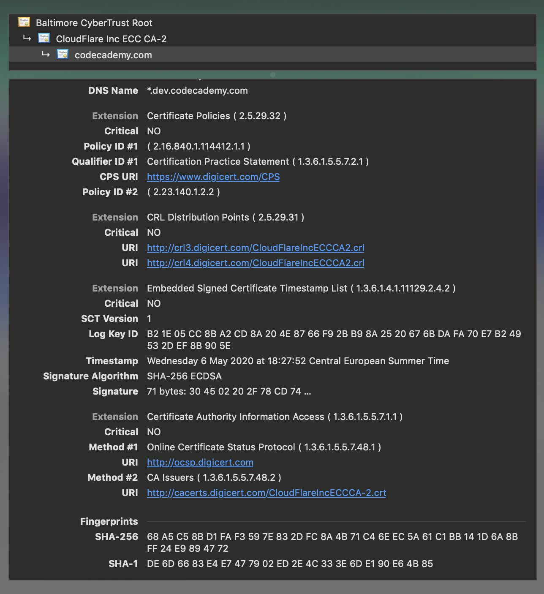
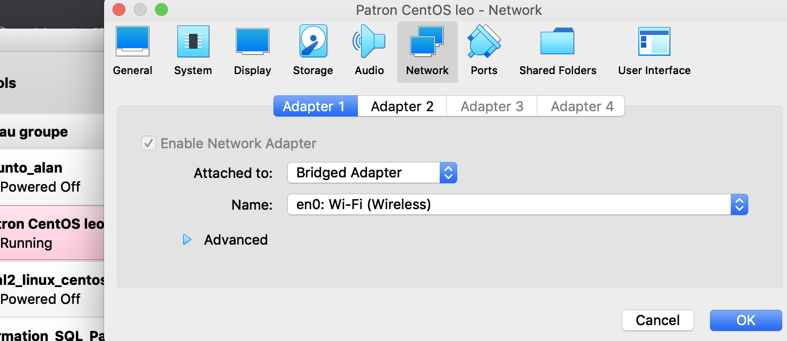

Maîtrise de poste - Day 1

## Self-footprinting

### Host OS

🌞 Déterminer les principales informations de votre machine

- nom de la machine, OS et version

  ```powershell
  ➜  ~ system_profiler SPSoftwareDataType
  Software:
  
      System Software Overview:
  
        System Version: macOS 10.14.5 (18F2058)
        Kernel Version: Darwin 18.6.0
        Boot Volume: Macintosh HD
        Boot Mode: Normal
        Computer Name: MacBook Pro de léa
        User Name: léa duvigneau (leaduvigneau)
        Secure Virtual Memory: Enabled
        System Integrity Protection: Enabled
        Time since boot: 1:07
  ```

  ```powershell
  ➜  tp_6 git:(master) ✗ sw_vers
  ProductName:	Mac OS X
  ProductVersion:	10.14.5
  BuildVersion:	18F2058
  ```

  ```powershell
  ➜  tp_6 git:(master) ✗ uname -a
  Darwin mbp-de-lea.home 18.6.0 Darwin Kernel Version 18.6.0: Sun Apr 28 18:06:45 PDT 2019; root:xnu-4903.261.4~6/RELEASE_X86_64 x86_64
  ```

- architecture processeur (32-bit, 64-bit, ARM, etc)

  ```powershell
  ➜  ~ getconf LONG_BIT
  64
  ```

- modèle du processeur, quantité RAM et modèle de la RAM

  ```powershell
  ➜  ~ system_profiler SPHardwareDataType
  Hardware:
  
      Hardware Overview:
  
        Model Name: MacBook Pro
        Model Identifier: MacBookPro15,4
        Processor Name: Intel Core i5
        Processor Speed: 1,4 GHz
        Number of Processors: 1
        Total Number of Cores: 4
        L2 Cache (per Core): 256 KB
        L3 Cache: 6 MB
        Hyper-Threading Technology: Enabled
        Memory: 8 GB
        Boot ROM Version: XX (iBridge: XX)
        Serial Number (system): XXXXXXXX
        Hardware UUID: XXXXXXXXXX
  ```
  
  ```powershell
  ➜  tp_6 git:(master) ✗ hostinfo
  Mach kernel version:
  	 Darwin Kernel Version 18.6.0: Sun Apr 28 18:06:45 PDT 2019; root:xnu-4903.261.4~6/RELEASE_X86_64
  Kernel configured for up to 8 processors.
  4 processors are physically available.
  8 processors are logically available.
  Processor type: x86_64h (Intel x86-64h Haswell)
  Processors active: 0 1 2 3 4 5 6 7
  Primary memory available: 8.00 gigabytes
  Default processor set: 348 tasks, 2451 threads, 8 processors
  Load average: 1.99, Mach factor: 5.99
  ```
  
  ```powershell
  ➜  tp_6 git:(master) ✗ system_profiler | grep Processor
      Apple: AUDynamicsProcessor:
      IOSlaveProcessor:
        Bundle ID: com.apple.driver.IOSlaveProcessor
        Location: /System/Library/Extensions/IOSlaveProcessor.kext
        Processor Name: Intel Core i5
        Processor Speed: 1,4 GHz
        Number of Processors: 1
  ```
  
  ```powershell
  ➜  tp_6 git:(master) ✗ sysctl -n machdep.cpu.brand_string
  Intel(R) Core(TM) i5-8257U CPU @ 1.40GHz
  ```
  
  ```powershell
  ➜  tp_6 git:(master) ✗ system_profiler SPHardwareDataType | grep "  Memory:"
        Memory: 8 GB
  ```

### Devices

Travail sur les périphériques branchés à la machine = à la carte mère.

🌞 Trouver

- la marque et le modèle de votre processeur

  - identifier le nombre de processeurs, le nombre de coeur

    ```powershell
    ➜  ~ system_profiler SPHardwareDataType
    Hardware:
    
        Hardware Overview:
    
          Model Name: MacBook Pro
          Model Identifier: MacBookPro15,4
          Processor Name: Intel Core i5
          Processor Speed: 1,4 GHz
          Number of Processors: 1
          Total Number of Cores: 4
          L2 Cache (per Core): 256 KB
          L3 Cache: 6 MB
          Hyper-Threading Technology: Enabled
          Memory: 8 GB
          Boot ROM Version: XX (iBridge: XX)
          Serial Number (system): XXXXXXXX
          Hardware UUID: XXXXXXXXXX
    ```

    ```powershell
    ➜  ~ sysctl -a | grep machdep.cpu
    machdep.cpu.max_basic: 22
    machdep.cpu.max_ext: 2147483656
    machdep.cpu.vendor: GenuineIntel
    machdep.cpu.brand_string: Intel(R) Core(TM) i5-8257U CPU @ 1.40GHz
    [...]
    ```

    Il n'y a qu'un seul processeur et 4 coeurs.

  - si c'est un proc Intel, expliquer le nom du processeur (oui le nom veut dire quelque chose)

    C'est le modèle Core 5 de 8ieme génération.

    

- la marque et le modèle :

  - de votre touchpad/trackpad
  
    ```powershell
    ➜  ~ system_profiler -detailLevel basic | grep -A 8 "Keyboard / Trackpad:"
            Apple Internal Keyboard / Trackpad:
    
              Product ID: 0x027d
              Vendor ID: 0x05ac (Apple Inc.)
              Version: 9.28
              Serial Number: FM79276070HKT58A4+EWT
              Speed: Up to 480 Mb/sec
              Manufacturer: Apple Inc.
              Location ID: 0x80500000 / 5
    ➜  ~ 
    ```
  
  - de vos enceintes intégrées
  
    ```powershell
    ➜  ~ system_profiler -detailLevel basic | grep -A 100 "Speakers:"
            MacBook Pro Speakers:
    
              Manufacturer: Apple Inc.
              Output Channels: 2
              Current SampleRate: 48000
              Transport: Built-in
              Output Source: MacBook Pro Speakers
    ```
  
  - de votre disque dur principal
  
    ```powershell
    diskutil list
    /dev/disk0 (internal):
       #:                       TYPE NAME                    SIZE       IDENTIFIER
       0:      GUID_partition_scheme                         251.0 GB   disk0
       1:                        EFI EFI                     314.6 MB   disk0s1
       2:                 Apple_APFS Container disk1         250.7 GB   disk0s2
    
    /dev/disk1 (synthesized):
       #:                       TYPE NAME                    SIZE       IDENTIFIER
       0:      APFS Container Scheme -                      +250.7 GB   disk1
                                     Physical Store disk0s2
       1:                APFS Volume Macintosh HD            222.3 GB   disk1s1
       2:                APFS Volume Preboot                 44.9 MB    disk1s2
       3:                APFS Volume Recovery                522.9 MB   disk1s3
       4:                APFS Volume VM                      3.2 GB     disk1s4
       
    ➜  tp_6 git:(master) ✗ diskutil info disk0
       Device Identifier:         disk0
       Device Node:               /dev/disk0
       Whole:                     Yes
       Part of Whole:             disk0
       Device / Media Name:       APPLE SSD AP0256N
    
       Volume Name:               Not applicable (no file system)
       Mounted:                   Not applicable (no file system)
       File System:               None
    
       Content (IOContent):       GUID_partition_scheme
       OS Can Be Installed:       No
       Media Type:                Generic
       Protocol:                  PCI-Express
       SMART Status:              Verified
    
       Disk Size:                 251.0 GB (251000193024 Bytes) (exactly 490234752 512-Byte-Units)
       Device Block Size:         4096 Bytes
    
       Read-Only Media:           No
       Read-Only Volume:          Not applicable (no file system)
    
       Device Location:           Internal
       Removable Media:           Fixed
    
       Solid State:               Yes
       Hardware AES Support:      Yes
    ```

🌞 Disque dur

- identifier les différentes partitions de votre/vos disque(s) dur(s)

  ```powershell
  ~ system_profiler -detailLevel basic | grep -A 9 "disk0"
            BSD Name: disk0
            Partition Map Type: GPT (GUID Partition Table)
            Removable Media: No
            S.M.A.R.T. status: Verified
            Volumes:
              EFI:
                Capacity: 314,6 MB (314 572 800 bytes)
                BSD Name: disk0s1
                Content: EFI
                Volume UUID: E783267B-A4C3-3556-B751-DBED770EB996
              disk0s2:
                Capacity: 250,69 GB (250 685 575 168 bytes)
                BSD Name: disk0s2
                
  ➜  ~ system_profiler -detailLevel basic | grep -A 9 "disk1"
        BSD Name: disk1s1
        Volume UUID: D793A464-0286-419D-87E7-1A72939CDB79
        Physical Drive:
            Device Name: APPLE SSD AP0256N
            Media Name: AppleAPFSMedia
            Medium Type: SSD
            Protocol: PCI-Express
            Internal: Yes
            Partition Map Type: Unknown
            S.M.A.R.T. Status: Verified
  ```
  
- déterminer le système de fichier de chaque partition et expliquer la fonction de chaque partition

  Dans le disque dur disk0, le disk0s1utilise comme système de fichier : EFI. Le disk0s2 utilise comme système de fichier : Apple_APFS (Apple File System).

  Le disk0s1 est la partition du disque pour tous les fichiers systèmes de l'os et le disk0s2 c'est la partition pour tous les autres fichiers. On partitionne un disque en plusieurs parties indépendantes pour qu'elles puissent gérer certaines opérations.

  Le disque dur disk1 n'est pas partitionné.

### Network

🌞 Afficher la liste des cartes réseau de votre machine

- expliquer la fonction de chacune d'entre elles

  ```powershell
  ➜  ~ ifconfig
  lo0: flags=8049<UP,LOOPBACK,RUNNING,MULTICAST> mtu 16384
  	options=1203<RXCSUM,TXCSUM,TXSTATUS,SW_TIMESTAMP>
  	inet 127.0.0.1 netmask 0xff000000 
  	inet6 ::1 prefixlen 128 
  	inet6 fe80::1%lo0 prefixlen 64 scopeid 0x1 
  	nd6 options=201<PERFORMNUD,DAD>
  gif0: flags=8010<POINTOPOINT,MULTICAST> mtu 1280
  stf0: flags=0<> mtu 1280
  XHC20: flags=0<> mtu 0
  XHC0: flags=0<> mtu 0
  VHC128: flags=0<> mtu 0
  en3: flags=8863<UP,BROADCAST,SMART,RUNNING,SIMPLEX,MULTICAST> mtu 1500
  	ether ff:ff:ff:ff:ff:ff
  	inet6 gr98::lzjf:58pa:am78:O887%en3 prefixlen 64 scopeid 0x7 
  	nd6 options=201<PERFORMNUD,DAD>
  	media: autoselect (100baseTX <full-duplex>)
  	status: active
  ap1: flags=8802<BROADCAST,SIMPLEX,MULTICAST> mtu 1500
  	ether ff:ff:ff:ff:ff:ff 
  	media: autoselect
  	status: inactive
  en0: flags=8863<UP,BROADCAST,SMART,RUNNING,SIMPLEX,MULTICAST> mtu 1500
  	ether ff:ff:ff:ff:ff:ff
  	inet6 gr98::lzjf:58pa:am78:O887%en0 prefixlen 64 secured scopeid 0x9 
  	inet 192.168.1.11 netmask 0xffffff00 broadcast 192.168.1.255
  	inet6 6jO8:6jO8:080:6jO8:6jO8:6jO8:6jO8:6jO8 prefixlen 64 autoconf secured 
  	inet6 6jO8:6jO8:080:6jO8:6jO8:6jO8:6jO8:6jO8 prefixlen 64 autoconf temporary 
  	nd6 options=201<PERFORMNUD,DAD>
  	media: autoselect
  	status: active
  p2p0: flags=8843<UP,BROADCAST,RUNNING,SIMPLEX,MULTICAST> mtu 2304
  	ether ff:ff:ff:ff:ff:ff
  	media: autoselect
  	status: inactive
  awdl0: flags=8943<UP,BROADCAST,RUNNING,PROMISC,SIMPLEX,MULTICAST> mtu 1484
  	ether ff:ff:ff:ff:ff:ff
  	inet6 gr98::lzjf:58pa:am78:O887%awdl0 prefixlen 64 scopeid 0xb 
  	nd6 options=201<PERFORMNUD,DAD>
  	media: autoselect
  	status: active
  en1: flags=8963<UP,BROADCAST,SMART,RUNNING,PROMISC,SIMPLEX,MULTICAST> mtu 1500
  	options=60<TSO4,TSO6>
  	ether ff:ff:ff:ff:ff:ff 
  	media: autoselect <full-duplex>
  	status: inactive
  en2: flags=8963<UP,BROADCAST,SMART,RUNNING,PROMISC,SIMPLEX,MULTICAST> mtu 1500
  	options=60<TSO4,TSO6>
  	ether ff:ff:ff:ff:ff:ff 
  	media: autoselect <full-duplex>
  	status: inactive
  bridge0: flags=8863<UP,BROADCAST,SMART,RUNNING,SIMPLEX,MULTICAST> mtu 1500
  	options=63<RXCSUM,TXCSUM,TSO4,TSO6>
  	ether ff:ff:ff:ff:ff:ff
  	Configuration:
  		id 0:0:0:0:0:0 priority 0 hellotime 0 fwddelay 0
  		maxage 0 holdcnt 0 proto stp maxaddr 100 timeout 1200
  		root id 0:0:0:0:0:0 priority 0 ifcost 0 port 0
  		ipfilter disabled flags 0x2
  	member: en1 flags=3<LEARNING,DISCOVER>
  	        ifmaxaddr 0 port 12 priority 0 path cost 0
  	member: en2 flags=3<LEARNING,DISCOVER>
  	        ifmaxaddr 0 port 13 priority 0 path cost 0
  	nd6 options=201<PERFORMNUD,DAD>
  	media: <unknown type>
  	status: inactive
  utun0: flags=8051<UP,POINTOPOINT,RUNNING,MULTICAST> mtu 2000
  	inet6 gr98::lzjf:58pa:am78:O887%utun0 prefixlen 64 scopeid 0xf 
  	nd6 options=201<PERFORMNUD,DAD>
  vboxnet0: flags=8842<BROADCAST,RUNNING,SIMPLEX,MULTICAST> mtu 1500
  	ether ff:ff:ff:ff:ff:ff
  vboxnet10: flags=8842<BROADCAST,RUNNING,SIMPLEX,MULTICAST> mtu 1500
  	ether ff:ff:ff:ff:ff:ff 
  vboxnet11: flags=8842<BROADCAST,RUNNING,SIMPLEX,MULTICAST> mtu 1500
  	ether ff:ff:ff:ff:ff:ff 
  vboxnet6: flags=8842<BROADCAST,RUNNING,SIMPLEX,MULTICAST> mtu 1500
  	ether ff:ff:ff:ff:ff:ff 
  vboxnet8: flags=8843<UP,BROADCAST,RUNNING,SIMPLEX,MULTICAST> mtu 1500
  	ether ff:ff:ff:ff:ff:ff 
  	inet 10.9.8.1 netmask 0xffffff00 broadcast 10.9.8.255
  vboxnet9: flags=8842<BROADCAST,RUNNING,SIMPLEX,MULTICAST> mtu 1500
  	ether ff:ff:ff:ff:ff:ff 
  ```

  ```powershell
   # Permet d'avoir le nom de certaines interfaces
   ➜  ~ networksetup -listallhardwareports
  
    Hardware Port: Wi-Fi
  Device: en0
    Ethernet Address: ff:ff:ff:ff:ff:ff
  
    Hardware Port: Bluetooth PAN
    Device: en4
    Ethernet Address: ff:ff:ff:ff:ff:ff
  
    Hardware Port: Thunderbolt 1
    Device: en1
    Ethernet Address: ff:ff:ff:ff:ff:ff
  
    Hardware Port: Thunderbolt 2
    Device: en2
    Ethernet Address: ff:ff:ff:ff:ff:ff
  
    Hardware Port: Thunderbolt Bridge
    Device: bridge0
    Ethernet Address: ff:ff:ff:ff:ff:ff
  ```
 VLAN Configurations
  ===================
  ```
  
  La fonction d'une carte réseau est de préparer, d'envoyer et de contrôler les données sur le réseau.
  
  lo0: Loopback interface, boucle locale, localhost, pile TCP/IP locale, adaptateur de bouclage.
  
  gif0: Tunnel générique IPv4/IPv6
  
  stf0: Tunnel IPv6/IPv4
  
  XHC20, XHC0, VHC128: Interfaces réseau USB
  
  ap1: Access point interface used for WiFi tethering
  
  en0: Wi-fi interface.
  
  en1: Thunderbolt 1
  
  en2 : Thunderbolt 2
  
  en3:  iBridge adapter for the TouchBar
  
  en4: Bluetooth PAN
  
  p2p0: Interface pour AirDrop
  
  awdl0: Apple Wireless Direct Link (Bluetooth) vers les appareils iOS
  
  bridge0: Pont logiciel entre d'autres interfaces. Thunderbolt bridge. typically for transfering files over cable between two Macs.
  
  utun0: Pilote d'interface de tunnel. tunnel virtual interface used for VPN connections.
  
  vboxnet0, vboxnet6, vboxnet8, vboxnet9, vboxnet10, vboxnet11: Interfaces logicielles spécifiques à VirtualBox.
  ```

🌞 Lister tous les ports TCP et UDP en utilisation

```powershell
➜  ~ netstat -bn | grep 'ESTABLISHED'
tcp4       0      0  X.X.X.X.60574     X.X.X.X.443     ESTABLISHED       4149       2730
tcp4       0      0  X.X.X.X.60573     X.X.X.X.443     ESTABLISHED       4588       2789
tcp4       0      0  X.X.X.X.60571     X.X.X.X.445     ESTABLISHED        419        711
tcp6       0      0  ff:ff:ff:ff:ff:ff.60548 ff:ff:ff:ff:ff:ff.443   ESTABLISHED       3613       8034
tcp6       0      0  ff:ff:ff:ff:ff:ff.60545 ff:ff:ff:ff:ff:ff.443   ESTABLISHED      12898      12637
tcp6       0      0  ff:ff:ff:ff:ff:ff.60541 ff:ff:ff:ff:ff:ff.443   ESTABLISHED       6405       4362
tcp4       0      0  X.X.X.X.60534     X.X.X.X.443     ESTABLISHED       3626       2586
tcp4       0      0  X.X.X.X.60529     X.X.X.X.443     ESTABLISHED       4827       5822
tcp4       0      0  X.X.X.X.60527     X.X.X.X.443     ESTABLISHED        757       2988
tcp6       0      0  ff:ff:ff:ff:ff:ff.60521 ff:ff:ff:ff:ff:ff.443   ESTABLISHED       9668       2757
tcp6       0      0  ff:ff:ff:ff:ff:ff.60519 ff:ff:ff:ff:ff:ff.443   ESTABLISHED      56604       9483
tcp4       0      0  X.X.X.X.60490     X.X.X.X.443     ESTABLISHED       5492       2618
tcp6       0      0  ff:ff:ff:ff:ff:ff.60455 ff:ff:ff:ff:ff:ff.443   ESTABLISHED      17304      15748
tcp6       0      0  ff:ff:ff:ff:ff:ff.60420 ff:ff:ff:ff:ff:ff.443   ESTABLISHED     137123     131922
tcp4       0      0  X.X.X.X.59597     X.X.X.X.443     ESTABLISHED      30269      29447
tcp4       0      0  X.X.X.X.58853     X.X.X.X.443     ESTABLISHED      20693      31157
tcp4       0      0  X.X.X.X.58784     X.X.X.X.443     ESTABLISHED      18603      23962
tcp4       0      0  X.X.X.X.58780     X.X.X.X.4070    ESTABLISHED     485574     318703
tcp4       0      0  X.X.X.X.58490     X.X.X.X.443     ESTABLISHED     174198      55952
tcp6       0      0  ff:ff:ff:ff:ff:ff.58484 ff:ff:ff:ff:ff:ff.5228  ESTABLISHED       5076      10408
tcp6       0      0  ff:ff:ff:ff:ff:ff.58482 ff:ff:ff:ff:ff:ff.49713 ESTABLISHED        752       1253
tcp4       0      0  X.X.X.X.49761     X.X.X.X.58473   ESTABLISHED       4222          0
tcp4       0      0  X.X.X.X.58473     X.X.X.X.49761   ESTABLISHED      11559       5560
tcp6       0      0  ff:ff:ff:ff:ff:ff.49156 ff:ff:ff:ff:ff:ff.49734 ESTABLISHED       2654       1810
tcp6       0      0  ff:ff:ff:ff:ff:ff.58092 ff:ff:ff:ff:ff:ff.49726 ESTABLISHED       2343       3176
tcp6       0      0  ff:ff:ff:ff:ff:ff.57574 ff:ff:ff:ff:ff:ff.49712 ESTABLISHED       1732       2707
tcp6       0      0  ff:ff:ff:ff:ff:ff.56408 ff:ff:ff:ff:ff:ff.49719 ESTABLISHED     774001     293878
tcp6       0      0  ff:ff:ff:ff:ff:ff.56354 ff:ff:ff:ff:ff:ff.49718 ESTABLISHED        860       2569
tcp4       0      0  X.X.X.X.52824     X.X.X.X.5223    ESTABLISHED      24364     106160
tcp6       0      0  ff:ff:ff:ff:ff:ff.51267 ff:ff:ff:ff:ff:ff.49718 ESTABLISHED        788       2497
tcp6       0      0  ff:ff:ff:ff:ff:ff.49974 ff:ff:ff:ff:ff:ff.59602 ESTABLISHED     278986     463052
tcp6       0      0  ff:ff:ff:ff:ff:ff.64752 ff:ff:ff:ff:ff:ff.49718 ESTABLISHED        788       3757
tcp6       0      0  ff:ff:ff:ff:ff:ff.63776 ff:ff:ff:ff:ff:ff.49718 ESTABLISHED        788       4177
tcp6       0      0  ff:ff:ff:ff:ff:ff.61735 ff:ff:ff:ff:ff:ff.49718 ESTABLISHED        788       4177
tcp6       0      0  ff:ff:ff:ff:ff:ff.60227 ff:ff:ff:ff:ff:ff.49718 ESTABLISHED        860       4879
tcp6       0      0  ff:ff:ff:ff:ff:ff.53762 ff:ff:ff:ff:ff:ff.49718 ESTABLISHED        788       5266
tcp4       0      0  X.X.X.X.49761     X.X.X.X.50395   ESTABLISHED       4487          0
tcp4       0      0  X.X.X.X.50395     X.X.X.X.49761   ESTABLISHED      20400          0
tcp6       0      0  ff:ff:ff:ff:ff:ff.63249 ff:ff:ff:ff:ff:ff.49718 ESTABLISHED        788       5857
tcp6       0      0  ff:ff:ff:ff:ff:ff.56398 ff:ff:ff:ff:ff:ff.49718 ESTABLISHED        860       8974
tcp6       0      0  ff:ff:ff:ff:ff:ff.54063 ff:ff:ff:ff:ff:ff.49718 ESTABLISHED        716      10195
tcp6       0      0  ff:ff:ff:ff:ff:ff.49653 ff:ff:ff:ff:ff:ff.49718 ESTABLISHED        788      12052
tcp6       0      0  ff:ff:ff:ff:ff:ff.61757 ff:ff:ff:ff:ff:ff.49718 ESTABLISHED        788      12196
tcp6       0      0  ff:ff:ff:ff:ff:ff.58875 ff:ff:ff:ff:ff:ff.49718 ESTABLISHED        788      13522
tcp6       0      0  ff:ff:ff:ff:ff:ff.58668 ff:ff:ff:ff:ff:ff.49718 ESTABLISHED        788      13732
tcp6       0      0  ff:ff:ff:ff:ff:ff.56494 ff:ff:ff:ff:ff:ff:.49718 ESTABLISHED        860      13804
tcp6       0      0  ff:ff:ff:ff:ff:ff.54756 ff:ff:ff:ff:ff:ff.49718 ESTABLISHED        788      15274
tcp6       0      0  ff:ff:ff:ff:ff:ff.49808 ff:ff:ff:ff:ff:ff.49718 ESTABLISHED        788      22552
tcp6       0      0  ff:ff:ff:ff:ff:ff.49157 ff:ff:ff:ff:ff:ff.49715 ESTABLISHED        651     108281```
```


  ```

- déterminer quel programme tourne derrière chacun des ports et expliquer la fonction de chacun de ces programmes

  443 : SSL (Secure Sockets Layer) ou HTTPS. Sites web TLS, iTunes Store, mise à jour logicielle, Suggestions Spotlight, Mac App Store, Plans, FaceTime, Game Center, authentification iCloud et services DAV. Permet la connection sécurisé HTTPS à un site web.

  445 : Serveur de domaine SMB Microsoft. Le protocole SMB autorise la « communication entre les processus venant de microsoft.

  4070 : Trivial IP Encryption (TrIPE).

  5223 : Service de notifications Push Apple (APNS). Services iCloud DAV (contacts, calendriers, signets), [Notifications Push ](https://support.apple.com/fr-fr/HT203609), FaceTime, iMessage, Game Center, Flux de photos.

  5228 :  Service de notifications Push Apple (APNS). Suggestions Spotlight, Siri.

  49712, 49713, 49715, 49718, 49719, 49726, 49734, 49761, 50395, 58473, 59602 : Xsan.  Accès au système de fichiers Xsan.

### Users

🌞 Déterminer la liste des utilisateurs de la machine

- la liste **complète** des utilisateurs de la machine (je vous vois les Windowsiens...)

  ```powershell
  ➜  ~ dscl . list /Users | grep -v '_'
  
  daemon
  leaduvigneau
  nobody
  root
  ```

- déterminer le nom de l'utilisateur qui est full admin sur la machine
  
  - il existe toujours un utilisateur particulier qui a le droit de tout faire sur la machine
  
    ```powershell
    ➜  ~ dscl . -read /Groups/admin GroupMembership
    GroupMembership: root leaduvigneau
    ```

### Processus

🌞 Déterminer la liste des processus de la machine

```powershell
➜  tp_6 git:(master) ✗ ps -ef
  UID   PID  PPID   C STIME   TTY           TIME CMD
    0     1     0   0 21Apr20 ??        10:33.15 /sbin/launchd
    0    39     1   0 21Apr20 ??         0:13.08 /usr/sbin/syslogd
    0    40     1   0 21Apr20 ??         0:23.57 /usr/libexec/UserEventAgent (System)
    0    43     1   0 21Apr20 ??         0:08.27 /System/Library/PrivateFrameworks/Uninstall.framework/Resources/uninstalld
    0    44     1   0 21Apr20 ??         0:27.14 /usr/libexec/kextd
    0    45     1   0 21Apr20 ??         2:51.74 /System/Library/Frameworks/CoreServices.framework/Versions/A/Frameworks/FSEvents.framework/Versions/A/Support/fseventsd
   55    50     1   0 21Apr20 ??         0:02.08 /System/Library/CoreServices/appleeventsd --server
    0    51     1   0 21Apr20 ??         4:13.73 /usr/sbin/systemstats --daemon
    0    53     1   0 21Apr20 ??         0:58.11 /usr/libexec/configd
    0    54     1   0 21Apr20 ??         1:57.59 /System/Library/CoreServices/powerd.bundle/powerd
    0    57     1   0 21Apr20 ??         3:14.82 /usr/libexec/logd
    0    64     1   0 21Apr20 ??         4:02.13 /System/Library/Frameworks/CoreServices.framework/Frameworks/Metadata.framework/Support/mds
    0    66     1   0 21Apr20 ??         0:11.24 /usr/libexec/diskarbitrationd
    0    69     1   0 21Apr20 ??         0:02.22 /System/Library/CoreServices/backupd.bundle/Contents/Resources/backupd-helper -launchd
    0    73     1   0 21Apr20 ??         1:52.04 /usr/libexec/opendirectoryd
    0    74     1   0 21Apr20 ??         0:16.31 /System/Library/PrivateFrameworks/ApplePushService.framework/apsd
    0    75     1   0 21Apr20 ??         0:00.02 /System/Library/PrivateFrameworks/Noticeboard.framework/Versions/A/Resources/nbstated
    0    76     1   0 21Apr20 ??         7:28.89 /System/Library/CoreServices/launchservicesd
  266    77     1   0 21Apr20 ??         0:07.35 /usr/libexec/timed
    0    78     1   0 21Apr20 ??         0:16.96 /usr/sbin/securityd -i
  213    79     1   0 21Apr20 ??         0:00.93 /System/Library/PrivateFrameworks/MobileDevice.framework/Versions/A/Resources/usbmuxd -launchd
  205    81     1   0 21Apr20 ??         1:25.82 /usr/libexec/locationd
    0    83     1   0 21Apr20 ??         0:00.06 autofsd
  244    84     1   0 21Apr20 ??         0:01.80 /usr/libexec/displaypolicyd -k 1
    0    86     1   0 21Apr20 ??         0:45.62 /usr/libexec/dasd
  501    90     1   0 21Apr20 ??         0:57.59 /System/Library/CoreServices/loginwindow.app/Contents/MacOS/loginwindow console
    0    91     1   0 21Apr20 ??         0:00.51 /System/Library/CoreServices/logind
    0    92     1   0 21Apr20 ??         0:02.80 /System/Library/PrivateFrameworks/GenerationalStorage.framework/Versions/A/Support/revisiond
    0    93     1   0 21Apr20 ??         0:00.04 /usr/sbin/KernelEventAgent
    0    95     1   0 21Apr20 ??         0:24.09 /usr/sbin/bluetoothd
  261    97     1   0 21Apr20 ??        34:36.16 /usr/libexec/hidd
    0    99     1   0 21Apr20 ??         3:14.64 /usr/libexec/corebrightnessd --launchd
    0   100     1   0 21Apr20 ??         0:09.20 /usr/libexec/AirPlayXPCHelper
    0   101     1   0 21Apr20 ??         0:58.20 /usr/sbin/notifyd
  241   103     1   0 21Apr20 ??         0:03.66 /usr/sbin/distnoted daemon
    0   106     1   0 21Apr20 ??         0:24.47 /usr/libexec/syspolicyd
    0   112     1   0 21Apr20 ??         0:06.93 /System/Library/Frameworks/Security.framework/Versions/A/XPCServices/authd.xpc/Contents/MacOS/authd
    0   127     1   0 21Apr20 ??         0:36.27 /usr/sbin/cfprefsd daemon
    0   142     1   0 21Apr20 ??         0:22.66 /System/Library/CoreServices/coreservicesd
    0   159     1   0 21Apr20 ??         0:00.02 /System/Library/Frameworks/PCSC.framework/Versions/A/XPCServices/com.apple.ctkpcscd.xpc/Contents/MacOS/com.apple.ctkpcscd
   88   169     1   0 21Apr20 ??       360:42.09 /System/Library/PrivateFrameworks/SkyLight.framework/Resources/WindowServer -daemon
  202   170     1   0 21Apr20 ??       176:38.39 /usr/sbin/coreaudiod
   24   175     1   0 21Apr20 ??         1:33.59 /usr/libexec/symptomsd
   65   189     1   0 21Apr20 ??         1:01.28 /usr/sbin/mDNSResponder
    0   190     1   0 21Apr20 ??         0:11.71 /usr/sbin/mDNSResponderHelper
  242   193     1   0 21Apr20 ??         0:10.31 /usr/libexec/nsurlsessiond --privileged
    0   194     1   0 21Apr20 ??         0:00.01 /usr/libexec/multiversed
    0   196     1   0 21Apr20 ??         0:00.62 
    [...]
  501  4081     1   0 27Apr20 ??        74:35.67 /Applications/Google Chrome.app/Contents/MacOS/Google [...]
ps -ef
```

```powershell
➜  tp_6 git:(master) ✗ top
Processes: 359 total, 2 running, 357 sleeping, 2431 threads                                                                                                                                          20:19:49
Load Avg: 2.56, 2.19, 2.01  CPU usage: 10.20% user, 2.96% sys, 86.83% idle  SharedLibs: 154M resident, 49M data, 14M linkedit. MemRegions: 160033 total, 1663M resident, 64M private, 650M shared.
PhysMem: 8131M used (2380M wired), 59M unused. VM: 2085G vsize, 1371M framework vsize, 23929294(0) swapins, 24653434(0) swapouts. Networks: packets: 16950829/12G in, 24411664/6571M out.
Disks: 5654258/192G read, 4825210/162G written.

PID    COMMAND      %CPU TIME     #TH   #WQ  #PORT MEM    PURG   CMPRS  PGRP  PPID  STATE    BOOSTS            %CPU_ME %CPU_OTHRS UID  FAULTS      COW     MSGSENT    MSGRECV    SYSBSD     SYSMACH
28291  top          4.7  00:01.21 1/1   0    25    6184K+ 0B     0B     28291 19404 running  *0[1]             0.00000 0.00000    0    5955+       103     465908+    232942+    20605+     272109+
28158  com.apple.Di 0.0  00:00.07 2     2    33    2152K  0B     1780K  28158 1     sleeping  0[1]             0.00000 0.00000    501  2217        140     1409       255        2891       2853
28132  deleted      0.0  00:00.05 2     2    43    2660K  0B     2100K  28132 1     sleeping  0[2]             0.00000 0.00000    501  2405        158     235        76         1032       468
28131  videosubscri 0.0  00:00.07 2     2    30    3276K  0B     2556K  28131 1     sleeping  0[8]             0.00000 0.00000    501  2632        152     145        47         714        346
28130  parsecd      0.0  00:00.22 2     1    73    5896K  0B     2852K  28130 1     sleeping  0[15]            0.00000 0.00000    501  7060        352     660        180        3800       1218
28068  printtool    0.0  00:00.02 2     2    31    1056K  0B     484K   28068 1     sleeping  0[2]             0.00000 0.00000    501  2779        144     133        39         944        292
28066  seld         0.0  00:00.05 2     1    50    1624K  0B     848K   28066 1     sleeping  0[4]             0.00000 0.00000    260  2321        163     153        47         873        323
28065  findmydevice 0.0  00:00.11 2     1    82    2620K  0B     1200K  28065 1     sleeping  0[4]             0.00000 0.00000    0    6319        252     415        125        1760       782
28058  passd        0.0  00:00.39 2     1    123   7988K  0B     2288K  28058 1     sleeping  0[9]             0.00000 0.00000    501  11187       377     1016       301        10599      2003
28056  studentd     0.0  00:00.39 2     1    130   9852K  0B     3780K  28056 1     sleeping *0[1]             0.00000 0.00000    501  9897        426     1285       291        12205      2741
28029  quicklookd   0.0  00:00.15 5     2    91    3700K  64K    1724K  28029 1     sleeping  0[16]            0.00000 0.00000    501  5226        223     904        249        43000      2057
28023  trustd       0.0  00:00.08 2     2    36    2876K  0B     2388K  28023 1     sleeping  0[25]            0.00000 0.00000    89   2569        162     253        64         3075       729
28006  ContainerMet 0.0  00:00.06 2     1    47    1988K  0B     816K   28006 1     sleeping  0[24]            0.00000 0.00000    501  4603        186     489        129        1636       840
28005  swcd         0.0  00:00.11 2     1    53    3988K  0B     2456K  28005 1     sleeping  0[0]             0.00000 0.00000    501  8950        153     950        360        3138       1707
28003  nfcd         0.0  00:00.15 2     1    62    2040K  0B     672K   28003 1     sleeping *0[1]             0.00000 0.00000    260  2835        214     569        156        4173       4718
27938  com.apple.We 0.1  00:44.45 6     3    116   111M-  4224K  15M    27938 1     sleeping *1[2]             0.00000 0.00000    501  82032       382     137153     87195      329431+    314904+
27937  XprotectServ 0.0  00:00.05 2     2    43    3080K  0B     2320K  27937 1     sleeping  0[1]             0.00000 0.00000    501  4157        172     164        49         731        378
27936  iconservices 0.0  00:00.02 2     2    34    2324K  0B     1480K  27936 1     sleeping  0[2]             0.00000 0.00000    240  2339        137     98         34         499        216
27935  Google Chrom 0.0  00:00.24 17    3    112   15M    0B     11M    4081  4081  sleeping *0[4]             0.00000 0.00000    501  9405        2192    2132+      825+       3564+      4353+
27702  com.apple.Cl 0.0  00:00.17 2     1    57    3444K  0B     3408K  27702 1     sleeping  0[2]             0.00000 0.00000    501  6714        181     365        91         1347       688
27701  cloudphotosd 0.0  00:00.56 3     1    180   10M    0B     9816K  27701 1     sleeping  0[8]             0.00000 0.00000    501  10932       815     1732+      571+       7307+      4218+
27700  com.apple.ph 0.0  00:00.24 2     1    48    7968K  0B     7924K  27700 1     sleeping  0[1]             0.00000 0.00000    501  8279        616     487        157        2987       969
27699  ScopedBookma 0.0  00:00.05 2     2    47    2716K  0B     2568K  27699 1     sleeping  0[0]             0.00000 0.00000    501  2442        147     170        81         862        428
27698  photolibrary 0.0  00:00.76 4     4    74    8416K  0B     8376K  27698 1     sleeping  0[1]             0.00000 0.00000    501  6257        417     1578       467        10670      3546
27697  photoanalysi 0.0  00:00.98 2     1    90    15M    0B     15M    27697 1     sleeping  0[1]             0.00000 0.00000    501  14351       877     1677       427        8634       2815
27664  ocspd        0.0  00:00.31 3     1    43    2440K  0B     1472K  27664 1     sleeping *0[1]             0.00000 0.00000    0    14018       192     8722       59         4201       26022
27461  mdworker_sha 0.0  00:00.08 3     1    56    3124K  0B     3080K  27461 1     sleeping *0[1]             0.00000 0.00000    501  4084        186     926        365        1524       1115
27460  Google Chrom 0.0  00:01.65 16    2    158   40M    0B     37M    4081  4081  sleeping *0[4]             0.00000 0.00000    501  30431       2324    11850+     5709+      30300+     29462+
27459  Google Chrom 0.0  00:04.02 15    1    141   33M    0B     31M    4081  4081  sleeping *0[5]             0.00000 0.00000    501  27438       3166    25857+     11694+     26287      75243+
27458  Google Chrom 0.0  00:01.06 15    1    152   22M    0B     20M    4081  4081  sleeping *0[5]             0.00000 0.00000    501  18322       2236    9926+      8195+      16239      31043+
27279  mdworker_sha 0.0  00:00.08 3     1    56    3204K  0B     2840K  27279 1     sleeping *0[1]             0.00000 0.00000    501  5075        187     835        333        1362       975
27180  mdworker_sha 0.0  00:00.66 4     1    63    9140K  0B     6104K  27180 1     sleeping *0[1]             0.00000 0.00000    501  31051       194     1625       606        6634       4329
27179  mdworker_sha 0.0  00:00.64 4     1    61    11M    0B     7708K  27179 1     sleeping *0[1]             0.00000 0.00000    501  29719       188     1511       567        5777       3776
27178  mdworker_sha 0.0  00:00.24 4     1    63    7928K  0B     2276K  27178 1     sleeping *0[1]             0.00000 0.00000    501  14409       191     896        357        2287       1635
27177  Google Chrom 0.0  00:20.26 16    2    151   70M    0B     66M    4081  4081  sleeping *0[5]             0.00000 0.00000    501  44575       2798    70991+     22345+     85404+     167178+
27176  mdworker_sha 0.0  00:01.22 4     1    65    9616K  0B     2676K  27176 1     sleeping *0[1]             0.00000 0.00000    501  48236       190     3028       1157       11476      7324
27169  mdworker_sha 0.0  00:00.12 4     1    56    5564K  0B     5520K  27169 1     sleeping *0[1]             0.00000 0.00000    501  8145        187     659        276        1084       997
27168  mdworker_sha 0.0  00:00.11 4     1    58    4752K  0B     4708K  27168 1     sleeping *0[1]             0.00000 0.00000    501  7882        186     658        276        1073       994
27167  mdworker_sha 0.0  00:00.07 3     1    57    5960K  0B     5920K  27167 1     sleeping *0[1]             0.00000 0.00000    501  5973        187     665        277        912        725
27165  mdworker_sha 0.0  00:00.27 4     1    62    9080K  0B     9036K  27165 1     sleeping *0[1]             0.00000 0.00000    501  14209       190     977        382        2912       1906
26965  Google Chrom 0.1  00:03.27 16    2    159   43M    0B     36M    4081  4081  sleeping *0[5]             0.00000 0.00000    501  32602       2260    19058+     8615+      35188+     47229+
26961  pbs          0.0  00:00.07 2     2    40    1928K  0B     1100K  26961 1     sleeping  0[0]             0.00000 0.00000    501  3344        146     198        68         1268       419
26960  iconservices 0.0  00:00.07 2     2    43    2708K  0B     1868K  26960 1     sleeping  0[0]             0.00000 0.00000    0    3061        150     144        46         3312       506
26954  networkservi 0.0  00:00.07 2     1    50    3080K  0B     3068K  26954 1     sleeping *0[1]             0.00000 0.00000    501  3408        203     176        51         841        405
26882  amfid        0.0  00:00.04 2     2    43    2288K  0B     2200K  26882 1     sleeping *0[1]             0.00000 0.00000    0    2603        171     106        67         854        314
26881  AGSService   0.0  00:00.03 2     1    41    1564K  0B     1540K  26881 1     sleeping *0[1]             0.00000 0.00000    501  3146        175     136        37         805        323
26869  keyboardserv 0.0  00:00.04 2     1    43    2240K  0B     2236K  26869 1     sleeping  0[1]             0.00000 0.00000    501  4181        183     197        63         1601       447
26868  AppleSpell   0.0  00:00.83 2     1    113   12M    0B     12M    26868 1     sleeping *0[1]             0.00000 0.00000    501  15999       362     1438       372        16416      2390
26825  distnoted    0.0  00:00.01 2     1    32    1952K  0B     1680K  26825 1     sleeping *0[1]             0.00000 0.00000    89   1018        93      123        57         375        288
26824  mdworker_sha 0.0  00:00.05 3     1    48    2972K  0B     2952K  26824 1     sleeping *0[1]             0.00000 0.00000    89   4300        188     634        262        885        675
26790  AudioCompone 0.0  00:00.02 2     1    40    2980K  0B     2964K  26790 1     sleeping  0[1]             0.00000 0.00000    0    2294        142     92         35         786        2
```

- je vous épargne l'explication de chacune des lignes, bien que ça serait pas plus mal...
- choisissez 5 services système et expliquer leur utilité
- par "service système" j'entends des processus élémentaires au bon fonctionnement de la machine
  - sans eux, l'OS tel qu'on l'utilise n'existe pas

-launchd : Service management framework.

-syslogd : Receives and processes log messages.

-dasd : Duet Activity Scheduler (DAS) maintains a scored list of background activities which usually consists of more than seventy items.

-configd : This is the System Configuration Server, which means it monitors and reports on your Mac’s settings and status.

-diskarbitrationd : This is a disk arbitration daemon that governs the use of disks by the system. It listens for, and handles, client requests, notifies clients of relevant disk events - such as mounting a new disk or filesystem.

-kextd : This is the kernel extension server. 

- déterminer les processus lancés par l'utilisateur qui est full admin sur la machine

  ```powershell
  ➜  tp_6 git:(master) ✗ ps -u root
    UID   PID TTY           TIME CMD
      0     1 ??        10:34.18 /sbin/launchd
      0    39 ??         0:13.08 /usr/sbin/syslogd
      0    40 ??         0:23.63 /usr/libexec/UserEventAgent (System)
      0    43 ??         0:08.28 /System/Library/PrivateFrameworks/Uninstall.framework/Resources/uninstalld
      0    44 ??         0:27.14 /usr/libexec/kextd
      0    45 ??         2:52.19 /System/Library/Frameworks/CoreServices.framework/Versions/A/Frameworks/FSEvents.framework/Versions/A/Support
      0    51 ??         4:14.92 /usr/sbin/systemstats --daemon
      0    53 ??         0:58.13 /usr/libexec/configd
      0    54 ??         1:57.98 /System/Library/CoreServices/powerd.bundle/powerd
      0    57 ??         3:15.24 /usr/libexec/logd
      0    64 ??         4:03.11 /System/Library/Frameworks/CoreServices.framework/Frameworks/Metadata.framework/Support/mds
      0    66 ??         0:11.29 /usr/libexec/diskarbitrationd
      0    69 ??         0:02.22 /System/Library/CoreServices/backupd.bundle/Contents/Resources/backupd-helper -launchd
      0    73 ??         1:52.19 /usr/libexec/opendirectoryd
      0    74 ??         0:16.31 /System/Library/PrivateFrameworks/ApplePushService.framework/apsd
      0    75 ??         0:00.02 /System/Library/PrivateFrameworks/Noticeboard.framework/Versions/A/Resources/nbstated
      0    76 ??         7:29.73 /System/Library/CoreServices/launchservicesd
      0    78 ??         0:16.98 /usr/sbin/securityd -i
      0    83 ??         0:00.06 autofsd
      0    86 ??         0:45.73 /usr/libexec/dasd
    501    90 ??         0:57.61 /System/Library/CoreServices/loginwindow.app/Contents/MacOS/loginwindow console
      0    91 ??         0:00.51 /System/Library/CoreServices/logind
      0    92 ??         0:02.84 /System/Library/PrivateFrameworks/GenerationalStorage.framework/Versions/A/Support/revisiond
      0    93 ??         0:00.04 /usr/sbin/KernelEventAgent
      0    95 ??         0:24.11 /usr/sbin/bluetoothd
      0    99 ??         3:14.73 /usr/libexec/corebrightnessd --launchd
      0   100 ??         0:09.21 /usr/libexec/AirPlayXPCHelper
      0   101 ??         0:58.36 /usr/sbin/notifyd
      0   106 ??         0:24.48 /usr/libexec/syspolicyd
      0   112 ??         0:06.93 /System/Library/Frameworks/Security.framework/Versions/A/XPCServices/authd.xpc/Contents/MacOS/authd
      0   127 ??         0:36.28 /usr/sbin/cfprefsd daemon
  [...]
  ```


## Scripting

🌞 Utiliser un langage de scripting natif à votre OS

- trouvez un langage natif par rapport à votre OS

  - s'il y en a plusieurs, expliquer le choix

- l'utiliser pour coder un script qui

  - affiche un résumé de l'OS

    - nom machine
    - IP principale
    - OS et version de l'OS
    - date et heure d'allumage
    - détermine si l'OS est à jour
    - Espace RAM utilisé / Espace RAM dispo
    - Espace disque utilisé / Espace disque dispo

  - liste les utilisateurs de la machine

  - calcule et affiche le temps de réponse moyen vers 

    ```powershell
    8.8.8.8
    ```

    - avec des `ping`

  🐙 ajouter des fonctionnalités au script

  - calcule et affiche le débit maximum en download et upload vers internet

Voici mon script en bash : 

```bash
#!/bin/bash


printf "%b\n" "Le nom de la machine, l'OS et sa version ainsi que la date et l'heure d'allumage de la machine : \n" 
system_profiler SPSoftwareDataType | grep "Computer Name:" # Nom machine 
system_profiler SPSoftwareDataType | grep -A 1 "System Version:" # OS et version
system_profiler SPSoftwareDataType | grep -A 1 "Time since boot:" # Date et heure d'allumage

echo -n "L'IP principale de cette machine est " 
ipconfig getifaddr en0  # IP principale

printf "%b\n" "\nL'OS est-il à jour ?"
softwareupdate -l  # Os à jour ?

printf "%b\n" "\nL'espace Ram utilisé en pourcentage ainsi que l'espace disque utilisé et disponible : "
top -l 1 | grep -E "^CPU|^Phys" # Espace Ram et disque utilisée / Espace ram et disque dispo

printf "%b\n" "\nListe des utilisateurs de cette machine :"
dscl . list /Users | grep -v '_' # Liste des users

printf "%b\n" "\nLe temps de réponse moyen d'un ping 8.8.8.8 en ms:"
ping -c 4 8.8.8.8 | tail -1| awk '{print $4}' | cut -d '/' -f 2 
# Temps de réponse moyen ping 8.8.8.8

printf "%b\n" "\nDébit de download et d'upload de la machine :"
curl -s https://raw.githubusercontent.com/sivel/speedtest-cli/master/speedtest.py | python - 
# Debit max download & upload vers internet
```

Voici le résultat de l'execution de mon script :

```powershell
➜  tp_6 git:(master) ✗ bash script_reseau.sh
Le nom de la machine, l'OS et sa version ainsi que la date et l'heure d'allumage de la machine : 

      Computer Name: MacBook Pro de léa
      System Version: macOS 10.14.5 (18F2058)
      Kernel Version: Darwin 18.6.0
      Time since boot: 16 days 4:38

L'IP principale de cette machine est 192.168.1.11

L'OS est-il à jour ?
Software Update Tool

Finding available software
Software Update found the following new or updated software:
   * macOS 10.14.6 Update- 
	macOS 10.14.6 Update ( ), 2946171K [recommended] [restart]

L'espace Ram utilisé en pourcentage ainsi que l'espace disque utilisé et disponible : 
CPU usage: 6.14% user, 12.29% sys, 81.55% idle 
PhysMem: 7854M used (5556M wired), 337M unused.

Liste des utilisateurs de cette machine :
daemon
leaduvigneau
nobody
root

Le temps de réponse moyen d'un ping 8.8.8.8 en ms:
32.373

Débit de download et d'upload de la machine :
Retrieving speedtest.net configuration...
Testing from Orange (X.X.X.X)...
Retrieving speedtest.net server list...
Selecting best server based on ping...
Hosted by ORANGE FRANCE (Blbzrber) [X.63 km]: 16.728 ms
Testing download speed................................................................................
Download: 18.29 Mbit/s
Testing upload speed................................................................................................
Upload: 1.28 Mbit/s
```

🌞 Créer un deuxième script qui permet, en fonction d'arguments qui lui sont passés :

- exécuter une action
  - lock l'écran
  - éteindre le PC
- après X secondes

```bash
#!/bin/bash

# $1 paramètre 1 : Lock or Shutdown
# $2 paramètre 2 : Time

if [ $# = 2 ]
then
    if [ $1 = "lock" ]
    then 
            echo "L'écran va se locker dans $2 secondes."
            sleep $2
            pmset displaysleepnow # lock
    elif [ $1 = "shutdown" ]
    then
            echo "L'ordinateur va s'éteindre dans $2 secondes."
            sleep $2
            sudo shutdown # shutdown
    else 
            echo "Les arguments passés sont incorrects."
    fi
else 
        echo "Le nombres d'arguments doient être de 2."
fi
```

Résultats :

```powershell
➜  tp_6 git:(master) ✗ bash script2_reseau.sh lock 5      
L'écran va se locker dans 5 secondes.
➜  tp_6 git:(master) ✗ bash script2_reseau.sh lock 5 lkfne
Le nombres d'arguments doient être de 2.
➜  tp_6 git:(master) ✗ bash script2_reseau.sh lock        
Le nombres d'arguments doient être de 2.
➜  tp_6 git:(master) ✗ bash script2_reseau.sh shutdown 3  
L'ordinateur va s'éteindre dans 3 secondes.
Password:
```

## Gestion de softs

Tous les OS modernes sont équipés ou peuvent être équipés d'un gestionnaire de paquets. Par exemple :

- `apt` pour les GNU/Linux issus de Debian
- `dnf` pour les GNU/Linux issus de RedHat
- `brew` pour macOS
- `chocolatey` pour Windows

🌞 Expliquer l'intérêt de l'utilisation d'un gestionnaire de paquets

- par rapport au téléchargement en direct sur internet
- penser à l'identité des gens impliqués dans un téléchargement (vous, l'éditeur logiciel, etc.)
- penser à la sécurité globale impliquée lors d'un téléchargement

La grande force des gestionnaires de paquets par rapport au téléchargement en direct sur internet repose sur la gestion des dépendances. Il facilite l'installation de nouveaux programmes même complexes, la mise à jour ou la suppression de ceux précédemment installés. Le gestionnaire de paquet simplifie donc la vie, entre-autre, du développeur qui a besoin de bibliothèques. Souvent, il s'intègre autant que possible à l'OS en utilisant les bibliothèques fournies au lieu de les réinstaller. Il gère aussi le chemin de l'installation, il n'est pas nécéssaire de s'occuper du dossier dans lequel va être installé le paquet.

Chacun peut installer son propre dépôt de paquets et le partager. Les paquets proviennent de supports variés ; CD d'installation, dépot sur internet, partage réseau... Il y a une vérification des sommes de contrôle, par le gestionnaire de paquet, de chaque paquet récupéré pour en vérifier l'intégrité. Il est donc plus sûr de télécharger via un gestionnaire de paquet où on peut déterminer la provenance des paquets plutôt qu'un téléchargement via un site internet.

🌞 Utiliser un gestionnaire de paquet propres à votre OS pour

- lister tous les paquets déjà installés

  ```powershell
  ➜  tp_6 git:(master) ✗ brew list
  c-ares			libgcrypt		openssl@1.1
  gcc			libgpg-error		p11-kit
  gdbm			libidn2			pcre
  gettext			libmaxminddb		python
  glib			libmpc			readline
  gmp			libsmi			sqlite
  gnutls			libssh			sqlmap
  icu4c			libtasn1		tree
  isl			libunistring		unbound
  jansson			lua@5.1			wireshark
  jemalloc		mpfr			xz
  libev			nettle			zsh-syntax-highlighting
  libevent		nghttp2
  libffi			node
  ```

- déterminer la provenance des paquets (= quel serveur nous délivre les paquets lorsqu'on installe quelque chose)

  ```powershell
  ➜  tp_6 git:(master) ✗ brew info vim
  vim: stable 8.2.0250 (bottled), HEAD
  Vi 'workalike' with many additional features
  https://www.vim.org/
  Conflicts with:
    ex-vi (because vim and ex-vi both install bin/ex and bin/view)
    macvim (because vim and macvim both install vi* binaries)
  Not installed
  From: https://github.com/Homebrew/homebrew-core/blob/master/Formula/vim.rb
  ==> Dependencies
  Required: gettext ✔, lua ✘, perl ✘, python ✔, ruby ✘
  ==> Options
  --HEAD
  	Install HEAD version
  ==> Analytics
  install: 76,304 (30 days), 207,312 (90 days), 820,020 (365 days)
  install-on-request: 72,582 (30 days), 197,010 (90 days), 769,372 (365 days)
  build-error: 0 (30 days)
  ```

## Partage de fichiers

Un serveur de fichiers permet de partager des fichiers sur le réseau. Il est bon de maîtriser un outil natif (ou très proche) de l'OS afin de lancer un partage ou y accéder.

Les solutions les plus répandues :

- Windows : partage Samba
- GNU/Linux ou MacOS : NFS ou Samba

> Sur Windows ça peut se faire avec un simple 'Clic droit > Propriétés > Partager' ou quelque chose comme ça.

🌞 Monter et accéder à un partage de fichiers

- prouver que le service est actif
  - prouver qu'un processus/service est dédié à ce partage
  
    ```powershell
    ➜  ~ ps aux | grep "smb"
    leaduvigneau     32262   0.0  0.0  4278296    836 s000  S+    7:43PM   0:00.00 grep --color=auto --exclude-dir=.bzr --exclude-dir=CVS --exclude-dir=.git --exclude-dir=.hg --exclude-dir=.svn --exclude-dir=.idea --exclude-dir=.tox smb
    ```
  
    
  
    
  
  - prouver qu'un port réseau permet d'y accéder
  
    ```powershell
    ➜  ~ netstat -nb | grep "445"
    tcp4       0      0  192.168.1.11.62835     192.168.1.1.445        ESTABLISHED        419        711
    ```
  
- prouver qu'un client peut y accéder

  ```powershell
  # Visualiser tous les partages
  smbclient -L //@IP -U User
  # Connexion
  smbclient //@IP/[DOSSIER] -U User
  ```

## Chiffrement et notion de confiance

Le but de cette partie c'est de comprendre la valeur du cadenas vert lors des connexions HTTPS. Le but :

- comprendre la signification exacte et technique de ce cadenas
- pouvoir infirmer ou confirmer manuellement sa validité

------

Tous les systèmes modernes sont munis d'un magasin de **certificats**. C'est une liste de certificats auxquels on fait confiance d'emblée. Plus précisément :

- par "systèmes", on entend, entre autres :
  - la plupart des OS
  - la plupart des navigateurs web
- "faire confiance"
  - ça veut dire qu'on accepte de croire ce que nous dit cette personne
  - il existe souvent le concept de "les amis de mes amis sont mes amis"
    - donc on fait confiance à tous les gens à qui font confiance les membres de notre liste (le magasin de certificat)

🌞 Expliquer en détail l'utilisation de certificats

- quelle est l'information principale d'un certificat ?
  - le certificat transporte un élément essentiel, toutes les autres infos ne sont que des métadonnées (cf 1.)
- quelles sont d'autres informations importantes pour la sécurité d'un certificat ? (cf 2.)

Le certificat est composé de deux parties essentielles : 

1. La signature chiffrée de l'autorité de certification.
2. Les informations d'identité du certificat (nom et adresse du porteur, dates de validité du certificat, nom de l'autorité de certification, clé publique...).

### Chiffrement de mails

Le chiffrement de mail permet de garantir :

- la confidentialité d'un mail
- la provenance d'un mail
- l'intégrité d'un mail

La mise en place du chiffrement de mail va différer suivant le client mails que vous utilisez. Je ne vais donc pas détailler précisément la démarche ici, simplement donner les étapes essentielles.

🌞 En utilisant votre client mail préféré, mettez en place du chiffrement de mail

- vous aurez besoin d'une paire de clés
- mettre en place une signature numérique
  - réalisable avec une configuration de votre côté
- mettre en place du chiffrement de mail
  - réalisable lorsque le destinataire a effectué une configuration particulière


### TLS

On va utiliser l'utilisation du protocole TLS faite par HTTPS comme exemple de mise en oeuvre de ce procédé.

🌞 Expliquer

- que garantit HTTPS par rapport à HTTP ? (deux réponses attendues)

  1. Le chiffrement des informations par un échange de clefs entre le serveur et le navigateur.
  2. L'athenticité du site et de son éditeur par la présence d'un certificat.

- qu'est-ce que signifie précisément et techniquement le cadenas vert que nous présente nos navigateurs lorsque l'on visite un site web "sécurisé".

  Le cadenas nous informe sur le niveau de sécurité de la connexion au site. L'URL du site peut être en HTTPS alors que le cadenas est ouvert et rouge ou bien avec une croix suivant les navigateurs. Celà signifie que le site n'est peut-etre pas celui sur lequel nous voulions nous connecter.
  Le cadenas nous informe de la connexion établie avec le site web (a-t'elle bien été réalisée ? A-t'elle été interceptée ?) et si les informations échangées sont chiffrées ou non. 

  Donc il permet de savoir si un site possède un certificat de sécurité, si ce certificat est considéré comme fiable par le navigateur (le navigateur peut avoir des exigences comme par exemple que le certificat du site en question provienne d'un organisme approuvé et reconnu.) et si celui-ci a établi une connexion privée au site.

🌞 Accéder à un serveur web sécurisé (client)

- accéder à un site web en HTTPS et visualiser le certificat

  

  - détailler l'ensemble des informations et leur utilité, valider manuellement le certificat

  





On retrouve dans Subject Name, les informations du site ocncernant sa localisation (Pays, ville, region), le nom de l'organisation du site et son nom de site courant.
Dans Issuer Name, on retouve les mêmes informations concernant l'emetteur du certificat du site autrement dit, de l'authorité de certification. Avec en plus, son numéro de série, sa version, les dates de validité du certificat, la signature de l'organisme de certification (= émetteur) et s'il y a des paramètres particuliers.
Issued certificate renvoie les infos du certificat.
Certificate Fingerprints represente les Hashs validants le certificat.
Vient ensuite la Public Key Info avec cette clef et ses usages, sa signature, sa taille, ses paramètres, son ID, son SHA-256 et SHA-1 et ses extensions détaillées.
Enfin Subject Alternative Names avec le noms des serveurs.

- déterminer ce qui permet de faire confiance au HTTPS de ce site web

  On peut gfaire confiance au HTTPS de ce site car son certificat est signé par une autorité externe connue. La hierarchie de confiance semble fiable également et les dates de validités du certificat sont correctes.

🐙 Se renseigner sur le protocole TLS, et l'expliquer en une suite d'étapes simples.

Le protocole TLS (Transport Layer Security) permet d'établir un lien certain entre un site internet et son propriétaire.
Les certificats permettent d'associer une clef publique à son véritable propriétaire. La clef publique du site permet l'échange d'une clef de session secrète qui permettra le chiffrement des informations échangées.

Les différentes étapes :

1. Le client contacte le serveur.

2. Le serveur envoie les informations necessaires pour la communication avec le client (version des protocoles SSL/TLS, session ID, selection de Hash, certificats serveurs (=clef publique))

3. Le client répond au serveur en envoyant des informations (validation du certificat serveur(CN, Date, Issuer), création d'une clef et chiffremenr de ces données avec la clef publique du serveur).

4. Récupération et génération de la clef finale par le serveur. Il utilise sa clef privée pour dechiffrer les données reçues et genère une clef finale avec les informations reçues du client.

5. Génération d'une clef de session entre le client et le serveur grâce à la clef finale qui sera la clef symetrique utilisée pour chiffrer et déchiffrer les informations échangées au cours de la session.

6. Chiffrement des données échangées avec la clef de session

   (source : https://www.synetis.com/ssl-tls-explication/)

## SSH

SSH n'est ici qu'un exemple pratique à mettre en oeuvre. Il est possible d'extrapoler les concepts abordés ici à d'autres services ou protocoles.

De plus, SSH est un protocole permettant de prendre la main sur un poste à distance, il est donc bon de savoir le manipuler afin d'avoir une maîtriser sur son poste en tant qu'outil d'administration.

### Serveur

**Monter un serveur SSH, une VM CentOS7 fera l'affaire.**

🐙 Sécuriser le serveur SSH (inspirez vous de guides sur internet [comme celui-ci de l'ANSI](https://www.ssi.gouv.fr/en/guide/openssh-secure-use-recommendations/))

- créer un fichier de configuration où **chaque ligne est comprise**
- livrer le fichier de configuration et expliquer chacun des lignes

### Client

- Générer une **nouvelle** paire de clés SSH
- Déposer la clé nécessaire sur le serveur pour pouvoir vous y connecter

🌞 Expliquer tout ce qui est nécessaire pour se connecter avec un échange de clés, **en ce qui concerne le client**

- quelle(s) clé(s) sont générée(s) ? Comment ?

Le client génère grâce à la commande ```ssh-keygen``` : une clef privée et une clef publique. Cette commande peut gérer les clefs privées générées par openSSL et produire les clefs privées correspondantes. Il existe plusieurs types de clefs : RSA, DSA (déconseillé), ECDSA pouvant être de longueur différentes : 1024 (déconseillé), 2048, 4096 bits.

- quelle clé est déposée ? Pourquoi pas l'autre ?

La clef déposée est la cléf publique car la clef privée ne doit jamais être montré pour conserver la sécurité du protocole SSH.

- à quoi ça sert **précisément** de déposer cette clé sur le serveur distant, **qu'est-ce qu'il va pouvoir faire, précisément** avec ?

La clef publique permet de déchiffrer un message chiffré par la clef privée correspondante. Il faut donc que le serveur ait en sa possession la clef publique du client pour pouvoir déchifrer les messages envoyés par celui-ci et chiffrés par sa clef privée.

- dans quel fichier est stocké la clé ? Quelles permissions sur ce fichier ?

La clef publique est stocké à cet endroit là (si c'est une clef RSA qui a été générée) : ```~/.ssh/id_rsa.pub```.
Le fichier a pur permission 600, c'est à dire que seul le user root peut le lire et écrire dans le fichier.


🌞 Le fingerprint SSH

- c'est le "yes/no" lors de la première connexion à un serveur SSH. Expliquer le fonctionnement et l'utilité du fingerprint SSH

Par défaut, la méthode de sécurité TOFU (Trust On First Use) est appliquée lors de la première connexion. 
Si le client n'est pas authentifié, SSH requiert à l'utilisateur de vérifier le fingerprint du serveur,  c'est à dire l'empreinte SSH. Si l'utilisateur valide ce fingerprint, SSH enregistre cette empreinte dans le fichier known_hosts pour autoriser automatiquement la connexion pour les prochaines comunications.

🌞 Créer un fichier `~/.ssh/config` et y définir une connexion

- permet de se connecter à la VM avec le nom `toto`
- utilise explicitement la paire de clé précédemments générée

```powershell
[leadu@localhost .ssh]$ sudo cat config

Host un 
	HostName 10.9.8.2
	User leadu
	IdentifyFile ~/.ssh/id_rsa.pub
```


## SSH avancé

### SSH tunnels

🌞 Mettez en place un serveur Web dans une VM

- connectez-vous à cette VM en SSH

- utilisez un port-forwarding local pour accéder au site web comme si vous y étiez

  - `ssh -D 7777 serveur`

  - configurez votre navigateur pour utiliser le proxy local sur le port 

    ```powershell
    7777
    ```

    - très facile à faire avec Firefox

  - visitez l'adresse `http://localhost` qui doit renvoyer sur le serveur web

- sur une CentOS7 avec internet, vous pouvez copier-coller la ligne plus bas, le but ici c'est pas de bosser sur un serveur web

```powershell
$ sudo yum install -y epel-release && sudo yum install -y nginx && sudo systemctl enable --now nginx && sudo firewall-cmd --add-port=80/tcp --permanent && sudo firewall-cmd --reload
```

### SSH jumps

🌞 Mettez en place et testez un jump SSH

- expliquer le concept et l'utilité d'un jump SSH

Le jump SSH est une alternative au SSH tunneling. L'idée est d'utiliser ProxyCommand pour automatiquement exécuter les commandes SSH sur l'hôte distant pour passer à l'hôte suivant et faire transiter tout le trafic. C'est très utile en entreprise pour ne pas avoir à se connecter manuellement à toutes les machines unes à unes.

- configurer un jump SSH dans votre fichier `~/.ssh/config`

```powershell
[leadu@localhost .ssh]$ sudo cat config

Host un 
	HostName 10.9.8.2
	User leadu
	IdentifyFile ~/.ssh/id_rsa.pub

Host deux
	HostName 127.0.0.1
	ProxyJump un
	
[leadu@localhost .ssh]$ ssh -J un deux
Last login: Sat May  9 17:16:35 2020 from localhost
[leadu@localhost .ssh]$ logout
Connection to 127.0.0.1 closed.

```

## Forwarding de ports at home

Doit être réalisé en duo. Le but : bosser à deux sur la même VM, même si vous êtes pas ensemble.

🌞 Configurer une VM

- un serveur SSH

- une IP en bridge VitualBox (pas host-only, bridge)

  

  - expliquer le concept d'une IP bridge dans VirtualBox

  Un bridge (= pont) est un equipement réseau qui permet de relier deux brins d'un même réseau physique. La machine guest est directement connecté sur le réseau local de l'hôte et peut être contacté depuis les autres machines du même réseau.

- vérifier que la VM est joignable depuis le LAN correspondant

🌞 Configurer un port forwarding sur votre box

- allez sur l'interface d'administration de votre Box
- ouvrez un port firewall
- configurez un port forwarding pour qu'on puisse accéder à la VM en utilisant l'IP de votre box

🌞 Tester

- votre binôme se connecte à la machine virtuelle
- avec un tunnel SSH (`-D`), il peut effectuer des requêtes dans le LAN
- prouvez que : vous accédez à l'interface d'administration de la Box du lAN distant

> VPN SSH maison, c'est pas beau ça ? It works perfectly fine.

🐙 `tmux`

- because why not
- on peut utiliser `tmux` pour partager une session terminal en temps réel
- utilisez la commande `tmux` pour partager un terminal